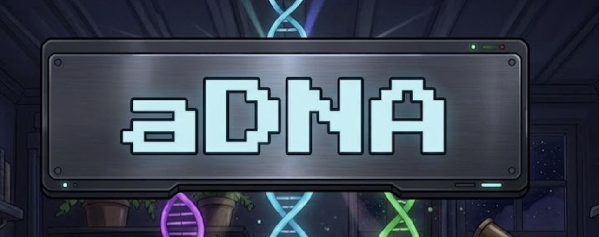

# Agentic-DNA

**Give your project a knowledge architecture that both humans and AI agents can navigate.**

Every project accumulates knowledge — decisions, contacts, research, processes, context. Without structure, that knowledge fragments across chat logs, scattered docs, and individual memory. AI agents start every session cold, re-discovering what the project is and how it works.

**aDNA (Agentic DNA)** organizes any project's knowledge into three directories — `who/`, `what/`, `how/` — with lightweight governance files that give AI agents instant orientation and give humans a browsable knowledge graph in [Obsidian](https://obsidian.md).

Clone this repo to get a ready-to-use vault with templates, tools, and examples. Customize for your domain in minutes.

> aDNA is a standalone knowledge architecture standard. It is the foundational building block of the [Lattice Protocol](https://github.com/LatticeProtocol/lattice-protocol) for federated AI compute — but the architecture is domain-neutral. Any project that uses AI agents, or just wants structured knowledge, benefits.

---

## Contents

**Start here** — [60 Seconds](#adna-in-60-seconds) · [Your First 10 Minutes](#your-first-10-minutes) · [The Problem](#the-problem) · [Who Is This For?](#who-is-this-for) · [Quick Start](#quick-start)

**Architecture** — [The Triad](#the-triad) · [The Ontology](#the-ontology) · [Extending the Ontology](#extending-the-ontology) · [What's Inside](#whats-inside)

**Operations** — [Adding aDNA to an Existing Project](#adding-adna-to-an-existing-project) · [Multi-Project Workspaces](#multi-project-workspaces) · [Working with AI Agents](#working-with-ai-agents)

**Reference** — [Lattices](#lattices-optional) · [Context Engineering](#context-engineering) · [Architecture Reference](#architecture-reference) · [FAQ](#frequently-asked-questions) · [Further Reading](#further-reading)

**Community** — [Contributing](#contributing) · [Ecosystem & Vision](#ecosystem--vision) · [Changelog](#versioning--changelog) · [License](#license)

---

## aDNA in 60 Seconds

Project knowledge has three kinds: **people** (contacts, teams, partners), **things you know** (research, decisions, designs), and **how you work** (plans, processes, workflows). aDNA gives each a folder — `who/`, `what/`, `how/`.

Inside each folder, a small `AGENTS.md` config tells AI agents what's here and how to work with it. When an agent opens your project, it reads the top-level config, then only the folder-level configs relevant to its task. Instead of reading everything, it reads just what it needs. Every new folder you add automatically narrows the search space.

No special tooling required. Folders, Markdown files, and a handful of conventions — works with any editor, any AI agent, any version control.

---

## Your First 10 Minutes

New here? Do these three things in order — you'll go from "what is this?" to a working vault of your own.

| Minutes | Do this | You get |
|---|---|---|
| **0–2** | Run the three [Quick Start](#quick-start) commands (`git clone … && cd ~/aDNA && claude`). | A ready workspace; the agent greets you and offers to create your first project. |
| **2–5** | Read [aDNA in 60 Seconds](#adna-in-60-seconds) and skim [The Triad](#the-triad). | The whole idea: three folders — `who/`, `what/`, `how/` — and why three. |
| **5–10** | Follow the guided learning path (below) — start with **Navigate an aDNA Vault**. | You can find any piece of knowledge in a vault and know where new content goes. |

**The guided learning path.** The full learning path lives at **[adna.network/learn](https://adna.network/learn/)** — start there if you're brand new. It runs beginner → advanced:

1. **[Navigate an aDNA Vault](what/tutorials/tutorial_navigate_a_vault.md)** — the designated first tutorial (15 min, no prerequisites). A guided tour: learn to read a vault.
2. **[Create Your First CLAUDE.md](what/tutorials/tutorial_first_claude_md.md)** — write the file that orients an AI agent (20 min).
3. **[Apply the Question Test](what/tutorials/tutorial_question_test.md)** — sort any content into the right triad leg (15 min).

Then continue with the intermediate and advanced tutorials in [`what/tutorials/`](what/tutorials/), or browse them by difficulty at [adna.network/learn/tutorials](https://adna.network/learn/tutorials/). Prefer a live class? See the workshop kits in [`how/workshops/`](how/workshops/).

> **Reading, not cloning?** This repo is the self-referential documentation vault — it teaches aDNA *by being* an aDNA vault. Everything the tutorials point at is real and present here. If you cloned the workspace image instead (`aDNA-Network/aDNA`), your tree is smaller (the standard lives in a hidden `.adna/`); the tutorials still apply — follow along at [adna.network/learn](https://adna.network/learn/) or in this repo.

**Where to go by reader type:**

| You are… | Start here |
|---|---|
| **Brand new** — want the idea and a working vault | [Your First 10 Minutes](#your-first-10-minutes) → [Quick Start](#quick-start) → [Navigate an aDNA Vault](what/tutorials/tutorial_navigate_a_vault.md) |
| **A developer** — integrating aDNA into a project | [Adding aDNA to an Existing Project](#adding-adna-to-an-existing-project) → [`adna_standard.md`](what/docs/adna_standard.md) (normative rules) |
| **Adding AI agents** — want the agent contract | [Working with AI Agents](#working-with-ai-agents) → [`CLAUDE.md`](CLAUDE.md) → per-directory [`AGENTS.md`](how/sessions/AGENTS.md) |
| **Evaluating** — is this right for us? | [The Problem](#the-problem) · [Who Is This For?](#who-is-this-for) · [comparisons](what/comparisons/) |
| **Contributing** — improve the standard | [Contributing](#contributing) → [`CONTRIBUTING.md`](CONTRIBUTING.md) · [community roles](who/community/community_roles.md) |

---

## The Problem

AI agents start every session cold. No memory of past work, no awareness of other agents, no understanding of the project. This creates four compounding failures:

| Failure | What happens |
|---|---|
| **Orientation overhead** | Every session begins with the agent re-discovering project structure. Context windows fill with exploration instead of execution. |
| **Coordination failure** | Multiple agents work on the same project without shared protocol. They overwrite each other and duplicate effort. |
| **Knowledge fragmentation** | Insights from one session are lost by the next. No persistent medium accumulates project understanding. |
| **Audience divergence** | Humans browse visually; agents parse programmatically. Most projects serve one audience poorly or both terribly. |

aDNA solves these by giving projects a **deliberate knowledge architecture** — structured knowledge that both humans and agents can read, navigate, and build on.

---

## Who Is This For?

| Persona | `who/` holds | `what/` holds | `how/` holds |
|---|---|---|---|
| **Startup founder** | Investors, customers, team, partners | Product decisions, market research, competitive analysis | Fundraising campaigns, sprint plans, onboarding |
| **Researcher** | Collaborators, lab members, funding contacts | Literature reviews, datasets, methodology decisions | Research missions, publication pipelines, grant workflows |
| **Creative professional** | Clients, collaborators | Project briefs, asset libraries, style guides | Project workflows, revision pipelines, delivery checklists |
| **Personal knowledge manager** | Mentors, communities, professional contacts | Course notes, book summaries, topic deep-dives | Learning paths, habit tracking, project plans |

Each persona starts with the same base structure and extends with domain-specific directories. See [Extending the Ontology](#extending-the-ontology).

---

## The Triad

Every piece of project knowledge answers exactly one of three questions:

```
who/   →  Who is involved?              (people, teams, organizations)
what/  →  What does this project know?  (knowledge, decisions, artifacts)
how/   →  How does this project work?   (processes, plans, operations)
```

**The Question Test** classifies any content:

| Content | Question | Triad leg |
|---|---|---|
| A research paper summary | What do we know about X? | `what/` |
| The deployment checklist | How do we deploy? | `how/` |
| The engineering team roster | Who works on this? | `who/` |
| An architecture decision record | What did we decide? | `what/decisions/` |
| A campaign plan | How do we execute Q2? | `how/campaigns/` |

Why three? Two legs conflate people with knowledge. Four or more legs decompose into the existing three. Three is the minimum that separates knowledge, process, and people without overlap.

### Two deployment forms

| Form | Structure | Use case |
|---|---|---|
| **Bare triad** | `what/` · `how/` · `who/` at project root | Knowledge bases, Obsidian vaults, standalone projects |
| **Embedded triad** | `.agentic/what/` · `.agentic/how/` · `.agentic/who/` | Git repos where aDNA lives alongside source code |

This repo is a bare triad. When adding aDNA to an existing codebase, use embedded form so it doesn't collide with your source tree.

### Governance files

Five files provide the structural skeleton:

| File | Audience | Purpose |
|---|---|---|
| `CLAUDE.md` | Agents | Master context — auto-loaded on session start. |
| `MANIFEST.md` | Both | Project identity — what this project is, entry points, active builds. |
| `STATE.md` | Both | Operational state — what's happening now, blockers, next steps. |
| `AGENTS.md` | Agents | Per-directory guide — one in every directory. |
| `README.md` | Humans | GitHub rendering, onboarding, external audience. |

Agents read `CLAUDE.md` → `STATE.md` → directory-level `AGENTS.md` files. Humans read `README.md` → `MANIFEST.md` → browse the triad. Same knowledge, two entry paths.

---

## Quick Start

Clone the workspace image — the workspace router `CLAUDE.md` ships pre-instantiated at the root and the standard comes embedded in a hidden `.adna/` folder — then start the agent. ~5 minutes. (Canonical face: [`aDNA-Network/aDNA`](https://github.com/aDNA-Network/aDNA); release architecture: ADR-034.)

```bash
git clone https://github.com/aDNA-Network/aDNA.git ~/aDNA
cd ~/aDNA
claude
```

> `~/aDNA/` is the recommended workspace root; any path works — `<workspace_root>` is detected, never hardcoded. Operators on the legacy `~/lattice/` root migrate via `skill_workspace_path_migration` (a turnkey agentic transition) plus a `~/lattice → ~/aDNA` symlink shim that keeps every existing reference valid mid-migration. Installed before June 2026 (cloned `.adna/` + copied router)? It keeps working — the predecessor template repo is preserved read-only at [`aDNA-Network/adna-legacy`](https://github.com/aDNA-Network/adna-legacy) and old URLs redirect there; upgrade via `skill_workspace_upgrade`.

On first run the agent reads the workspace router, detects a fresh workspace, and walks you through creating your first project — forking the embedded standard into e.g. `~/aDNA/my_research_lab.aDNA/` with its own governance and git history (your projects stay untracked by the image's git history by design). The embedded `.adna/` stays clean; updates arrive with `git pull` at the workspace root.

**Optional — Obsidian:** vaults are plain Markdown, so any editor works. For the curated Obsidian experience (15 community plugins + the Tokyo Night theme), run `.adna/setup.sh` and open the workspace in Obsidian (Git Bash or WSL on Windows).

The same flow is published at [adna.network/get-started](https://adna.network/get-started/); a terminal-first walkthrough and manual setup (no AI agent) are documented in [`agent_first_guide.md`](what/docs/agent_first_guide.md) and [`migration_guide.md`](what/docs/migration_guide.md).

---

## Adding aDNA to an Existing Project

Already have a project? Add aDNA structure instead of cloning. 10-15 minutes; works with any codebase.

| Form | Structure | Use when |
|---|---|---|
| **Embedded** | `.agentic/who/` · `.agentic/what/` · `.agentic/how/` | Adding to a code repo — aDNA lives alongside source code |
| **Bare** | `who/` · `what/` · `how/` at project root | aDNA IS the project — knowledge bases, documentation vaults |

**Minimum viable aDNA** — 5 files + 3 directories: `CLAUDE.md` + `MANIFEST.md` + `STATE.md` at root; one `AGENTS.md` per triad directory; the three triad directories themselves.

```bash
mkdir -p .agentic/who .agentic/what .agentic/how
```

Full walkthrough: [`what/docs/migration_guide.md`](what/docs/migration_guide.md).

---

## Multi-Project Workspaces

The `~/aDNA/` workspace supports multiple projects. Each project is a fork of the `.adna` template with its own governance, git history, and domain customization. Forked projects use the `.aDNA` suffix.

```
~/aDNA/
├── CLAUDE.md              # Workspace router (bootstrapped from the template)
├── .adna/                 # Base template (hidden; never modified — updated via git pull)
├── my_research_lab.aDNA/  # Project A (forked, customized)
└── client_acme.aDNA/      # Project B (forked)
```

Open Claude Code at the workspace root, say "create a new project," and the agent forks the template and runs a 5-question onboarding interview to scaffold a fully configured project.

**Pattern**: [`what/docs/projects_folder_pattern.md`](what/docs/projects_folder_pattern.md).

---

## The Ontology

Base aDNA ships **16 entity types** across the triad — the minimal operational ontology:

| Triad leg | Entities | Purpose |
|---|---|---|
| **WHO** (4) | `governance`, `team`, `coordination`, `identity` | Who decides, who works, how they sync, who/where this node is |
| **WHAT** (5) | `context`, `decisions`, `modules`, `lattices`, `inventory` | What you know, what you've decided, what you build, how you compose, what's installed |
| **HOW** (7) | `campaigns`, `missions`, `sessions`, `templates`, `skills`, `pipelines`, `backlog` | Plan → decompose → execute → track → automate → ideate |

**You extend by adding domain-specific entities under the appropriate triad leg.** The base gives you operational infrastructure that works from day one. Your extensions add the domain knowledge.

| Domain | Example extensions | Triad leg |
|---|---|---|
| **Startup / Business** | `investors`, `customers`, `partners`, `fundraising_pipeline` | `who/` |
| **Research / Science** | `experiments`, `datasets`, `hypotheses`, `protocols` | `what/` |
| **Software team** | `services`, `incidents`, `deployments` | `how/` |
| **Creative agency** | `clients`, `creative_assets`, `revision_cycles` | `who/` + `what/` |

### The Discriminator Pattern

When related entities share a directory, use a frontmatter field to distinguish them:

```yaml
# what/modules/tool_lattice_validate.md
type: module
module_type: tool

# what/modules/model_protein_binder.md
type: module
module_type: model
```

This keeps the directory flat while preserving semantic precision. The base ontology uses three discriminators: `module_type`, `lattice_type`, and `skill_type`.

---

## Extending the Ontology

Three steps to add a new entity type:

### 1. Create the directory under the right triad leg

```bash
mkdir -p who/customers    # People/orgs → who/
mkdir -p what/datasets    # Knowledge → what/
mkdir -p how/runbooks     # Operational → how/
```

### 2. Add an `AGENTS.md` telling agents what lives here

```markdown
# customers/ — Agent Guide

## What's Here
Customer records for active and prospective accounts.

## Working Rules
- One file per customer: `customer_<name>.md`
- Check `updated` field before modifying
- Set `last_edited_by` and `updated` on every edit
- Link to contacts via `[[contacts/contact_name]]`
```

### 3. Create a template in `how/templates/` so new entities are consistent

Configure Templater to auto-trigger the template when files are created in the new directory.

**Using an AI agent?** The skill `how/skills/skill_new_entity_type.md` automates all three steps — tell the agent what entity type you need and where it belongs.

---

## What's Inside

```
Agentic-DNA/
├── CLAUDE.md              # Agent master context
├── MANIFEST.md            # Project identity (customize)
├── STATE.md               # Operational state (customize)
├── what/                  # Knowledge
│   ├── context/           #   Context library (5 topics, 27 subtopics)
│   ├── decisions/         #   Architecture Decision Records
│   ├── docs/              #   aDNA specification documents
│   └── lattices/          #   Lattice definitions + tools + 15 examples
├── how/                   # Operations
│   ├── templates/         #   44 templates (25 base + 11 extension + 8 operational)
│   ├── pipelines/prd_rfc/ #   R&D → PRD → RFC pipeline
│   ├── sessions/          #   Session tracking
│   ├── campaigns/         #   Multi-mission initiatives
│   ├── missions/          #   Task decomposition
│   ├── skills/            #   50 agent recipes & procedures
│   └── backlog/           #   Ideas & improvements
├── who/                   # Organization
│   ├── coordination/      #   Cross-agent notes
│   └── governance/        #   Project governance
└── .obsidian/             # Visual config (theme, snippets, plugins)
```

Lattice tools, the JSON schema, 15 example lattices (business / research / creative / biotech), and the PRD→RFC pipeline are documented in [Further Reading](#further-reading).

---

## Working with AI Agents

aDNA is designed for human-agent collaboration. Humans browse the vault in Obsidian; agents read structured Markdown. Same knowledge, two entry paths.

Agent protocol — session tracking, the Campaign → Mission → Objective execution hierarchy, coordination conventions, and SITREP handoffs — lives in [`CLAUDE.md`](CLAUDE.md) (auto-loaded on session start) and the per-directory [`AGENTS.md`](how/sessions/AGENTS.md) files. Multi-user teams sharing a vault via git: install [Obsidian Git](https://github.com/denolehov/obsidian-git); per-device files are pre-excluded.

---

## Frequently Asked Questions

**Do I need Obsidian?** No. aDNA is a directory convention. Any text editor or Markdown tool works. Obsidian adds visual browsing (graph view, wikilinks, canvas), but the structure is plain files. For a terminal-first walkthrough, see [`what/docs/agent_first_guide.md`](what/docs/agent_first_guide.md).

**What if I don't use AI agents?** aDNA works as a human-only knowledge management system. Skip `CLAUDE.md` and `AGENTS.md` — they're inert governance files. See [`what/docs/migration_guide.md`](what/docs/migration_guide.md).

**How do I sync the vault across machines?** Use git. The vault is a standard git repository. For Obsidian-native sync, install [Obsidian Git](https://github.com/denolehov/obsidian-git).

**Can I add my own entity types?** Yes — that's the extension model. See [Extending the Ontology](#extending-the-ontology).

**Can I run multiple vaults or connect them?** aDNA supports multi-vault composition through bridge patterns (nesting, sibling, monorepo). See [`what/docs/adna_bridge_patterns.md`](what/docs/adna_bridge_patterns.md).

---

## Lattices (Optional)

A **lattice** is a YAML-defined directed graph connecting datasets, modules, reasoning nodes, and processes into an executable composition. Lattices are optional — the triad handles knowledge management without them.

| Type | What it does | Example |
|---|---|---|
| `pipeline` | Deterministic DAG | Sales pipeline: lead → qualify → propose → close |
| `agent` | LLM-driven reasoning | Code review: diff → analyze → critique → suggest |
| `context_graph` | Knowledge structure | Domain graph linking papers, models, datasets |
| `workflow` | Operational process | Product launch: research → build → test → ship |

15 example lattices ship in `what/lattices/examples/` (business / research / creative / biotech). Start with `hello_world.lattice.yaml` and customize. Round-trip Obsidian canvas for visual editing via `tools/lattice2canvas` + `tools/canvas2lattice`. Full schema: [`what/lattices/lattice_yaml_schema.json`](what/lattices/lattice_yaml_schema.json).

---

## Context Engineering

Token efficiency shapes everything. Every token in an agent's context window must earn its place.

| Principle | What it means |
|---|---|
| **Smallest high-signal token set** | Maximum useful signal in fewest tokens. Cut filler. |
| **Sub-agents as compression** | A sub-agent explores 10K+ tokens and returns 1-2K of findings. 5-10× compression. |
| **Progressive disclosure** | Tier 1 always loaded; Tier 2 adds depth on demand; Tier 3 provides source verification. |
| **Model-attention-aware formatting** | Tables compress 40-60% vs. prose. Use structured formats. |
| **Just-in-time retrieval** | Load only what the current operation needs. |

The `what/context/` directory implements these as a **context library** — structured knowledge files with token estimates, tiered information, and progressive loading.

---

## Architecture Reference

Governance files (CLAUDE / MANIFEST / STATE / AGENTS / README), collision-prevention rules, compute tiers (L1 Edge / L2 Regional / L3 Cloud), and the full normative model are documented in [`what/docs/adna_standard.md`](what/docs/adna_standard.md) and [`what/docs/adna_design.md`](what/docs/adna_design.md). Agents read `CLAUDE.md` + per-directory `AGENTS.md`; humans read `README.md` + `MANIFEST.md`.

---

## Contributing

Bug reports, template improvements, documentation fixes, and design pattern proposals welcome. aDNA is a knowledge architecture, so contributions are primarily Markdown, YAML, and shell scripts.

AI agents working in aDNA vaults can also contribute: [Agent Contribution Mode](CONTRIBUTING.md#agent-contribution-mode) describes how agents surface framework-level improvements organically.

**Side-quests**: Browse [`how/quests/`](how/quests/) for structured validation experiments that run in 10-30 minutes with spare agent tokens. See the [Side-Quest Guide](what/docs/side_quest_guide.md).

Full guide: [`CONTRIBUTING.md`](CONTRIBUTING.md).

---

## Ecosystem & Vision

aDNA is more than a file convention — it's a standard designed to improve through community usage. Agents working in aDNA vaults organically surface framework-level improvements; side-quests collect structured validation data; version migrations deliver improvements to every vault.

Read [`VISION.md`](who/governance/VISION.md) for the decentralized frontier lab model and the opt-in participation ladder (use standalone → contribute improvements → run side-quests → shape the standard).

---

## Further Reading

| Document | What it covers |
|---|---|
| [`what/docs/adna_standard.md`](what/docs/adna_standard.md) | Full normative specification (v2.5) — all MUST/SHOULD/MAY rules |
| [`what/docs/standard_reading_guide.md`](what/docs/standard_reading_guide.md) | Three persona-based paths through the standard |
| [`what/docs/adna_design.md`](what/docs/adna_design.md) | Architecture rationale — why three legs, design tradeoffs |
| [`what/docs/adna_bridge_patterns.md`](what/docs/adna_bridge_patterns.md) | Multi-instance composition — nesting, sibling, monorepo |
| [`what/docs/migration_guide.md`](what/docs/migration_guide.md) | Adding aDNA to an existing project |
| [`what/docs/agent_first_guide.md`](what/docs/agent_first_guide.md) | Terminal-first aDNA setup with Claude Code |
| [`what/docs/projects_folder_pattern.md`](what/docs/projects_folder_pattern.md) | Multi-project workspace pattern |
| [`what/lattices/canvas_yaml_interop.md`](what/lattices/canvas_yaml_interop.md) | Canvas ↔ YAML bidirectional mapping |
| [`VISION.md`](who/governance/VISION.md) | Ecosystem vision and participation ladder |

---

## Versioning & Changelog

aDNA tracks two independent version numbers: **governance** (CLAUDE.md, vault structure) and **standard** (the normative specification). Both use Major.Minor versioning.

See [`CHANGELOG.md`](CHANGELOG.md) for the full version history.

---

## License

MIT.
