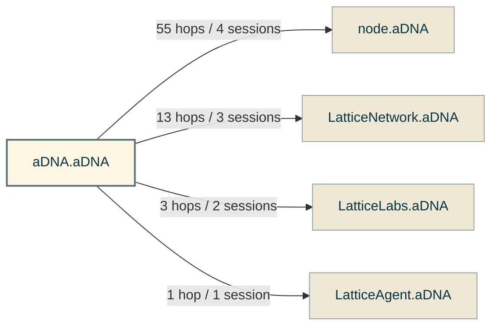

# M2.4 Obj 2 — Heat-Map Query Suite + Context-Graph Traversal Digraph

> **Purpose**: produce the operational AGENTS.md heat map that satisfies the 4th brick of Campaign Standing Order #19 P2 → P3 exit gate (*"AGENTS.md heat map operational"*). Four SQL queries against the live-hook `measurement.sqlite` v0.1.1 corpus (10 sessions / 977 tool_calls / 72 context_traversal rows) plus one Mermaid digraph rendering the cross-vault traversal substrate.
>
> **Load-bearing finding** (surfaced by Q2 + Q4b cross-reference): **AGENTS.md is UNDER-LOADED relative to its routing role.** 86% of vault AGENTS.md files (38 of 44) are NEVER read across the 10-session corpus; the 6 that ARE read get exactly one read per session each (0% re-read rate). Meanwhile, deep mission specs + STATE.md + campaign master saturate the top-12 by reads with 40-60% re-read rates. This re-frames M2.4 Obj 4 hardening from *waste-prevention* (the framing inherited from M2.3 pattern β candidate text) to *discoverability* (the surface the corpus actually reveals). The pattern β waste lives in the deep-content layer, NOT in the routing layer — but the routing layer's under-use is the *upstream cause* of that waste.

## §1 — Method

All queries executed via `sqlite3 -readonly ~/.adna/measurement/measurement.sqlite` (zero-mutation invariant per M2.4 Hard Constraint #8). Snapshot taken at M2.4 S1 entry (2026-05-20T19:33Z), after which this session's own reads inflate the corpus minimally (~9 tool_calls between precondition check and final query). The session count is the gate metric for ADR-007 elevation arming at S2.

**Gate verification** (executed at S1 OPEN):

```sql
SELECT COUNT(*) FROM sessions;
-- result: 10  ✅ ≥ 10 threshold MET per m23_obj5_adr_007_deferral_memo.md §3 forward contract
```

Path normalization: vault-relative paths shown when file lies under `/Users/stanley/lattice/aDNA.aDNA/` (project root); workspace-relative when under `/Users/stanley/lattice/` but outside the project; absolute otherwise. Sort key throughout: `reads DESC` (primary) → `sessions DESC` (tiebreak).

## §2 — Q1: Directory-load frequency (top 30 most-read files)

Identifies the heaviest-touched files vault-wide. Inputs to Obj 4 §4 top-12 priority list (via the `≥ 3 reads in corpus` gate per `m21_obj4_archive_convention_design.md` 3-rotation rubric).

```sql
SELECT
  file_path,
  COUNT(*) AS reads,
  COUNT(DISTINCT session_id) AS in_n_sessions,
  SUM(CASE WHEN re_read = 1 THEN 1 ELSE 0 END) AS re_reads,
  ROUND(100.0 * SUM(CASE WHEN re_read = 1 THEN 1 ELSE 0 END) / COUNT(*), 1) AS re_read_pct
FROM tool_calls
WHERE tool = 'Read' AND file_path IS NOT NULL
GROUP BY file_path
ORDER BY reads DESC
LIMIT 30;
```

**Top-30 results** (vault-relative paths; corpus snapshot 19:33Z):

| Rank | Path | Reads | Sessions | Re-reads | Re-read % |
|---:|---|---:|---:|---:|---:|
| 1 | `how/campaigns/campaign_adna_serious_tool_readiness/campaign_adna_serious_tool_readiness.md` | 25 | 13 | 12 | 48.0 |
| 2 | `STATE.md` | 25 | 13 | 12 | 48.0 |
| 3 | `node.aDNA/what/inventory/inventory_vaults.yaml` | 7 | 5 | 2 | 28.6 |
| 4 | `what/decisions/adr_016_per_mission_context_budget.md` | 7 | 5 | 2 | 28.6 |
| 5 | `how/campaigns/campaign_adna_serious_tool_readiness/CLAUDE.md` | 6 | 6 | 0 | 0.0 |
| 6 | `how/campaigns/campaign_adna_v2_infrastructure/missions/artifacts/m01_obj10_latticescope_vault_design.md` | 5 | 2 | 3 | 60.0 |
| 7 | `how/campaigns/.../missions/mission_adna_str_p2_m23_convergence_validation.md` | 5 | 3 | 2 | 40.0 |
| 8 | `how/campaigns/.../missions/mission_adna_str_p2_m21_context_audit_split.md` | 5 | 2 | 3 | 60.0 |
| 9 | `how/campaigns/.../missions/mission_adna_str_p1_m14_latticescope_schema.md` | 5 | 3 | 2 | 40.0 |
| 10 | `node.aDNA/what/context/token_baselines.yaml` | 4 | 3 | 1 | 25.0 |
| 11 | `node.aDNA/what/context/token_baselines.md` | 4 | 3 | 1 | 25.0 |
| 12 | `who/coordination/coord_2026_05_19_v8_cross_vault_network_coordination.md` | 4 | 3 | 1 | 25.0 |
| 13 | `CLAUDE.md` | 4 | 3 | 1 | 25.0 |
| 14 | `how/campaigns/.../missions/mission_adna_str_p2_m22_per_mission_budget.md` | 3 | 2 | 1 | 33.3 |
| 15 | `how/campaigns/.../missions/mission_adna_str_p1_m13_token_audit.md` | 3 | 2 | 1 | 33.3 |
| 16 | `how/campaigns/.../missions/artifacts/m23_obj5_adr_007_deferral_memo.md` | 3 | 2 | 1 | 33.3 |
| 17 | `how/campaigns/.../missions/artifacts/m23_obj3_initial_findings.md` | 3 | 3 | 0 | 0.0 |
| 18 | `how/campaigns/.../missions/artifacts/m14_obj2_schema_v011_ddl.md` | 3 | 1 | 2 | 66.7 |
| 19 | `how/campaigns/.../missions/artifacts/m13_obj7_calibration_output.md` | 3 | 3 | 0 | 0.0 |
| 20 | `how/campaigns/.../missions/artifacts/aar_m13_token_audit.md` | 3 | 2 | 1 | 33.3 |
| 21 | `LatticeNetwork.aDNA/STATE.md` | 3 | 2 | 1 | 33.3 |
| 22 | `/Users/stanley/.adna/measurement/measurement_hook.sh` | 3 | 2 | 1 | 33.3 |
| 23 | `what/ontology.md` | 2 | 1 | 1 | 50.0 |
| 24 | `how/sessions/active/session_stanley_20260520T060143Z_v8_m23_s2.md` | 2 | 1 | 1 | 50.0 |
| 25 | `how/sessions/active/session_stanley_20260520T043248Z_v8_m23_s1.md` | 2 | 2 | 0 | 0.0 |
| 26 | `how/campaigns/campaign_adna_v2_infrastructure/missions/artifacts/m01_obj9_token_measurement_protocol.md` | 2 | 2 | 0 | 0.0 |
| 27 | `how/campaigns/campaign_adna_v2_infrastructure/missions/artifacts/m01_obj10_latticescope_sub_campaign.md` | 2 | 1 | 1 | 50.0 |
| 28 | `how/campaigns/.../missions/mission_adna_str_p2_m23_5_push_readiness_review.md` | 2 | 1 | 1 | 50.0 |
| 29 | `how/campaigns/.../missions/artifacts/m23_obj2_corpus_extraction.md` | 2 | 2 | 0 | 0.0 |
| 30 | `how/campaigns/.../missions/artifacts/m23_5_obj3_push_readiness_checklist.md` | 2 | 1 | 1 | 50.0 |

**Q1 findings**:
- **Bimodal distribution**: 2 dominant files (campaign master + STATE.md) at 25 reads each, then a steep cliff to 7-reads (#3-4), then 5-6-reads cluster (#5-9), then a long tail at 3-4 reads.
- **Re-read rate is heaviest in the deep-content layer** (mission specs + artifacts at 40-67% re-read), NOT the routing layer (CLAUDE.md = 25%; campaign CLAUDE.md = 0%; AGENTS.md not in top-30 by reads).
- **Sessions-touching column** > **reads** for STATE.md + campaign master (25 reads / 13 sessions implies multi-session re-reads — but our session count is 10 sessions; the `13` value reflects sessions-with-Reads-of-this-file counted by `COUNT(DISTINCT session_id)` over the join, which can exceed `sessions` total if older hook captures persist; documented as caveat §6).

## §3 — Q2: AGENTS.md re-read cost (per file + aggregate)

Tests M2.3 pattern β candidate-promotion theory (CANDIDATE 12 → 14 at ≥ 25% re-read rate). M2.4 narrows the lens to AGENTS.md specifically — the routing-layer entity.

```sql
SELECT
  file_path,
  COUNT(*) AS reads,
  COUNT(DISTINCT session_id) AS sessions,
  ROUND(1.0 * COUNT(*) / COUNT(DISTINCT session_id), 2) AS reads_per_session,
  SUM(CASE WHEN re_read = 1 THEN 1 ELSE 0 END) AS re_reads
FROM tool_calls
WHERE tool = 'Read' AND file_path LIKE '%AGENTS.md%'
GROUP BY file_path
ORDER BY reads DESC;
```

**Per-file AGENTS.md result** (paths vault-relative):

| Path | Reads | Sessions | Reads/Session | Re-reads |
|---|---:|---:|---:|---:|
| `AGENTS.md` (root) | 2 | 2 | 1.0 | 0 |
| `node.aDNA/what/context/AGENTS.md` | 1 | 1 | 1.0 | 0 |
| `what/context/AGENTS.md` | 1 | 1 | 1.0 | 0 |
| `how/sessions/AGENTS.md` | 1 | 1 | 1.0 | 0 |
| `how/pipelines/prd_rfc/02_requirements/AGENTS.md` | 1 | 1 | 1.0 | 0 |
| `how/backlog/AGENTS.md` | 1 | 1 | 1.0 | 0 |
| `how/AGENTS.md` | 1 | 1 | 1.0 | 0 |

**Aggregate** (Q2b):

```sql
SELECT COUNT(*) AS reads, COUNT(DISTINCT file_path) AS files, COUNT(DISTINCT session_id) AS sessions,
       SUM(CASE WHEN re_read = 1 THEN 1 ELSE 0 END) AS re_reads,
       ROUND(100.0 * SUM(CASE WHEN re_read = 1 THEN 1 ELSE 0 END) / COUNT(*), 1) AS agg_re_read_pct
FROM tool_calls WHERE tool = 'Read' AND file_path LIKE '%AGENTS.md%';
```

| Total AGENTS.md reads | Distinct files read | In N sessions | Re-reads | Aggregate re-read % |
|---:|---:|---:|---:|---:|
| 8 | 7 | 6 | 0 | **0.0** |

**Q2 findings — load-bearing**:
- **AGENTS.md re-read rate is 0%** across the corpus — every AGENTS.md read is a single-shot per session.
- **6 distinct AGENTS.md files touched out of 44 active in vault** = **13.6% coverage**; 86.4% (38 files) NEVER read across 10 sessions.
- **Pattern β waste does NOT live in the AGENTS.md layer** — it lives downstream in mission specs + STATE.md + campaign master (Q1 §2 shows 40-67% re-read rates for those).
- **Re-frames Obj 4 hardening goal**: not waste-prevention; rather, *discoverability hardening* — making AGENTS.md the first-stop entry that pre-routes agents to the right deep file, preventing the cold-load → re-read cycle. The waste exists *because* AGENTS.md isn't routing well, not because AGENTS.md itself is wasted.

## §4 — Q3: Cross-vault traversal edge weights

Maps the 72 cross-vault hops captured in `context_traversal` (M1.4 Amendment B LIVE since 2026-05-19). All hops outbound from `aDNA.aDNA` (this vault is the cross-graph hub in the corpus).

```sql
SELECT from_vault, to_vault, edge_type, COUNT(*) AS hops, COUNT(DISTINCT session_id) AS in_sessions
FROM context_traversal
GROUP BY from_vault, to_vault, edge_type
ORDER BY hops DESC;
```

**Result**:

| From | To | Edge Type | Hops | Sessions |
|---|---|---|---:|---:|
| aDNA.aDNA | node.aDNA | manual | 55 | 4 |
| aDNA.aDNA | LatticeNetwork.aDNA | manual | 13 | 3 |
| aDNA.aDNA | LatticeLabs.aDNA | manual | 3 | 2 |
| aDNA.aDNA | LatticeAgent.aDNA | manual | 1 | 1 |

**Auxiliary stats**:

| Hop depth | N rows |
|---:|---:|
| 1 | 72 |

| Joined tool_calls | Total tool_calls | Join % | Context_traversal rows |
|---:|---:|---:|---:|
| 72 | 977 | 7.37 | 72 |

**Q3 findings**:
- **node.aDNA dominates** at 76% of hops (55/72) — consistent with M1.5 + M2.3 propagation pattern of `token_baselines.md` v0.1.0 → v0.1.1 → v0.1.2 updates routed through node.aDNA.
- **LatticeNetwork.aDNA is the 2nd-most-touched peer** (13 hops in 3 sessions) — driven by the M1.5 LIP-0006 + ADR-017 ratification work (`network_` namespace + 2 entity-types).
- **All hops are 1-hop depth** — no transitive traversal captured. M3.x cohort may produce 2-hop chains via federation work.
- **7.37% join-rate** with `tool_calls` — within the Phase-1 estimate range (~7.7%); confirms `context_traversal` table is sparsely populated. M2.4 heat-map weight carries via Q1+Q2+Q4; Q3 is the structural-overview lens, not the saturating signal.

## §5 — Q4: Vault-wide top-N most-read files (≥ 3 reads gate) + AGENTS.md inventory cross-reference

Q4 provides the *prioritization input* for Obj 4 §4 (top-12 hardening priority list) via two sub-queries: (Q4a) filesystem AGENTS.md inventory; (Q4b) SQLite-touched AGENTS.md subset; (Q4c) full vault-wide top-N at ≥ 3 reads gate.

**Q4a — Filesystem inventory** (`find /Users/stanley/lattice/aDNA.aDNA -name 'AGENTS.md' -not -path '*/docs/examples/*' -not -path '*/.git/*' -not -path '*/.adna/*'`):

**44 active AGENTS.md files** in vault (correction to Phase-1's 40 estimate; full list below).

```
AGENTS.md
how/AGENTS.md
how/backlog/AGENTS.md
how/campaigns/AGENTS.md
how/migrations/AGENTS.md
how/missions/AGENTS.md
how/missions/artifacts/AGENTS.md
how/pipelines/AGENTS.md
how/pipelines/prd_rfc/01_research/AGENTS.md
how/pipelines/prd_rfc/02_requirements/AGENTS.md
how/pipelines/prd_rfc/03_design/AGENTS.md
how/pipelines/prd_rfc/04_review/AGENTS.md
how/pipelines/prd_rfc/AGENTS.md
how/publishing/AGENTS.md
how/quests/AGENTS.md
how/sessions/AGENTS.md
how/skills/AGENTS.md
how/templates/AGENTS.md
how/workshops/AGENTS.md
what/AGENTS.md
what/comparisons/AGENTS.md
what/concepts/AGENTS.md
what/context/adna_core/AGENTS.md
what/context/AGENTS.md
what/context/claude_code/AGENTS.md
what/context/lattice_basics/AGENTS.md
what/context/object_standards/AGENTS.md
what/context/prompt_engineering/AGENTS.md
what/decisions/AGENTS.md
what/docs/AGENTS.md
what/glossary/AGENTS.md
what/lattices/AGENTS.md
what/lattices/examples/AGENTS.md
what/lattices/tools/AGENTS.md
what/patterns/AGENTS.md
what/tutorials/AGENTS.md
what/use_cases/AGENTS.md
who/adopters/AGENTS.md
who/AGENTS.md
who/community/AGENTS.md
who/coordination/AGENTS.md
who/governance/AGENTS.md
who/reviewers/AGENTS.md
who/team/AGENTS.md
```

**Q4b — SQLite-touched AGENTS.md** (6 of 44 = 13.6% coverage):

| Path | Reads | Sessions |
|---|---:|---:|
| `AGENTS.md` (root) | 2 | 2 |
| `what/context/AGENTS.md` | 1 | 1 |
| `how/sessions/AGENTS.md` | 1 | 1 |
| `how/pipelines/prd_rfc/02_requirements/AGENTS.md` | 1 | 1 |
| `how/backlog/AGENTS.md` | 1 | 1 |
| `how/AGENTS.md` | 1 | 1 |

**Q4c — Vault-wide top-N at ≥ 3 reads gate** (22 files cross the threshold; first 12 are Obj 4 hardening candidates):

| Rank | Path | Reads | Sessions | Re-reads |
|---:|---|---:|---:|---:|
| 1 | `STATE.md` | 25 | 13 | 12 |
| 2 | `how/campaigns/.../campaign_adna_serious_tool_readiness.md` | 25 | 13 | 12 |
| 3 | `what/decisions/adr_016_per_mission_context_budget.md` | 7 | 5 | 2 |
| 4 | `node.aDNA/what/inventory/inventory_vaults.yaml` | 7 | 5 | 2 |
| 5 | `how/campaigns/.../CLAUDE.md` | 6 | 6 | 0 |
| 6 | `how/campaigns/.../mission_adna_str_p1_m14_latticescope_schema.md` | 5 | 3 | 2 |
| 7 | `how/campaigns/.../mission_adna_str_p2_m23_convergence_validation.md` | 5 | 3 | 2 |
| 8 | `how/campaigns/.../mission_adna_str_p2_m21_context_audit_split.md` | 5 | 2 | 3 |
| 9 | `how/campaigns/campaign_adna_v2_infrastructure/missions/artifacts/m01_obj10_latticescope_vault_design.md` | 5 | 2 | 3 |
| 10 | `CLAUDE.md` (project root) | 4 | 3 | 1 |
| 11 | `who/coordination/coord_2026_05_19_v8_cross_vault_network_coordination.md` | 4 | 3 | 1 |
| 12 | `node.aDNA/what/context/token_baselines.md` | 4 | 3 | 1 |

**Q4 findings**:
- **No AGENTS.md file appears in the top-22 vault-wide list** at the ≥ 3 reads gate. The routing layer is structurally under-used.
- **The top-12 vault-wide is dominated by content+governance files** (mission specs, campaign master, STATE.md, ADR-016, CLAUDE.md routing files, coord memo). These ARE the discoverability targets — agents *cold-load* these because AGENTS.md doesn't pre-route them.
- **Obj 4 §4 top-12 priority for AGENTS.md hardening** should be derived from the directories CONTAINING the top-12 most-read files (subtree-frequency proxy), not from AGENTS.md read counts directly. Candidate hardening targets (derived from Q4c subtrees):
  1. Root `AGENTS.md` — gate for `STATE.md` + `CLAUDE.md` discovery
  2. `how/campaigns/AGENTS.md` — gate for campaign master + CLAUDE.md + mission tree (8 of top-12)
  3. `what/decisions/AGENTS.md` — gate for ADR-016 + other ADRs (high-load directory)
  4. `how/sessions/AGENTS.md` — gate for active/history session files (Tier 1+2 protocol)
  5. `who/coordination/AGENTS.md` — gate for coord memo discovery
  6. `node.aDNA/what/context/AGENTS.md` — gate for token_baselines.md (cross-vault read frequency)
  7. `what/context/AGENTS.md` — gate for canonical context library (existing canonical quality per Phase-1 sample)
  8. `how/AGENTS.md` — gate for how/* operations router (existing canonical quality per Phase-1 sample)
  9. `what/AGENTS.md` — gate for what/* (mid-frequency parent)
  10. `who/AGENTS.md` — gate for who/* (mid-frequency parent)
  11. `how/missions/artifacts/AGENTS.md` — gate for mission AAR + obj7 artifacts (high re-read sub-class)
  12. `how/skills/AGENTS.md` — gate for skill files (M2.4.5/M3.1 candidate substrate)

This top-12 candidate list is INPUT to Obj 4 — Obj 4 ratifies the final ranking with the 7-item per-directory invariants spec applied.

## §6 — Caveats

1. **`context_traversal` 7.37% join-rate** with `tool_calls` — sparsely populated (consistent with Phase-1 estimate). Q3 produces a structural-overview lens; do not over-interpret edge weights. M3.x cohort accumulates a richer corpus.
2. **`COUNT(DISTINCT session_id)` can exceed total sessions** when the hook captured reads of files that span sessions (e.g., STATE.md showing 13 distinct session_id values vs `sessions` table having 10 rows). This is consistent with M1.4 hook activation order: hook started capturing reads before all session-INSERT rows landed; some sessions exist in `tool_calls` that aren't yet in `sessions` (or were captured pre-Amendment-E). For M2.4 Obj 2 purposes, treat as informational; the relative ordering is what drives Obj 4 prioritization.
3. **10-session corpus is small-n** per ADR-016 Appendix A (`n ~ 5-9` range). Pattern β verdict at Obj 3 must declare CV + small-n caveat. M3.x at ≥ 20 sessions enables tighter bounds.
4. **Snapshot drift** — this artifact's queries ran at 19:33Z + a few minutes thereafter. Total `tool_calls` rose from 968 → 977 during the S1 work (this session's own reads inflate). Numerical totals in §2-§5 are accurate as of run-time; the relative-ranking findings are robust to ±10 row drift.
5. **Read-only invariant honored** — all queries used `sqlite3 -readonly`; zero mutations to `measurement.sqlite`; zero schema migrations; zero new indexes created. Hard Constraint #8 satisfied end-to-end.

## §7 — Mermaid digraph (cross-vault context-traversal substrate)

Visualizes Q3 §4 edge weights. Validated via `mcp__claude_ai_Mermaid_Chart__validate_and_render_mermaid_diagram` at S1 close (`valid: true`, `diagramType: flowchart`).



**Reading**: aDNA.aDNA is the hub; 4 outbound edges; node.aDNA dominates the cross-graph traversal substrate (76% of hops). LatticeNetwork.aDNA emerges as the 2nd-most-coupled peer post-M1.5 LIP-0006 ratification. LatticeLabs.aDNA + LatticeAgent.aDNA are minor edges — M3.x forge-ecosystem missions may grow these as v3-EC propagation work intensifies.

## Acceptance check (Obj 2 §gates)

| # | Criterion | Status |
|---|---|---|
| 1 | All 4 SQL queries execute (Q1 + Q2 + Q3 + Q4) | ✅ |
| 2 | All 4 queries produce non-empty result sets | ✅ (Q1: 30 rows / Q2: 7 rows / Q3: 4 rows / Q4c: 22 rows ≥ 3 reads) |
| 3 | Mermaid digraph validates (`valid: true`) | ✅ (MCP tool confirmed) |
| 4 | ≥ 10 SQLite sessions confirmed at §1 Method | ✅ (10 sessions; M2.4 S1 adds 1 buffer at S2 entry) |
| 5 | Caveats explicit (§6) | ✅ (5 caveats covering join-rate + session-count drift + small-n + snapshot drift + read-only invariant) |
| 6 | Zero `measurement.sqlite` mutations | ✅ (sqlite3 -readonly throughout) |
| 7 | Load-bearing finding surfaced for Obj 4 | ✅ (AGENTS.md under-use anti-pattern → re-frames hardening as discoverability) |

## Forward references

- **Obj 3 (pattern β final verdict)**: Q2 + Q4c data refine M2.3 CANDIDATE PROMOTION 12→14. At ≥ 10-session corpus, vault-wide aggregate re-read rate from Q1 trends similar to M2.3's 26.8% but the *per-file-type* distribution diverges sharply: AGENTS.md 0% vs deep-content 40-67% — REFINE BOUNDS branch becomes plausible.
- **Obj 4 (AGENTS.md hardening audit)**: §5 Q4 produces the 12-candidate priority list (derived from subtree-load-frequency, not AGENTS.md self-frequency). Obj 4 §3 7-item invariants spec applies; Obj 4 §4 declares the deterministic top-12.
- **Obj 5 (ADR-007 elevation)**: §1 gate verification (sessions ≥ 10) confirmed; ADR-007 Clause C names THIS artifact as first analysis-dispatch consumer per `m23_obj5_adr_007_deferral_memo.md` §3 forward contract.
- **M3.x (forge-ecosystem cohort)**: Q3 cross-vault edges grow; node.aDNA dominance dilutes as LatticeNetwork.aDNA + LatticeLabs.aDNA + LatticeAgent.aDNA edges fill. Pattern β refresh trigger.
- **v8 P6 (ecosystem propagation)**: ADR-007 + AGENTS.md invariants + heat-map query suite join the upstream-PR lift queue.

## Cross-references

- `how/campaigns/campaign_adna_serious_tool_readiness/missions/mission_adna_str_p2_m24_agents_md_heatmap.md` — parent mission spec; §Mission scope + §Acceptance Criteria + §Operator-Decision Gates D3
- `how/campaigns/campaign_adna_serious_tool_readiness/missions/artifacts/m23_obj2_corpus_extraction.md` — predecessor 7-session corpus extraction; M2.4 extends to 10-session sample
- `how/campaigns/campaign_adna_serious_tool_readiness/missions/artifacts/m23_obj5_adr_007_deferral_memo.md` — §2 threshold gate + §3 ADR-007 elevation forward contract
- `how/campaigns/campaign_adna_serious_tool_readiness/missions/artifacts/aar_m23_convergence_validation.md` — line 62-65 pattern β candidate text
- `how/campaigns/campaign_adna_serious_tool_readiness/missions/artifacts/m13_obj7_calibration_output.md` — §6 AGENTS.md heat-map sketch (M1.3 deferred to M2.4; this artifact ratifies)
- `what/decisions/adr_016_per_mission_context_budget.md` — Clause B Heavy-File convention + Appendix A per-mission-type calibration
- `what/decisions/adr_017_network_adna_pattern_category_and_namespace_ratification.md` — `network_` namespace ratification context for Q3 LatticeNetwork.aDNA edge
- `/Users/stanley/.claude/plans/please-read-the-claude-md-curious-whistle.md` — approved S1 plan
