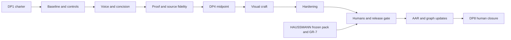

# Campaign architecture

[I] This architecture absorbs VITRINE's prospective craft/docs scope while preserving its records and HAUSSMANN's human endgame. It keeps Agentic DNA, puts the concrete mechanism before the shared-heritage explanation, and gives democratic participation an evidence-bearing place after the first useful example.

## Order law and decade framing

Positioning ADR-048 stays resolved and IA ADR-049 stays capped. Voice/concision precedes proof/fidelity; both precede high-fidelity visual changes. P0–P2 are **Decade 1, scope approved at DP1 and budgets committed phase by phase**. P3–P6 are **Decade 2, architecture provisional until DP4 and budgets committed phase by phase**. Decade describes the governance wave, not an invented mission count. P2 documentation tranches are already assigned before budget commitment; new routes require an explicit scope/budget delta. No sequencing exception is proposed.

## Phases and missions

### P0 — Baseline and instruments

| Mission | Title | Sessions | Tier | Deps |
|---|---|---:|---|---|
| [[mission_garnier_p0_1_baseline]] | Freeze baseline and reconcile authority | 2 | opus / codex | DP1 |
| [[mission_garnier_p0_2_instruments]] | Calibrate the added instruments | 1 | opus / codex | mission_garnier_p0_1_baseline |

**⛩ DP2 exit:** Pinned target/exemplar baseline; two isolated v1.1 scorers; added instruments have passing/failing controls; P1 budget presented for operator commitment. Named artifact: `artifacts/p0/phase_exit.md`. Estimated agent sittings: 3; budget: 123 kT (committed at DP1). P0 completed; DP2 accepted with six amendments on 2026-09-15.

### P1 — Voice and concision

| Mission | Title | Sessions | Tier | Deps |
|---|---|---:|---|---|
| [[mission_garnier_p1_1_homepage_voice]] | Make the homepage demonstrate the mechanism | 1 | opus / codex | mission_garnier_p0_2_instruments |
| [[mission_garnier_p1_2_quickstart_voice]] | Bring the first task into focus | 1 | opus / codex | mission_garnier_p1_1_homepage_voice |
| [[mission_garnier_p1_3_mission_voice]] | Make the public-good invitation concise | 1 | opus / codex | mission_garnier_p1_2_quickstart_voice |

**⛩ DP3 exit:** Four-part homepage storyboard and all seven surface word-target dispositions complete; unsupported claims and banned prose zero; formative human feedback recorded for all three decisive classes; P2 tranche scope/budget presented. Named artifact: `artifacts/p1/phase_exit.md`. Estimated agent sittings: 3; budget: 320 kT (committed at DP2; original 186 kT preserved). P1 is authorized and queued.

### P2 — Proof, fidelity and midpoint

| Mission | Title | Sessions | Tier | Deps |
|---|---|---:|---|---|
| [[mission_garnier_p2_1_proof_lineage]] | Show a reproducible example and its lineage | 1 | opus / codex | mission_garnier_p1_3_mission_voice |
| [[mission_garnier_p2_2_source_fidelity]] | Reconcile glossary and community publishing ownership | 1 | opus / codex | mission_garnier_p2_1_proof_lineage |
| [[mission_garnier_p2_3_docs_review]] | Review the remaining documentation by risk | 1 | opus / codex | mission_garnier_p2_2_source_fidelity |
| [[mission_garnier_p2_3_t01_docs_review]] | Review documentation tranche T01 | 1 | opus / codex | mission_garnier_p2_3_docs_review |
| [[mission_garnier_p2_3_t02_docs_review]] | Review documentation tranche T02 | 1 | opus / codex | mission_garnier_p2_3_t01_docs_review |
| [[mission_garnier_p2_3_t03_docs_review]] | Review documentation tranche T03 | 1 | opus / codex | mission_garnier_p2_3_t02_docs_review |
| [[mission_garnier_p2_3_t04_docs_review]] | Review documentation tranche T04 | 1 | opus / codex | mission_garnier_p2_3_t03_docs_review |
| [[mission_garnier_p2_3_t05_docs_review]] | Review documentation tranche T05 | 1 | opus / codex | mission_garnier_p2_3_t04_docs_review |
| [[mission_garnier_p2_3_t06_docs_review]] | Review documentation tranche T06 | 1 | opus / codex | mission_garnier_p2_3_t05_docs_review |
| [[mission_garnier_p2_3_t07_docs_review]] | Review documentation tranche T07 | 1 | opus / codex | mission_garnier_p2_3_t06_docs_review |
| [[mission_garnier_p2_3_t08_docs_review]] | Review documentation tranche T08 | 1 | opus / codex | mission_garnier_p2_3_t07_docs_review |
| [[mission_garnier_p2_3_t09_docs_review]] | Review documentation tranche T09 | 1 | opus / codex | mission_garnier_p2_3_t08_docs_review |
| [[mission_garnier_p2_3_t10_docs_review]] | Review documentation tranche T10 | 1 | opus / codex | mission_garnier_p2_3_t09_docs_review |
| [[mission_garnier_p2_3_t11_docs_review]] | Review documentation tranche T11 | 1 | opus / codex | mission_garnier_p2_3_t10_docs_review |
| [[mission_garnier_p2_3_t12_docs_review]] | Review documentation tranche T12 | 1 | opus / codex | mission_garnier_p2_3_t11_docs_review |
| [[mission_garnier_p2_4_trust_surfaces]] | Bring current state and governance beside the invitation | 1 | opus / codex | mission_garnier_p2_3_t12_docs_review |
| [[mission_garnier_p2_5_midpoint]] | Measure Decade 1 and ratify the craft wave | 2 | opus / codex | mission_garnier_p2_4_trust_surfaces |

**⛩ DP4 exit:** Every documentation tranche actually reviewed and corrections verified; no inventory-only completion; source-fidelity and proof records complete; two-scorer midpoint pack; Decade 2 replanned and P3 budget presented. Named artifact: `artifacts/p2/phase_exit.md`. Estimated agent sittings: 18; budget: 991 kT (provisional until DP3). Missions remain queued.

### P3 — Visual craft

| Mission | Title | Sessions | Tier | Deps |
|---|---|---:|---|---|
| [[mission_garnier_p3_1_design_system]] | Enforce the evolved visual system | 1 | opus / codex | mission_garnier_p2_5_midpoint |
| [[mission_garnier_p3_2_hero_slots]] | Craft the hero and illustration slots | 2 | opus / codex | mission_garnier_p3_1_design_system |
| [[mission_garnier_p3_3_diagram_code]] | Unify diagrams and code treatment | 2 | opus / codex | mission_garnier_p3_2_hero_slots |
| [[mission_garnier_p3_4_motion_social]] | Finish motion, states and social previews | 1 | opus / codex | mission_garnier_p3_3_diagram_code |

**⛩ DP5 exit:** Five-slot program verified; touched templates captured in both themes across the canonical matrix; text/keyboard equivalence and no unapproved token drift; P4 budget presented. Named artifact: `artifacts/p3/phase_exit.md`. Estimated agent sittings: 6; budget: 290 kT (provisional until DP4). Missions remain queued.

### P4 — Hardening

| Mission | Title | Sessions | Tier | Deps |
|---|---|---:|---|---|
| [[mission_garnier_p4_1_performance]] | Harden performance and field measurement | 2 | sonnet / codex | mission_garnier_p3_4_motion_social |
| [[mission_garnier_p4_2_accessibility]] | Verify accessibility beyond automation | 2 | opus / codex | mission_garnier_p4_1_performance |
| [[mission_garnier_p4_3_regression]] | Refresh regression and machine evidence | 1 | sonnet / codex | mission_garnier_p4_2_accessibility |

**⛩ DP6 exit:** Full injected gates, markup and pinned visual container pass; no new skips/xfails; automated/manual AA evidence complete; lab and field dispositions separate under the accepted exception policy; P5 budget presented. Named artifact: `artifacts/p4/phase_exit.md`. Estimated agent sittings: 5; budget: 218 kT (provisional until DP5). Missions remain queued.

### P5 — Humans, rescore and launch gate

| Mission | Title | Sessions | Tier | Deps |
|---|---|---:|---|---|
| [[mission_garnier_p5_1_human_panel]] | Run the decisive and standing reader panels | 2 | opus / codex | mission_garnier_p4_3_regression |
| [[mission_garnier_p5_2_rescore]] | Rescore and prepare the integration handoff | 2 | opus / codex | mission_garnier_p5_1_human_panel |
| [[mission_garnier_p5_3_publication]] | Present the public-launch decision | 1 | opus / codex | mission_garnier_p5_2_rescore |

**⛩ DP7 exit:** At least five cold humans per decisive class and ≥80% passing in each window under the sealed rubric; standing readers preserved; full v1.1 rescore and predecessor integration boundaries satisfied; publication remains separately authorized; P6 budget presented. Named artifact: `artifacts/p5/phase_exit.md`. Estimated agent sittings: 5; budget: 199 kT (provisional until DP6). Missions remain queued.

### P6 — AAR and graph-update closure

| Mission | Title | Sessions | Tier | Deps |
|---|---|---:|---|---|
| [[mission_garnier_p6_1_campaign_aar]] | Write the full campaign AAR | 1 | opus / codex | mission_garnier_p5_3_publication |
| [[mission_garnier_p6_2_decadal_aar]] | Run the decadal reviewer and adopter pass | 2 | opus / codex | mission_garnier_p6_1_campaign_aar |
| [[mission_garnier_p6_3_graduation]] | Graduate reusable context | 1 | opus / codex | mission_garnier_p6_2_decadal_aar |
| [[mission_garnier_p6_4_graph_updates]] | Prepare the graph-update wave | 1 | sonnet / codex | mission_garnier_p6_3_graduation |
| [[mission_garnier_p6_5_followup]] | Scope follow-up and review cadence | 1 | sonnet / codex | mission_garnier_p6_4_graph_updates |
| [[mission_garnier_p6_6_close]] | Ratify closure and file the close splash | 1 | opus / codex | mission_garnier_p6_5_followup |

**⛩ DP8 exit:** All AARs, sixteen-lens review, context graduation, graph-update dispositions and review cadence complete; operator signs closure. Named artifact: `artifacts/p6/phase_exit.md`. Estimated agent sittings: 7; budget: 303 kT (provisional until DP7). Missions remain queued.

## Measurement and success

VITRUVIUS v1.1 remains the instrument of record; consume the predecessor instrument without forking it. P0.1, P2.5 and P5.2 use two isolated scorers and the same fixed Nous/Mastra exemplars, full dimension/anchor breakdowns, evidence ceilings and disagreement records. Historical v1.0 scores remain labeled historical; no current baseline is invented by the amendment.

[I] North-star: improve D1, D5 and D6 by at least one supported anchor rung where below four at P0, otherwise preserve them; D7 must not regress. Report all dimensions. Zero false/unsupported claims, zero unadjudicated S1/S2 defects, zero protected-invariant regressions, nav ≤7, zero internal 404s, complete axe matrix with zero violations and manual WCAG 2.2 AA flows remain launch requirements. The canonical adopter capstone target remains ≥4.95, with parallel reviewer dimensions separate.

[D] Approved D-6 uses [[reader_protocol]]: fresh-context synthetic prescreens, early formative humans before visual production, sealed answer keys and ≥80% passing per class in each window among at least five final cold readers per class. Timing/cohort limits and retests are explicit; synthetic work never satisfies a human criterion.

[D] Approved D-10 makes [[word_budgets]] advisory editorial targets. Record overage reasons and preserve meaning, prerequisites, consent and accessible explanation. Unsupported claims and banned prose remain blocking. The added instrument contract versions populations and exclusions, demonstrates passing/failing controls, and reports type/adjective diagnostics separately from VITRUVIUS.

[D] [[field_performance_policy]] owns the accepted insufficient-data exception: passing lab budgets, verified collector receipt, explicit unmeasured metrics and a launch+30-day review followed monthly until sufficient data. Collection-unverified and measured field failure remain blocking. P5.3 records the exact exception in its separate publication gate; missing data is never green. Provider bars are consumed from their pinned owner file, never transcribed.

## Risk register

| Risk | Severity | Mitigation |
|---|---|---|
| HAUSSMANN P5.2 measurement contamination | High | Freeze source/evidence identity; no GARNIER publication before frozen pack without explicit amended boundary |
| Craft regresses D5×D11 | High | Capture and manual a11y in the same increment; text equivalents, no smaller body text to satisfy word budgets |
| Imagery implies real operations | High | Abstract-only generated assets, five slots, provenance and alt; no synthetic endorsements |
| H1/G4 and counsel | High | Preserve holds; inspect exact candidate clearance before publication |
| Hestia/Vitruvius peer collisions | High | No registry edits or provider forks; stage owned requests |
| Codex/Claude simultaneous writers | High | Active file lease, explicit scope and pre-write recheck |
| Score theatre | High | Clause evidence, two isolated scorers, cohort controls, human denominators and ceiling statements |
| Source mirror drift | High | Source→transform→HTML/twin family controls, complete disposition ledger |
| Unavailable field/human instruments | High | Human tasks remain owed; field exception requires the accepted collection/lab/follow-up conditions |
| Mission exceeds one window | Medium | 23 kT transition plus bounded work; re-scope above 80 kT before claiming full coverage |

## Budgets and tiers

[D] Actual amended mission files derive 38 missions, 47 estimated agent sittings and 2,444 kT content-load. Calibration remains unmeasured; the original 1,637 kT arithmetic is historical. [[budget_basis]] owns objective allowances, uncertainty, tier choices and per-phase commitments. P0 retains its initial 123 kT envelope; P1 is committed at 320 kT under [[dp2_ratification_20260915]]; P2 and later phase budgets are provisional.

## Evidence and gate growth

Store each mission's artifacts under `artifacts/pN/`, machine output and captures under `evidence/pN/`; retain source hash, live identity, tool pin, timestamp, scope and controls. Raw bulky captures are ignored by an explicit rule when the phase creates them; cited captures and summaries are committed. Gate growth follows observed regression classes: copy/twin fidelity, source transforms, matrix coverage, component exceptions, clipboard failures and motion states. Every added detector and its red-test land in the same commit, early in the mission, never at session tail.

## Method × acceptance review

[I] Every amended mission has specific input/output surfaces, existing command recipes or explicit manual protocols, distinct failing controls and all nine criterion/method feasibility pairs. This is authoring-time method review, not executed acceptance. [[docs_review_scope]] fixes the full tranche population before budget commitment; all tranche reviews must complete before DP4. Word overage warns, unsupported claims fail, and human/field unknowns remain explicit.

## What this protects

- Claims remain at or below their evidence; zero false or unsupported public claims is a launch requirement, not a freshly established present fact.
- Preserve state-of-the-network, canonical properties, consent-qualified people, and disclosed agent authorship.
- Preserve nav ≤7, lowercase canonical URLs, redirects, and zero internal 404s.
- Preserve curated llms.txt, Markdown twins and negotiation, registry JSON, JSON-LD, MCP, and explicit self-conformance boundaries.
- Preserve both themes, dual-theme code, responsive/reflow behavior, keyboard access, automated and manual accessibility evidence, and production header controls.
- Preserve honest-empty community/proposal states, AEP-1/2, registry admission and lifecycle tiers, and the human-only community boundary.
- Preserve site voice, one-new-term discipline, same-diff gates, derived fixtures, alias ancestry protection, and publication controls.
- Preserve HAUSSMANN P5.1/P5.2 and GR-7 ownership, H1/G4 and counsel holds, pt19, and the single-writer lease.

## P6 output wave

P6.1 full and lightweight campaign AAR with instrument drift and estimate/actual units; P6.2 decadal AAR with all sixteen reviewer lenses and canonical adopter/parallel scorecards; P6.3 context graduation; P6.4 graph-update ledger and staged memos; P6.5 follow-up/cadence; P6.6 close splash and operator closure. See [[graph_update_plan]]. These missions are mandatory even if publication is deferred.

Related: [[campaign_garnier]] · [[mission_garnier_genesis]].

[D] DP2 adds the six clauses in [[dp2_ratification_20260915]]: visible homepage output first, accessible AI DNA/public-good explanation, exact privacy and mobile-diagram owners, gate-adoption failure controls, bounded workload reviews and formative humans before DP3. The original DP1 forecast was 2,310 kT; the current sum reflects only the approved P1 reforecast.
