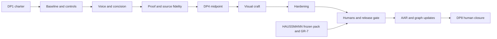

# Campaign architecture

[I] This architecture absorbs VITRINE's prospective craft/docs scope while preserving its records and HAUSSMANN's human endgame. It keeps Agentic DNA, puts the concrete mechanism before the shared-heritage explanation, and gives democratic participation an evidence-bearing place after the first useful example.

## Order law and decade framing

Positioning ADR-048 stays resolved and IA ADR-049 stays capped. Voice/concision precedes proof/fidelity; both precede high-fidelity visual changes. P0–P2 are **Decade 1, committed only at DP1**. P3–P6 are **Decade 2, provisional until DP4**. Decade describes the governance wave, not an invented mission count. P2.5's midpoint gate can add narrowly scoped tranches rather than pretending a large corpus fits one window. No sequencing exception is proposed.

## Phases and missions

### P0 — Baseline and instruments

| Mission | Title | Sessions | Tier | Deps |
|---|---|---:|---|---|
| [[mission_garnier_p0_1_baseline]] | Freeze baseline and reconcile authority | 1 | opus / codex | DP1 |
| [[mission_garnier_p0_2_instruments]] | Calibrate the added instruments | 1 | opus / codex | mission_garnier_p0_1_baseline |

**⛩ DP2 exit:** Pinned baseline, two isolated v1.1 scorers and two cohort exemplars; every added instrument has a failing and passing control. Named artifact: `artifacts/p0/phase_exit.md`. Proposed sessions: 2; budget: 123 kT. All missions queued.

### P1 — Voice and concision

| Mission | Title | Sessions | Tier | Deps |
|---|---|---:|---|---|
| [[mission_garnier_p1_1_homepage_voice]] | Make the homepage demonstrate the mechanism | 1 | opus / codex | mission_garnier_p0_2_instruments |
| [[mission_garnier_p1_2_quickstart_voice]] | Bring the first task into focus | 1 | opus / codex | mission_garnier_p1_1_homepage_voice |
| [[mission_garnier_p1_3_mission_voice]] | Make the public-good invitation concise | 1 | opus / codex | mission_garnier_p1_2_quickstart_voice |

**⛩ DP3 exit:** All seven proposed surface budgets adjudicated; zero unsupported claims and banned prose hits; unchanged prerequisite, consent and ownership meaning. Named artifact: `artifacts/p1/phase_exit.md`. Proposed sessions: 3; budget: 189 kT. All missions queued.

### P2 — Proof, fidelity and midpoint

| Mission | Title | Sessions | Tier | Deps |
|---|---|---:|---|---|
| [[mission_garnier_p2_1_proof_lineage]] | Show a reproducible example and its lineage | 1 | opus / codex | mission_garnier_p1_3_mission_voice |
| [[mission_garnier_p2_2_source_fidelity]] | Reconcile glossary and community publishing ownership | 1 | opus / codex | mission_garnier_p2_1_proof_lineage |
| [[mission_garnier_p2_3_docs_review]] | Review the remaining documentation by risk | 1 | opus / codex | mission_garnier_p2_2_source_fidelity |
| [[mission_garnier_p2_4_trust_surfaces]] | Bring current state and governance beside the invitation | 1 | opus / codex | mission_garnier_p2_3_docs_review |
| [[mission_garnier_p2_5_midpoint]] | Measure Decade 1 and ratify the craft wave | 1 | opus / codex | mission_garnier_p2_4_trust_surfaces |

**⛩ DP4 exit:** Every source-family row and docs route has a reviewed disposition; worked example reproduces; midpoint two-scorer pack complete; Decade 2 explicitly replanned. Named artifact: `artifacts/p2/phase_exit.md`. Proposed sessions: 5; budget: 336 kT. All missions queued.

### P3 — Visual craft

| Mission | Title | Sessions | Tier | Deps |
|---|---|---:|---|---|
| [[mission_garnier_p3_1_design_system]] | Enforce the evolved visual system | 1 | opus / codex | mission_garnier_p2_5_midpoint |
| [[mission_garnier_p3_2_hero_slots]] | Craft the hero and illustration slots | 1 | opus / codex | mission_garnier_p3_1_design_system |
| [[mission_garnier_p3_3_diagram_code]] | Unify diagrams and code treatment | 1 | opus / codex | mission_garnier_p3_2_hero_slots |
| [[mission_garnier_p3_4_motion_social]] | Finish motion, states and social previews | 1 | opus / codex | mission_garnier_p3_3_diagram_code |

**⛩ DP5 exit:** Five-slot visual program validated; all touched templates captured in 12 viewport/theme combinations; diagrams have equivalent text/keyboard access; no unapproved token drift. Named artifact: `artifacts/p3/phase_exit.md`. Proposed sessions: 4; budget: 271 kT. All missions queued.

### P4 — Hardening

| Mission | Title | Sessions | Tier | Deps |
|---|---|---:|---|---|
| [[mission_garnier_p4_1_performance]] | Harden performance and field measurement | 1 | opus / codex | mission_garnier_p3_4_motion_social |
| [[mission_garnier_p4_2_accessibility]] | Verify accessibility beyond automation | 1 | opus / codex | mission_garnier_p4_1_performance |
| [[mission_garnier_p4_3_regression]] | Refresh regression and machine evidence | 1 | opus / codex | mission_garnier_p4_2_accessibility |

**⛩ DP6 exit:** Safe build plus injected full gates and pinned visual container pass; no new skips/xfails; automated and manual AA evidence complete; lab and field performance are separately dispositioned. Named artifact: `artifacts/p4/phase_exit.md`. Proposed sessions: 3; budget: 203 kT. All missions queued.

### P5 — Humans, rescore and launch gate

| Mission | Title | Sessions | Tier | Deps |
|---|---|---:|---|---|
| [[mission_garnier_p5_1_human_panel]] | Run the decisive and standing reader panels | 1 | opus / codex | mission_garnier_p4_3_regression |
| [[mission_garnier_p5_2_rescore]] | Rescore and prepare the integration handoff | 1 | opus / codex | mission_garnier_p5_1_human_panel |
| [[mission_garnier_p5_3_publication]] | Present the public-launch decision | 1 | opus / codex | mission_garnier_p5_2_rescore |

**⛩ DP7 exit:** At least five humans per decisive class with ≥80% correct in each window; standing readers do not regress; full clause-level v1.1 rescore; HAUSSMANN evidence and GR-7 boundary satisfied; publication separately authorized. Named artifact: `artifacts/p5/phase_exit.md`. Proposed sessions: 3; budget: 179 kT. All missions queued.

### P6 — AAR and graph-update closure

| Mission | Title | Sessions | Tier | Deps |
|---|---|---:|---|---|
| [[mission_garnier_p6_1_campaign_aar]] | Write the full campaign AAR | 1 | opus / codex | mission_garnier_p5_3_publication |
| [[mission_garnier_p6_2_decadal_aar]] | Run the decadal reviewer and adopter pass | 1 | opus / codex | mission_garnier_p6_1_campaign_aar |
| [[mission_garnier_p6_3_graduation]] | Graduate reusable context | 1 | opus / codex | mission_garnier_p6_2_decadal_aar |
| [[mission_garnier_p6_4_graph_updates]] | Prepare the graph-update wave | 1 | opus / codex | mission_garnier_p6_3_graduation |
| [[mission_garnier_p6_5_followup]] | Scope follow-up and review cadence | 1 | opus / codex | mission_garnier_p6_4_graph_updates |
| [[mission_garnier_p6_6_close]] | Ratify closure and file the close splash | 1 | opus / codex | mission_garnier_p6_5_followup |

**⛩ DP8 exit:** All mission AARs, full campaign AAR, 16-lens pass, context graduation and every graph-update row accounted for; cadence and follow-ups assigned; operator signs closure. Named artifact: `artifacts/p6/phase_exit.md`. Proposed sessions: 6; budget: 336 kT. All missions queued.

## Measurement and success

VITRUVIUS v1.1 remains the instrument of record, consumed from HAUSSMANN, not forked. P0.1, P2.5 and P5.2 each use two isolated scorers, one same-archetype and one adjacent fixed-cohort exemplar, full dimensional breakdown, clause failures and evidence ceilings. v1.0 history is in [[instrument_boundary]]; no v1.1 baseline is fabricated in genesis.

[I] Proposed north-star: improve D1, D5 and D6 by at least one supported anchor rung versus P0 where below four, otherwise preserve them; D7 must not regress and every available proof clause must be evidenced without inventing adoption. Show D1/D5/D6/D7 alongside all other dimensions. Require zero S1/S2 findings at launch unless explicitly adjudicated as unconfirmed or an amended gate; zero false/unsupported claims; no protected-invariant regressions; nav ≤7; zero internal 404s; axe zero on the declared matrix; WCAG 2.2 AA manual flows. Human decisive-panel threshold is ≥80% in each window in each of three classes with ≥5 humans each. The canonical adopter capstone target is ≥4.95; parallel reviewer scores are reported separately.

[I] Additional bars are owned by [[word_budgets]] and P0.2's versioned `instrument_contract.md`: eight-term prose census zero, one-new-term doctrine intact, no unexplained token/component drift in a declared population, and every matrix row present. Controls must reject planted words, overflow, missing routes, wrong themes and token bypasses. Treat adjectives-per-claim and type-role counts as experimental diagnostics until their method is ratified; never move the VITRUVIUS score by adding their totals.

[R] Field CWV is p75 LCP/INP/CLS, not a Lighthouse score ([Web Vitals](https://web.dev/articles/vitals)); [R] manual accessibility checks use [WCAG 2.2](https://www.w3.org/TR/WCAG22/). Require green field p75 mobile when sufficient observations exist; absence of sufficient field data is an unresolved launch criterion, not permission to call lab data user experience. Provider lab bars are read directly from WebForge's `what/lib/gates/lighthouse_profiles.json` at run time, hash pinned in the manifest, never copied into this charter.
## Risk register

| Risk | Severity | Mitigation |
|---|---|---|
| HAUSSMANN P5.2 measurement contamination | High | Freeze source/evidence identity; no GARNIER publication before frozen pack without explicit amended boundary |
| Craft regresses D5×D11 | High | Capture and manual a11y in the same increment; text equivalents, no smaller body text to satisfy word budgets |
| Imagery implies real operations | High | Abstract-only generated assets, five slots, provenance and alt; no synthetic endorsements |
| H1/G4 and counsel | High | Preserve holds; inspect exact candidate clearance before publication |
| Hestia/Vitruvius peer collisions | High | No registry edits or provider forks; stage owned requests |
| Codex/Claude simultaneous writers | High | Active file lease, explicit scope and pre-write recheck |
| Score theatre | High | Clause evidence, two isolated scorers, cohort controls, human denominators and ceiling statements |
| Source mirror drift | High | Source→transform→HTML/twin family controls, complete disposition ledger |
| Unavailable field/human instruments | High | Report unmeasured; retain launch gate; a relaxed bar requires a recorded amendment |
| Mission exceeds one window | Medium | 23 kT transition plus bounded work; re-scope above 80 kT before claiming full coverage |

## Budgets and tiers

[D] Derived from the authored mission frontmatters: **26 missions, 26 estimated sessions, 26 calibrated sessions, 1637 kT content-load**. Every budget is 23 kT transition plus a bounded work estimate; no runtime billing forecast is implied. The derivation script is `evidence/genesis/derive_campaign.py`; run it from the vault root. Genesis is separate from this envelope. One long actual genesis sitting has crossed context boundaries; it is not represented as eight completed human sessions.

## Evidence and gate growth

Store each mission's artifacts under `artifacts/pN/`, machine output and captures under `evidence/pN/`; retain source hash, live identity, tool pin, timestamp, scope and controls. Raw bulky captures are ignored by an explicit rule when the phase creates them; cited captures and summaries are committed. Gate growth follows observed regression classes: copy/twin fidelity, source transforms, matrix coverage, component exceptions, clipboard failures and motion states. Every added detector and its red-test land in the same commit, early in the mission, never at session tail.

## Method × acceptance review

[D] Every mission lists all nine V1/V2/V3 × C1/C2/C3 pair judgments. Artifact inspection proves completeness, reached-surface evidence proves behavior, and actual diff/gate/AAR inspection proves scope. None alone proves the other two. The corpus mission explicitly forbids calling uninspected pages reviewed; it must split at its budget boundary. A public-launch mission prepares a decision, not an unauthorized deployment.

## What this protects

- Claims remain at or below their evidence; zero false or unsupported public claims is a launch requirement, not a freshly established present fact.
- Preserve state-of-the-network, canonical properties, consent-qualified people, and disclosed agent authorship.
- Preserve nav ≤7, lowercase canonical URLs, redirects, and zero internal 404s.
- Preserve curated llms.txt, Markdown twins and negotiation, registry JSON, JSON-LD, MCP, and explicit self-conformance boundaries.
- Preserve both themes, dual-theme code, responsive/reflow behavior, keyboard access, automated and manual accessibility evidence, and production header controls.
- Preserve honest-empty community/proposal states, AEP-1/2, registry admission and lifecycle tiers, and the human-only community boundary.
- Preserve site voice, one-new-term discipline, same-diff gates, derived fixtures, alias ancestry protection, and publication controls.
- Preserve HAUSSMANN P5.1/P5.2 and GR-7 ownership, H1/G4 and counsel holds, pt19, and the single-writer lease.

## P6 output wave

P6.1 full and lightweight campaign AAR with instrument drift and estimate/actual units; P6.2 decadal AAR with all sixteen reviewer lenses and canonical adopter/parallel scorecards; P6.3 context graduation; P6.4 graph-update ledger and staged memos; P6.5 follow-up/cadence; P6.6 close splash and operator closure. See [[graph_update_plan]]. These missions are mandatory even if publication is deferred.

Related: [[campaign_garnier]] · [[mission_garnier_genesis]].
