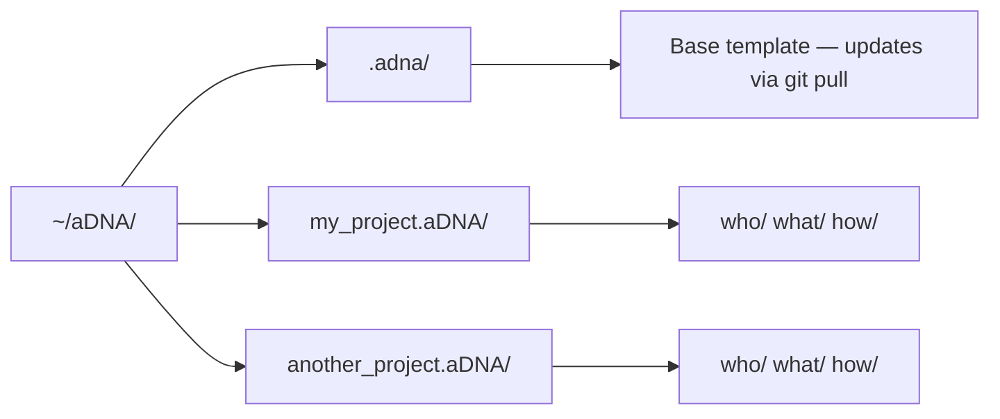
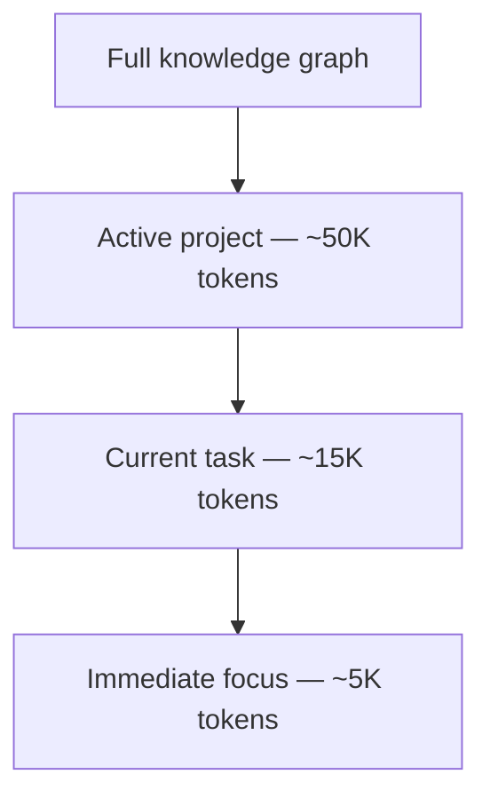

> [!NOTE]
> **This directory is the aDNA standard tree, embedded in [`aDNA-Network/aDNA`](https://github.com/aDNA-Network/aDNA) — the clone-and-run workspace image.** It updates with the workspace (`git pull` at the workspace root); do not modify it directly (Standing Rule 1). The standard is developed in the private `aDNA.aDNA` vault and released here at gate cadence via `skill_template_release`.

<p align="center">
  
</p>

# aDNA — Agentic DNA

[](https://github.com/aDNA-Network/aDNA/releases/tag/v8.7) [](https://github.com/aDNA-Network/aDNA/blob/main/.adna/what/docs/adna_standard.md) [](https://adna.network)

[](LICENSE)
[](https://obsidian.md)
[](https://docs.anthropic.com/en/docs/claude-code)
[](CONTRIBUTING.md)
[](https://python.org)

**An open-source project template where AI agents and humans share the same map.**

Most knowledge systems weren't designed with AI agents in mind. aDNA is.

- **One structure, two audiences.** Three directories (`who/`, `what/`, `how/`) organize any project so both AI agents and humans can navigate it.
- **Context narrows automatically.** As your knowledge grows, agents load only what the current task needs — not everything you've ever written.
- **Plain Markdown, no lock-in.** Folders, Markdown files, and a handful of conventions. Works with any editor, any AI agent, any version control.
- **Conversational onboarding.** Clone the repo, run `claude`, and the AI builds a project structure tailored to your domain.

*A lattice is a graph of graphs — every project you create becomes a node in a growing graph of structured knowledge. This repo is the seed.*

**On this page:** [Getting Started](#getting-started) · [What Is aDNA?](#what-is-adna) · [How It Works](#how-it-works) · [What's Inside .adna/?](#whats-inside-adna) · [Who Is This For?](#who-is-this-for) · [How aDNA Compares](#how-adna-compares) · [Learn More](#learn-more) · [License](#license)

*New here? Read top-to-bottom — the page runs orient → get started → understand → compare → go deeper. Just want to run it? Jump to [Getting Started](#getting-started).*

---

## Getting Started

**Prerequisites:** [Git](https://git-scm.com) and [Claude Code](https://docs.anthropic.com/en/docs/claude-code) installed.

```bash
# Clone the workspace image, then start the AI — it handles the rest
git clone https://github.com/aDNA-Network/aDNA.git ~/aDNA && cd ~/aDNA && claude
```

Claude reads the workspace router (`~/aDNA/CLAUDE.md`) and walks you through creating your first project. Tell it about your domain — it builds the right structure for you.

> For a faster clone, add `--depth 1` — the latest workspace without full git history. `~/aDNA/` is the recommended root, but any path works (it's detected, never hardcoded).
>
> **Upgrading an older install?** Pre-v7.0 workspaces (the nested `adna/.adna/` layout) and the legacy `~/lattice/` root both keep working — migrate at your pace with the [v6→v7 guide](how/docs/upgrade_v6_to_v7.md) for the flatten, or [`skill_workspace_path_migration`](how/skills/skill_workspace_path_migration.md) for the root move.

---

## What Is aDNA?

**aDNA (Agentic DNA)** defines the structure inside each project. It organizes knowledge into three directories:

```
who/     →  Who is involved?                 (people, teams, organizations)
what/    →  What does this project know?     (knowledge, decisions, artifacts)
how/     →  How does this project work?      (processes, plans, operations)
```

Small config files (`AGENTS.md`) in each directory give AI agents instant orientation. Humans browse the same structure in [Obsidian](https://obsidian.md)'s graph view.

---

## How It Works

Your `~/aDNA/` directory looks like this:



The hidden `.adna/` directory is the base template — it holds the toolkit: templates, skills, context library, workflow tools, and Obsidian config.

When you create a project, Claude forks `.adna/` into a new `project_name.aDNA/` directory with its own git repo.

Run `git pull` in `~/aDNA/` anytime to update the template. Your projects are unaffected.

As you add projects, context narrows to what each task actually needs:



---

## What's Inside .adna/?

| Component | What it is |
|-----------|-----------|
| **Context library** | Curated domain knowledge across multiple topics (~75K tokens) |
| **Templates** | Session, mission, campaign, context, ADR, and more |
| **Agent skills** | Onboarding, project fork, quality audit, lattice publishing |
| **Workflow toolkit** | YAML definitions, Python validators, YAML↔Canvas converters, JSON Schema |
| **Obsidian config** | Theme, plugins, CSS snippets — runs `setup.sh` to install |
| **Full documentation** | Detailed README, aDNA standard, design docs, migration guides |

---

## Who Is This For?

aDNA works for any project that manages knowledge:

- **Researchers** — papers, datasets, experiments, collaborations
- **Founders** — investors, customers, product roadmap, fundraising
- **Creative professionals** — clients, projects, assets, revision cycles
- **Teams** — shared context, coordinated operations, persistent memory
- **Personal knowledge managers** — learning goals, reading notes, skills

Every domain is different — the conversational onboarding adapts the structure to yours.

---

## How aDNA Compares

| | aDNA | Notion | PARA | Johnny Decimal | Zettelkasten |
|---|---|---|---|---|---|
| **AI-native** | Built for agents | — | — | — | — |
| **Human-friendly** | Obsidian graph | Web app | Folders | Numbered folders | Links + backlinks |
| **Portable** | Markdown + Git | Proprietary | Methodology | Methodology | Methodology |
| **Context scales** | Narrows automatically | — | — | — | — |
| **Execution system** | Project → task → objective | Project views | Projects + Areas | Categories | — |

aDNA isn't a replacement for these systems — it's what happens when you need your knowledge architecture to work for AI agents *and* humans simultaneously.

---

## Learn More

**Start here → the [adna.network](https://adna.network) learning path** — the guided, dual-audience walkthrough (concepts → tutorials → patterns) for newcomers. This image ships the standard and the toolkit, not the tutorials; the learning path is on the web.

The full technical documentation lives inside `.adna/`:

- **[aDNA Standard](what/docs/adna_standard.md)** — formal specification
- **[Contributing](CONTRIBUTING.md)** — how to improve aDNA
- **[Changelog](CHANGELOG.md)** — version history

---

## License

[MIT](LICENSE) — use it for anything.

*Built by [Lattice Protocol](https://github.com/aDNA-Network). aDNA is domain-neutral — any project benefits.*
