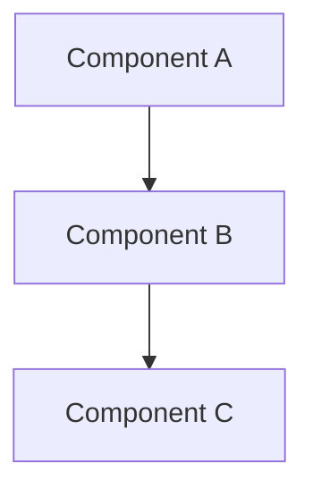

# RFC: <% tp.file.title %>

## Summary

[One paragraph describing the proposed design at a high level. What will be built, how, and why this approach.]

## Motivation

[Why this design is needed. Link back to the PRD problem statement. What happens if we don't do this?]

## Proposed Design

### Architecture



### Component Design

#### Component 1: [Name]

**Purpose**: [What this component does]

**Interface**:
```
[API, function signature, protocol, or contract]
```

**Behavior**: [How it works, key algorithms, state management]

#### Component 2: [Name]

**Purpose**: [What this component does]

**Interface**:
```
[API, function signature, protocol, or contract]
```

**Behavior**: [How it works]

### Data Flow

[How data moves through the system. Input -> processing -> output. State transitions.]

### Error Handling

[How errors are detected, reported, and recovered from.]

## Requirement Traceability

| Requirement ID | PRD Requirement | Design Element | Notes |
|---------------|-----------------|----------------|-------|
| REQ-{SLUG}-001 | [requirement text] | [component/section that satisfies it] | |
| REQ-{SLUG}-002 | | | |

## Alternatives Considered

### Alternative 1: [Name]

**Approach**: [Description]

**Pros**:
- [Advantage]

**Cons**:
- [Disadvantage]

**Why rejected**: [Rationale]

### Alternative 2: [Name]

**Approach**: [Description]

**Pros**:
- [Advantage]

**Cons**:
- [Disadvantage]

**Why rejected**: [Rationale]

## Migration / Rollout

### Rollout Plan

| Phase | Scope | Duration | Rollback Trigger |
|-------|-------|----------|-----------------|
| | | | |

### Migration Steps

1. [Step 1]
2. [Step 2]

### Rollback Plan

[How to revert if something goes wrong.]

## Security & Privacy

| Concern | Assessment | Mitigation |
|---------|-----------|------------|
| | Low / Medium / High risk | |
| | | |

[If no security implications, state "No security or privacy implications identified" with brief rationale.]

## Testing Strategy

### Unit Tests

- [What to test at the unit level]

### Integration Tests

- [What to test across components]

### Acceptance Tests

- [How to verify PRD requirements are met -- link back to acceptance criteria]

## Open Questions

- [ ] [Design question 1 -- options being considered]
- [ ] [Design question 2]

## Related

- **PRD**: [[prd_<project_slug>]]
- **Research**: [[how/pipelines/prd_rfc/01_research/]]
- **Plan**: [[how/missions/]]
