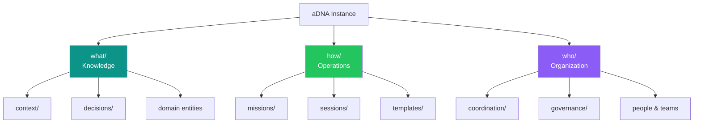

{/* GENERATED by scripts/split_specification.mjs from src/content/reference/specification.mdx.
    Do not edit by hand — edits are lost on the next run. Change the spec, then re-split. */}

> **Scan**: The `who/what/how` ontology, bare vs. embedded deployment forms, classification question test.

*Decisions: C1, C8*

## 3.1 The what/how/who Ontology

Every aDNA instance organizes knowledge into three categories:

| Layer | Question | Contains |
|-------|----------|----------|
| **what/** | WHAT does this project know? | Knowledge objects, context library, decisions, reference material, domain entities |
| **how/** | HOW does this project work? | Missions, sessions, templates, pipelines, tasks, skills, processes |
| **who/** | WHO is involved? | People, teams, coordination notes, governance policies, communications |

The triad is the universal ontology. Any piece of project knowledge belongs in exactly one of the three legs. When classifying content, apply the question test: "Is this about WHAT we know, HOW we work, or WHO is involved?"

**Classification examples**:

| Content | Question | Triad Leg |
|---------|----------|-----------|
| "How does ancient DNA extraction work?" | WHAT do we know? | `what/context/` |
| "Mission plan for Q2 deployment" | HOW do we work? | `how/missions/` |
| "Contact info for the partnership lead" | WHO is involved? | `who/contacts/` |

The triad is deliberately minimal. Three categories are sufficient because they map to the three dimensions of any project: its knowledge, its operations, and its people. Additional categories create sorting ambiguity.



## 3.2 Bare Triad

In a bare triad deployment, `what/`, `how/`, and `who/` sit as top-level directories at the project root. Governance files sit alongside them at root level.

**When to use**: Knowledge bases, standalone agent workspaces, and any project where aDNA IS the primary content.

```
{project_root}/
├── CLAUDE.md
├── MANIFEST.md
├── STATE.md
├── AGENTS.md
├── README.md
├── what/
├── how/
├── who/
└── {project_content}/
```

## 3.3 Embedded Triad

In an embedded triad deployment, the triad is wrapped inside `.agentic/` at the repository root. Governance files remain at the repository root (not inside `.agentic/`).

**When to use**: Any git-tracked codebase adding agent support. The `.agentic/` prefix follows the convention of dot-prefixed directories for meta/config in git repositories (like `.github/`, `.vscode/`).

```
{repo_root}/
├── CLAUDE.md
├── MANIFEST.md
├── STATE.md
├── AGENTS.md
├── README.md
├── .agentic/
│   ├── AGENTS.md
│   ├── what/
│   ├── how/
│   └── who/
└── {codebase}/
```

## 3.4 Deployment Form Selection

Both deployment forms are first-class. The triad ontology is identical in both — only the physical nesting differs. CLAUDE.md in each environment bridges any path differences.

An aDNA instance MUST use exactly one deployment form. A project MUST NOT mix bare and embedded triads.

## 3.5 Directory Convention

An aDNA project directory SHOULD use the `.aDNA` suffix to indicate it follows the Agentic DNA knowledge architecture standard. This suffix serves as a visual type marker, analogous to `.app` bundles in macOS or `.git` directories in version control.

**Naming rules:**

- The base template (the `aDNA` repository, embedded in a workspace at `.adna/`) MUST NOT use the `.aDNA` suffix — it is the source, not an instance. *(Per ADR-006 repo rename `Agentic-DNA`→`aDNA` + ADR-008 airlock embedding at `.adna/`.)*
- Forked projects SHOULD use the pattern `ProjectName.aDNA/` (e.g., `zeta.aDNA/`, `my_research.aDNA/`).
- The project name portion MUST match `[a-z][a-z0-9_]{0,63}` — lowercase letters, digits, and underscores only, starting with a letter, maximum 64 characters.
- The suffix `.aDNA` uses mixed case (capital D, N, A) matching the abbreviation branding.
- Nesting `.aDNA` directories inside other `.aDNA` directories is NOT RECOMMENDED.
- Existing projects MAY adopt the convention by renaming their directory. This is optional.

**Discovery:**

Tools SHOULD discover aDNA projects via `*.aDNA` glob patterns:

```bash
# List aDNA projects in workspace
ls -d *.aDNA 2>/dev/null
find . -maxdepth 1 -name "*.aDNA" -type d
```

**Workspace convention:**

```
~/aDNA/
├── .adna/                 # Base template — the aDNA standard tree (hidden; source, not an instance)
├── my_research.aDNA/      # Forked project (aDNA instance)
├── zeta.aDNA/             # Another project
└── CLAUDE.md              # Workspace-level governance
```

---
