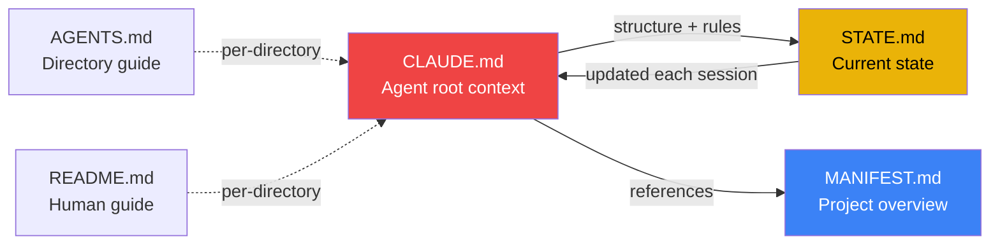

{/* GENERATED by scripts/split_specification.mjs from src/content/reference/specification.mdx.
    Do not edit by hand — edits are lost on the next run. Change the spec, then re-split. */}

> **Scan**: Five ALLCAPS files (CLAUDE, MANIFEST, STATE, AGENTS, README) — purpose, required contents, quickstart sequences, progressive enrichment.

*Decisions: C2, C3, D1, D2, D6, D19, D25*

Every aDNA instance MUST have governance files at the project root. These are the agent's primary orientation documents.

### 4.1 Governance File List

The following ALLCAPS files constitute the governance layer:

| File | Required | Purpose | Update Cadence |
|------|----------|---------|----------------|
| **CLAUDE.md** | MUST | Agent root context — persona, project map, safety rules, startup protocol | When structure or protocols change |
| **MANIFEST.md** | MUST | Static project overview — what the project is, architecture, entry points | When project scope or architecture changes |
| **STATE.md** | SHOULD | Dynamic operational state — current phase, blockers, recent decisions, next steps | Every session close-out |
| **AGENTS.md** | MUST | Root-level agent guide — directory purpose, key files, patterns | When directory structure changes |
| **README.md** | MUST | Root-level human guide — navigation, setup, how to browse | When onboarding experience changes |

### 4.2 CLAUDE.md — Agent Root Context

CLAUDE.md is the primary agent orientation document. It MUST exist at the project root in both deployment forms. It is auto-loaded by Claude Code and serves as the agent's first read on every session.

**Required sections**:

1. **Identity**: Project name, agent persona (if defined — see Appendix A), mission statement. The agent MUST know what project it is operating in and what role it plays.
2. **Project Map**: Directory structure diagram, key files table. The agent MUST be able to navigate the project from this section alone.
3. **Safety Rules**: Collision prevention tier (see §13), escalation protocol, data integrity rules. The agent MUST know what it can and cannot do.
4. **Agent Protocol**: Startup checklist, session tracking rules, closure requirements. The agent MUST know how to begin and end work.
5. **Quickstart**: A concise startup sequence for cold-start orientation. MUST enable a fresh agent to begin useful work within one session. Include both agent and human quickstarts:

   **Agent Quickstart** (5 steps):
   1. Read CLAUDE.md — understand project structure, safety rules, persona
   2. Read STATE.md — understand current phase, blockers, recent decisions
   3. Check `how/sessions/active/` — identify any conflicting sessions
   4. Check `who/coordination/` — read urgent cross-agent notes
   5. Create session file in `how/sessions/active/` and begin work

   **Human Quickstart** (4 steps):
   1. Read README.md — understand what this project is and how to navigate
   2. Read MANIFEST.md — understand architecture and entry points
   3. Browse the triad (`what/`, `how/`, `who/`) — explore the knowledge structure
   4. Open STATE.md — see current operational status and next steps

**Optional sections** (add when relevant):

- Domain Knowledge — project-specific context the agent needs
- Working with Content — naming, metadata, linking conventions
- Machine Setup — multi-machine path patterns and tool requirements
- Environment-Specific Rules — sync, IDE, CI/CD integration

**Versioning**: CLAUDE.md SHOULD include a version comment in its header: `<!-- vX.Y | YYYY-MM-DD -->`. Major version for structural changes, minor for significant updates. Session history serves as the detailed changelog.

**Persona framework**: When a persona is defined, it MUST include: identity (name, role metaphor, mission), operating style (3-5 behavioral principles), and communication norms (tone, greeting/close patterns). See Appendix A for the full framework and reference implementation.

### 4.3 MANIFEST.md — Project Overview

MANIFEST.md describes what the project IS. It changes infrequently — only when project scope, architecture, or major workstreams change.

**Contents**:
- Project identity and purpose
- Architecture overview
- Key entry points and navigation
- Active missions / major workstreams (stable references, not dynamic status)

### 4.4 STATE.md — Dynamic Operational State

STATE.md captures where the project IS RIGHT NOW. It SHOULD be updated on every session close-out. It MUST be updated when phase, blockers, or priorities change.

**Contents**:
- Current phase / milestone
- Recent decisions (last 3-5)
- Active blockers
- What's working well
- Next steps / recommended priorities

STATE.md enables fast cold-start orientation: a fresh agent reads CLAUDE.md (structure and rules) then STATE.md (current situation) and is ready to work.

### 4.5 AGENTS.md — Per-Directory Agent Guide

Every aDNA instance MUST have a root-level AGENTS.md (listed in §4.1). Beyond root, every directory where agents operate SHOULD have an AGENTS.md file. AGENTS.md is agent-facing: optimized for machine consumption with structured, scannable content.

**Lightweight core** (every AGENTS.md):
- Purpose — what this directory contains and why
- Key files — important files with brief descriptions
- Patterns — naming, structure, or workflow conventions specific to this directory

**Enrichment layers** (add as the directory matures):
- Quick reference table
- Modification guide — how to add or change content
- Dependencies — what this directory relies on
- Testing / validation notes
- Current state / recent changes
- Troubleshooting

AGENTS.md files grow through progressive enrichment: start lightweight, add detail when agents or humans repeatedly need information that is not yet documented.

### 4.6 README.md — Per-Directory Human Guide

README.md is human-facing: optimized for browsing in GitHub, an IDE, or a knowledge-base tool. It complements AGENTS.md by providing navigation context for humans.

Every aDNA instance MUST have a root README.md. Subdirectory README.md files are OPTIONAL — create them when human navigation would benefit.

---
