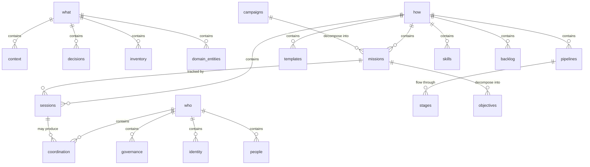

{/* GENERATED by scripts/split_specification.mjs from src/content/reference/specification.mdx.
    Do not edit by hand — edits are lost on the next run. Change the spec, then re-split. */}

> **Scan**: Required/recommended/optional subdirectories for each triad leg, registry pattern, ontology artifact, starter/standard/full skeletons.

*Decisions: C5, C6, C7, C11, C12, C14, C15*

### 5.1 what/ — Knowledge Layer

what/ contains everything the project KNOWS.

**Required subdirectories**:

| Directory | Purpose |
|-----------|---------|
| `context/` | Agent context library — synthesized knowledge agents load before domain work |

**Recommended subdirectories**:

| Directory | Purpose |
|-----------|---------|
| `decisions/` | Architecture Decision Records (ADRs) — significant decisions and their rationale |

**Optional subdirectories** (add based on project domain):

| Directory | Purpose |
|-----------|---------|
| `reference/` | Bounded exception for code-adjacent reference material (see §19.5) |
| `inventory/` | Installed/configured state — vaults, system, memberships. Base WHAT type since v2.3 (ADR-035); markdown + paired `.yaml` companion. |
| `{domain}/` | Project-specific knowledge: `models/`, `hardware/`, `datasets/`, `specs/`, etc. |

**Registry pattern**: what/ serves as a registry layer. Entries in what/ subfolders describe and link to objects — they do not duplicate source material. Example registry entry:

```yaml
# what/models/model_llama_3.md
---
type: model
status: active
source: "src/models/llama3/"    # link to implementation
tags: [model, llm, inference]
---
Brief description, capabilities, constraints. Links to source — does not duplicate code.
```

**Ontology artifact**: An aDNA instance SHOULD include `what/ontology.md` with a Mermaid ER diagram mapping entity types, triad categories, and relationships. Minimal skeleton:



Projects extend this skeleton with domain-specific entities (e.g., `customers`, `models`, `hardware`). Knowledge-base environments MAY additionally maintain `what/ontology.canvas` for interactive exploration.

### 5.2 who/ — Organization Layer

who/ contains everything about WHO is involved and WHY.

**Required subdirectories**:

| Directory | Purpose |
|-----------|---------|
| `coordination/` | Cross-agent notes — handoffs, urgency signals, ephemeral coordination |
| `governance/` | Team roles, decision authority, policies, escalation paths |

**Optional subdirectories** (add based on organizational needs):

| Directory | Purpose |
|-----------|---------|
| `identity/` | Stable identity records validated against external reality — node / network / deployment (hostname, operator, persistent UUID, peer-id). Base WHO type since v2.3 (ADR-035); markdown + paired `.yaml` companion. |
| `{domain}/` | Project-specific organization: `customers/`, `partners/`, `contacts/`, `communications/`, `roadmap/` |

### 5.3 how/ — Operations Layer

how/ contains everything about HOW the project works.

**Required subdirectories**:

| Directory | Purpose |
|-----------|---------|
| `missions/` | Missions — objective decomposition, dependencies, claiming protocol |
| `sessions/` | Session tracking — execution records with SITREP close-outs |
| `templates/` | Reusable templates for all aDNA file types |

**Recommended subdirectories**:

| Directory | Purpose |
|-----------|---------|
| `backlog/` | Ideation and improvement tracking (see §19.2) |

**Optional subdirectories**:

| Directory | Purpose |
|-----------|---------|
| `pipelines/` | Content-as-code workflows (see §14) |
| `tasks/` | Granular task tracking |
| `skills/` | Reusable agent procedures (see §19.3) |
| `processes/` | Human-readable workflow documentation |
| `deliverables/` | Output artifacts |
| `federation/` | Consumer federation wrappers — one `<wrapper>/` per federated software-element/service graph (v2.5, ADR-045) |

### 5.4 Universal Skeleton

The minimum viable aDNA instance. Graduated by project complexity:

**Starter Skeleton** (minimum for any aDNA project):

```
{root}/
├── CLAUDE.md
├── MANIFEST.md
├── README.md
├── what/
│   └── context/
├── how/
│   ├── missions/
│   ├── sessions/
│   └── templates/
└── who/
    ├── coordination/
    └── governance/
```

**Standard Skeleton** (active multi-agent projects — adds STATE.md, AGENTS.md, backlog):

```
{root}/
├── CLAUDE.md
├── MANIFEST.md
├── STATE.md
├── AGENTS.md
├── README.md
├── what/
│   ├── AGENTS.md
│   ├── context/
│   │   └── AGENTS.md
│   └── decisions/
├── how/
│   ├── AGENTS.md
│   ├── missions/
│   ├── sessions/
│   │   ├── active/
│   │   └── history/
│   ├── templates/
│   └── backlog/
└── who/
    ├── AGENTS.md
    ├── coordination/
    └── governance/
```

**Full Skeleton** (large projects — adds domain-specific directories):

Extends the Standard Skeleton with project-specific subdirectories in each triad leg. Examples: `what/models/`, `what/hardware/`, `who/customers/`, `how/pipelines/`, `how/skills/`.

For embedded triad deployments, the same skeletons apply inside `.agentic/`, with governance files remaining at the repository root.

### 5.5 Conformance Levels

The skeletons defined in §5.4 establish three normative **conformance levels**. A project claiming aDNA conformance MUST satisfy all MUST requirements at its declared level.

#### Level 1: Starter Conformance

An aDNA instance at Starter conformance MUST have:

1. **Governance files**: `CLAUDE.md`, `MANIFEST.md`, `README.md` at the root (bare) or repository root (embedded)
2. **Triad directories**: `what/`, `how/`, `who/` (bare) or `.agentic/what/`, `.agentic/how/`, `.agentic/who/` (embedded)
3. **Required subdirectories**: `what/context/`, `how/missions/`, `how/sessions/`, `how/templates/`, `who/coordination/`, `who/governance/`
4. **Frontmatter**: All content files inside the triad MUST include the base fields defined in §7.2, per its per-class profile (`type`, `status`, `created`, `updated`, `last_edited_by`, `tags`; `status` optional for `directory_index` + `coordination` — v2.5, ADR-044)

Starter conformance represents the minimum viable aDNA instance — sufficient for a single-agent project with basic session tracking.

**Conformance-walk scope** (v2.5, ADR-044): a conformance run validates the instance rooted at the directory being checked; it does NOT recurse into embedded standalone instances (in the reference vault: `what/docs/examples/` and `how/templates/template_node_adna_exemplar/`). Each embedded instance is validated standalone if desired.

#### Level 2: Standard Conformance

An aDNA instance at Standard conformance MUST satisfy all Starter requirements AND:

5. **Additional governance files**: `STATE.md` and a root `AGENTS.md`
6. **Per-directory AGENTS.md**: Every triad leg (`what/`, `how/`, `who/`) MUST have an `AGENTS.md` file
7. **Recommended directories**: `what/decisions/`, `how/backlog/`, `how/sessions/active/`, `how/sessions/history/`
8. **Session lifecycle**: Sessions MUST follow the lifecycle defined in §8 (creation → execution → close-out with SITREP)

Standard conformance represents an active multi-agent project with operational discipline.

#### Level 3: Full Conformance

An aDNA instance at Full conformance MUST satisfy all Standard requirements AND:

9. **Context library**: `what/context/` MUST contain at least one topic directory with its own `AGENTS.md` and at least one context file with `token_estimate` in frontmatter
10. **FAIR metadata**: Deployable objects (modules, datasets, lattices) MUST include a `fair:` frontmatter block with at minimum `keywords` and `license`
11. **Ontology artifact**: `what/ontology.md` MUST exist with a Mermaid ER diagram (per §5.1)
12. **Template compliance**: All content types used in the project MUST have corresponding templates in `how/templates/`

Full conformance represents a mature, federatable aDNA instance ready for cross-instance interoperation.

#### Conformance Declaration

Projects MAY declare their conformance level in `MANIFEST.md` using the `adna_conformance` frontmatter field:

```yaml
adna_conformance: starter  # or: standard, full
```

An instance that does not declare a conformance level is assumed to be unverified. The `adna_validate.py` tool (see `what/lattices/tools/`) can determine conformance level programmatically.

---
