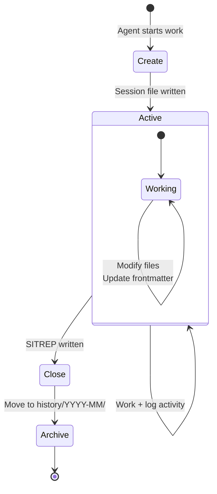

{/* GENERATED by scripts/split_specification.mjs from src/content/reference/specification.mdx.
    Do not edit by hand — edits are lost on the next run. Change the spec, then re-split. */}

> **Scan**: Bounded units of agent work — lifecycle (create → execute → close → archive), session tiers, SITREP close-out, next-session prompt, the 75% rule.

*Decisions: D3, D4, D5*

## 8.1 Session Lifecycle

A session is a bounded unit of agent work. Every session follows this lifecycle:

1. **Create**: Write a session file in `how/sessions/active/`
2. **Execute**: Perform work, logging activity
3. **Close**: Write SITREP + next-session prompt
4. **Archive**: Set `status: completed`, move to `how/sessions/history/YYYY-MM/`

A session file MUST be created before an agent modifies any other project files. This is the audit trail.



## 8.2 Session ID Format

Session IDs MUST use the timestamped format:

```
session_{user}_{YYYYMMDD}_{HHMMSS}_{descriptor}
```

Example: `session_{username}_20260211_120000_gap_analysis`

Timestamped IDs are machine-sortable, collision-free across agents, and self-documenting. The descriptor SHOULD be a brief lowercase-underscore slug describing the session's purpose.

## 8.3 Session Tiers

| Tier | When | Requirements |
|------|------|-------------|
| **Tier 1** (default) | Normal content work | Session file with intent, activity log, SITREP close-out |
| **Tier 2** | Shared config edits (governance files, plugin configs) | Tier 1 requirements + scope declaration + conflict scan + heartbeat |

Tier 1 is a lightweight audit trail. Tier 2 adds coordination safeguards for edits that affect shared infrastructure.

Sessions MAY include a **Technical Readiness Review (TRR)** quality gate before close-out — a structured check that deliverables meet acceptance criteria. TRR is particularly useful for code-generation sessions or sessions producing artifacts that downstream tasks depend on.

## 8.4 SITREP Close-Out

Every session MUST end with a SITREP:

```markdown
## SITREP

**Completed**: [what was finished]
**In progress**: [what was started but not finished, with handoff notes]
**Next up**: [recommended next actions]
**Blockers**: [anything preventing progress]
**Files touched**: [created, modified, moved]
```

## 8.5 Next-Session Prompt

Every session MUST include a next-session prompt after the SITREP:

```markdown
## Next Session Prompt

[Self-contained paragraph that a fresh agent can read to continue this work.
Include: what was accomplished, what remains, key context, recommended approach.]
```

The next-session prompt ensures continuity. A fresh agent reading this prompt and STATE.md SHOULD be able to continue the work without needing to read the full session history.

## 8.6 STATE.md Update

STATE.md SHOULD be updated on every session close. It MUST be updated when the current phase, blockers, or priorities change.

## 8.7 The 75% Rule

Agents MUST scope each session to use no more than approximately 75% of the context window. The remaining 25% is reserved for thinking, debugging, and course correction.

If a task requires more than 75% of the context window, the agent MUST split the work across sessions, checkpointing progress in the session close-out.

No other session sizing prescriptions are universal. Time, task count, and line-count guidelines are project-specific — different work paradigms (code generation, knowledge synthesis, CRM maintenance) have different natural session sizes.

---
