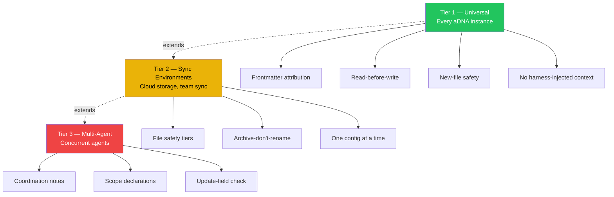

{/* GENERATED by scripts/split_specification.mjs from src/content/reference/specification.mdx.
    Do not edit by hand — edits are lost on the next run. Change the spec, then re-split. */}

> **Scan**: Three tiers — universal (frontmatter attribution, read-before-write), sync (file safety tiers, archive-don't-rename), multi-agent (coordination notes, scope declarations).

*Decisions: D7*

### 13.1 Overview

Collision prevention protects against data loss when multiple agents or humans modify the same files. The system is tiered — projects adopt the tiers they need.

### 13.2 Tier 1 — Universal

Every aDNA instance MUST implement Tier 1:

1. **Frontmatter attribution**: Every file modification MUST update `last_edited_by` and `updated` in frontmatter.
2. **Read-before-write**: Agents MUST read current file content immediately before writing. Never rely on cached reads.
3. **New-file safety**: Creating a new file has no collision risk. New files are always safe.
4. **No harness-injected context**: Governance files (`CLAUDE.md`/`STATE.md`/`AGENTS.md`) MUST NOT carry committed **harness context boundaries** — the `# userEmail` and `# currentDate (Today's date is …)` lines an agent harness injects into a running session. They are session context, not governance: once committed they are stale and information-free (the email lives in the credential broker; the date is a frozen snapshot). Strip them before committing; a session that commits a governance file MUST drop any injected tail. (ADR-042.)

### 13.3 Tier 2 — Sync Environments

Projects using file sync (cloud storage, team sync tools) SHOULD additionally implement:

1. **Safety tiers**: Classify files as Safe (content — low collision risk), Shared Config (governance, plugin configs — medium risk), or Volatile (auto-generated files like `workspace.json` — do not attempt to maintain).
2. **Archive-don't-rename**: Move files to `archive/` instead of renaming. Sync systems handle renames poorly.
3. **One config at a time**: Edit one shared config file, verify the write, then move to the next.

### 13.4 Tier 3 — Multi-Agent

Projects with multiple agents operating simultaneously SHOULD additionally implement:

1. **Coordination notes**: Use `who/coordination/` (§11) for strategic cross-agent communication.
2. **Session scope declarations**: Tier 2 sessions declare which files/directories they will modify.
3. **Update-field check**: Before modifying a file where `updated` is today and `last_edited_by` is not you, confirm with the user before overwriting.

---
