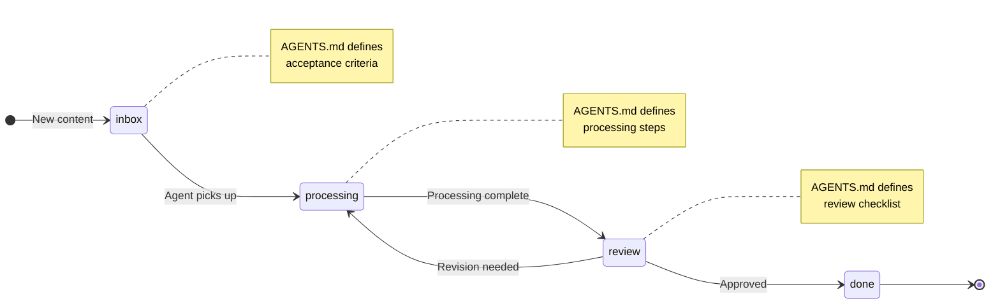

{/* GENERATED by scripts/split_specification.mjs from src/content/reference/specification.mdx.
    Do not edit by hand — edits are lost on the next run. Change the spec, then re-split. */}

> **Scan**: Folder-based workflows where a file's directory location IS its processing state — pipeline structure, stage AGENTS.md, pipeline index.

*Decisions: D14*

## 14.1 Paradigm

Content-as-code is a universal paradigm for folder-based workflows: a file's directory location IS its processing state. Moving a file between stage directories advances it through the workflow.

This paradigm applies wherever content flows through defined stages — research ingestion, document review, approval workflows, deployment pipelines.



## 14.2 Pipeline Structure

Pipelines live in `how/pipelines/{pipeline_name}/`:

```
how/pipelines/{pipeline_name}/
├── AGENTS.md           # Pipeline overview, stage transitions
├── inbox/              # Stage 1
│   └── AGENTS.md       # Processing instructions for this stage
├── processing/         # Stage 2
│   └── AGENTS.md
├── review/             # Stage 3
│   └── AGENTS.md
└── done/               # Stage 4
    └── AGENTS.md
```

Each stage folder MUST have an AGENTS.md with processing instructions specific to that stage.

Stage names and count are pipeline-specific. The file's location is its state — no separate status tracking is needed.

## 14.3 Pipeline Index

The `how/pipelines/` directory SHOULD have an AGENTS.md documenting all pipelines, their purposes, and their stage flows.

---
