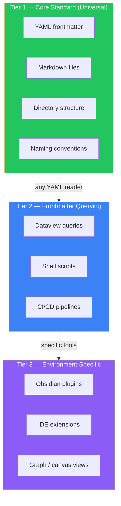

{/* GENERATED by scripts/split_specification.mjs from src/content/reference/specification.mdx.
    Do not edit by hand — edits are lost on the next run. Change the spec, then re-split. */}

> **Scan**: Three tiers — core standard (Tier 1, universal), frontmatter querying (Tier 2, any YAML reader), environment-specific (Tier 3, IDE/plugin). Aggregation points.

*Decisions: C13, D22*

## 16.1 Three-Tier Model

| Tier | Scope | Examples | Universal? |
|------|-------|----------|-----------|
| **Tier 1** | Core standard | YAML frontmatter, markdown, directory structure, naming conventions | Yes — works with any tool |
| **Tier 2** | Frontmatter querying | Dataview, custom scripts, CI/CD that reads frontmatter | Recommended — any tool that parses YAML |
| **Tier 3** | Environment-specific | IDE extensions, knowledge-base plugins, graph view, canvas | No — tool-specific |

Everything in this standard is Tier 1 unless noted otherwise. Tier 1 features work with any tool that can read files and directories.

## 16.2 Aggregation Points

The following cross-directory views are useful in any aDNA instance. Their implementation is Tier 2/3 (tool-specific):

| Aggregation Point | Aggregates | Purpose |
|-------------------|-----------|---------|
| Active missions overview | `how/missions/` | All missions with current status |
| Context index | `what/context/` | All topics with token budgets |
| Session history | `how/sessions/history/` | Recent sessions with outcomes |
| Coordination status | `who/coordination/` | Active cross-agent notes |

Implementation examples: Dataview queries, shell scripts that parse frontmatter, CI/CD dashboard panels. Any tool that can read YAML frontmatter can implement these views.

---
