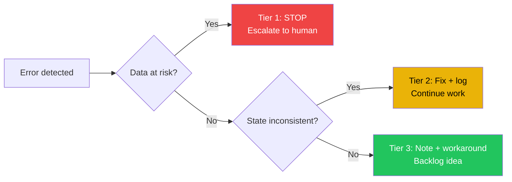

{/* GENERATED by scripts/split_specification.mjs from src/content/reference/specification.mdx.
    Do not edit by hand — edits are lost on the next run. Change the spec, then re-split. */}

> **Scan**: Three-tier response — data integrity threat (STOP + escalate), state inconsistency (fix + log), process issue (workaround + backlog).

*Decisions: D24*

## 17.1 Tiered Response

| Severity | Trigger | Response | Recovery |
|----------|---------|----------|----------|
| **Tier 1 — Data integrity threat** | Corrupt file, data loss, conflicting writes destroying content | Stop all writes immediately. Document the issue. Do NOT attempt automated repair. Escalate to human with `#needs-human` tag. | Human-guided only |
| **Tier 2 — State inconsistency** | Stale STATE.md, broken cross-references, missing frontmatter | Attempt recovery: re-read files, reconcile state, add missing fields. Log the issue and recovery action in session file. Continue work. | Agent-recoverable with documentation |
| **Tier 3 — Process issue** | Template not found, naming violation, ambiguous pipeline stage | Note the issue in session file. Work around it. Create a backlog idea for improvement. | Work around, improve later |

## 17.2 Escalation

Agents MUST log blockers with the `#needs-human` tag when:
- Data integrity is at risk (Tier 1 errors)
- A decision exceeds the agent's authority
- Ambiguous scope could lead to destructive actions

Agents MUST NOT proceed with destructive or irreversible actions when uncertain. When in doubt, stop and ask.

---
