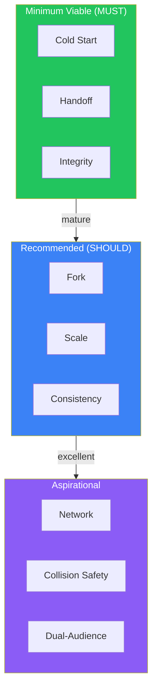

{/* GENERATED by scripts/split_specification.mjs from src/content/reference/specification.mdx.
    Do not edit by hand — edits are lost on the next run. Change the spec, then re-split. */}

> **Scan**: Three levels — minimum viable (cold start, handoff, integrity), recommended (fork, scale, consistency), aspirational (network, collision safety, dual-audience).

*Decisions: D21*

### 18.1 Minimum Viable (every aDNA MUST pass)

1. **Cold Start**: A fresh agent reads CLAUDE.md, then STATE.md (if present), and begins useful work within one session. No prior project knowledge is required.
2. **Handoff**: Agent A closes a session with SITREP + next-session prompt. Agent B reads the close-out and STATE.md and continues the work seamlessly.
3. **Integrity**: No data corruption or silent overwrites during multi-agent operation with collision prevention active.

### 18.2 Recommended (mature aDNA SHOULD pass)

4. **Fork**: The aDNA structure can be copied to a new project and adapted with only CLAUDE.md and domain content changes.
5. **Scale**: The aDNA supports 10+ missions, 50+ sessions, and 100+ content files without navigational degradation.
6. **Consistency**: Both deployment forms (bare and embedded) feel like the same system to agents and humans.

### 18.3 Aspirational (excellent aDNA)

7. **Network**: Multiple aDNA instances can discover and reference each other via documented patterns.
8. **Collision Safety**: Multi-agent concurrent operation produces no data loss even under heavy write contention.
9. **Dual-Audience**: Both humans (IDE, GitHub, knowledge-base tools) and agents find the content navigable and useful.

---
