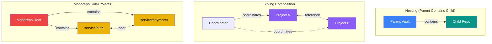
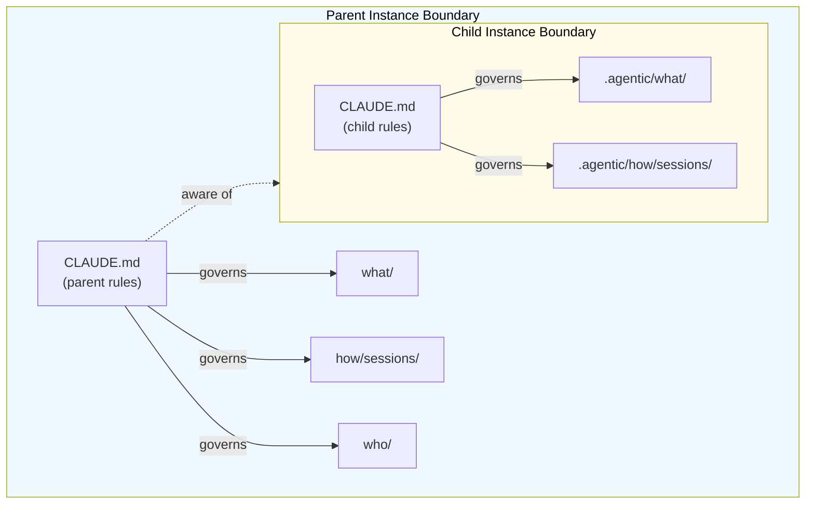
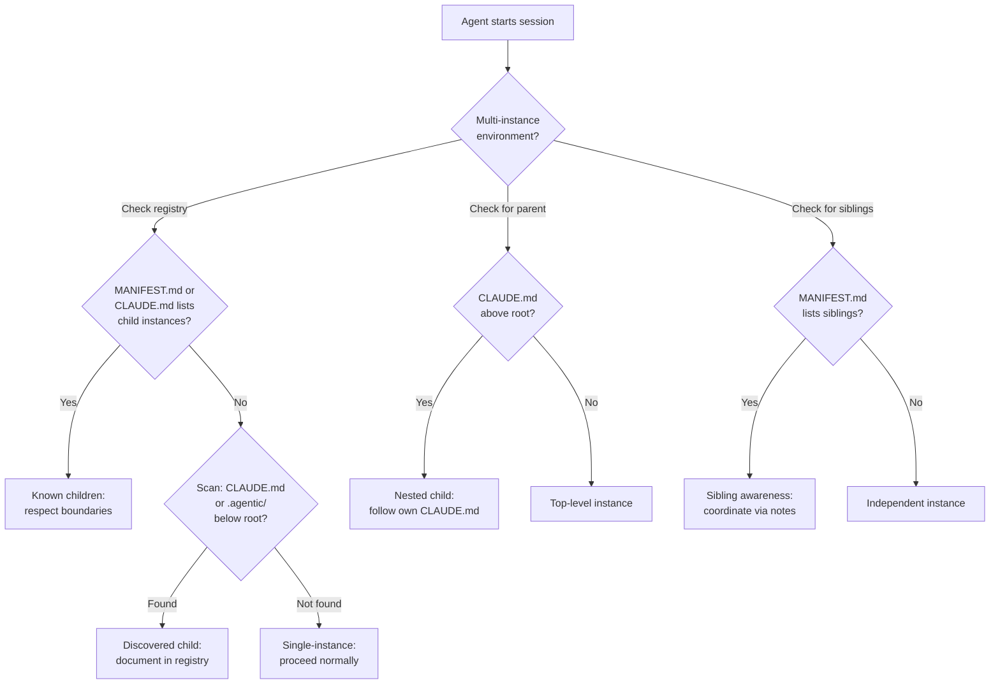
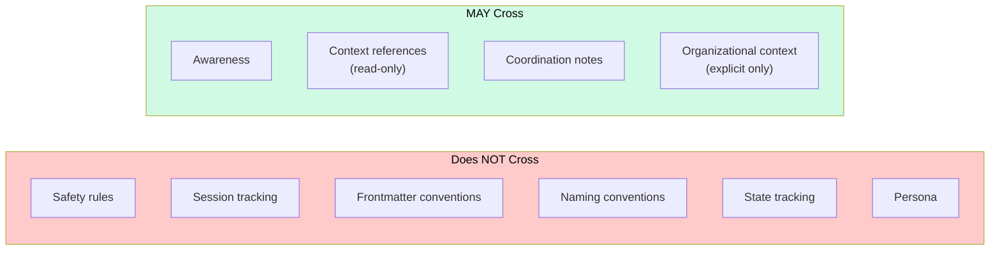
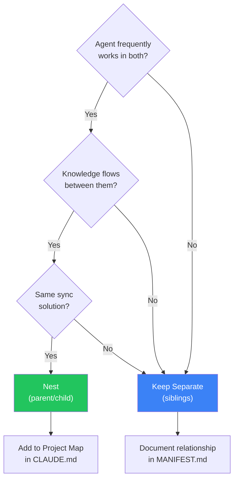

# aDNA Bridge Patterns

<!-- Companion to the aDNA Universal Standard v2.1 and Design Document -->

## 1. Introduction

The aDNA Universal Standard defines how a single project organizes its knowledge using the what/how/who triad, deployed as either a bare triad or an embedded triad. But projects do not exist in isolation. A vault may contain a cloned repository. Sibling repositories may share organizational context. A monorepo may host multiple sub-projects, each with its own aDNA instance.

This document addresses **G8 (Cross-Instance Awareness)** — how multiple aDNA instances discover, reference, and coexist with each other. It was deferred from the initial standard (spec Appendix C) with the unlock condition: "At least two aDNA instances needing to interoperate, providing concrete design requirements." That condition is now met.

### Relationship to the standard

This is an **informational companion** with SHOULD-level guidance. It does not introduce MUST requirements — we have operational experience with exactly one multi-instance environment, which provides concrete patterns but is insufficient to mandate universal rules.

The three-document ecosystem is now:

| Document | Role | Normative Level |
|----------|------|-----------------|
| **01_adna_standard.md** | Specification — MUST/SHOULD/MAY rules | Normative |
| **02_agenticdna_design.md** | Rationale — why decisions were made | Explanatory |
| **03_bridge_patterns.md** | Composition — how instances relate | Informational (SHOULD) |

### Addressing D21 "Network" criterion

The aspirational success criterion #7 (spec §18.3) states: "Multiple aDNA instances can discover and reference each other via documented patterns." This document provides those patterns. An aDNA environment that implements these patterns addresses the Network criterion.

---

## 2. Terminology

| Term | Definition |
|------|-----------|
| **aDNA instance** | A complete set of governance files, triad directories, and operational infrastructure implementing the aDNA standard within a single project boundary |
| **Instance boundary** | The root directory of an aDNA instance — everything within is governed by that instance's CLAUDE.md |
| **Parent instance** | An aDNA instance whose directory tree physically contains another aDNA instance |
| **Child instance** | An aDNA instance that is physically nested inside another instance's directory tree |
| **Sibling instances** | aDNA instances that share an organizational relationship but are not physically nested — each lives in its own root directory |
| **Bridge** | Any mechanism that enables one aDNA instance to reference or discover another |
| **Composition** | The pattern of how multiple aDNA instances relate to each other |
| **Scope boundary** | The governance perimeter of an aDNA instance — governance files apply within the boundary, not across it |

---

## 3. Pattern Catalog

Three composition patterns cover the ways aDNA instances relate to each other. They are not mutually exclusive — a project ecosystem may use all three simultaneously.



### 3.1 Nesting (Parent Contains Child)

**Pattern**: A parent aDNA instance's directory tree physically contains one or more child aDNA instances. The child instance has its own governance files, its own triad, and its own scope boundary.

**When it occurs**: A vault (bare triad) clones or embeds a repository (embedded triad) within its directory tree. Or a workspace directory contains multiple project checkouts, each with its own aDNA instance.

**Structure**:

```
parent_vault/                      <- Parent instance boundary
├── CLAUDE.md                      <- Parent governance
├── MANIFEST.md
├── STATE.md
├── what/                           <- Parent triad
├── how/
├── who/
└── dev_workspace/
    └── child_repo/                <- Child instance boundary
        ├── CLAUDE.md              <- Child governance (independent)
        ├── MANIFEST.md
        ├── .agentic/              <- Child embedded triad
        │   ├── what/
        │   ├── how/
        │   └── who/
        └── src/                   <- Child project content
```

**Key properties**:

- **Governance isolation**: The child's CLAUDE.md governs the child. The parent's CLAUDE.md governs everything except the child. There is no inheritance — a child does not "inherit" the parent's safety rules or session protocols unless the child's own CLAUDE.md explicitly incorporates them.
- **Session independence**: Sessions in the parent track work in the parent's `how/sessions/`. Sessions in the child track work in the child's `.agentic/how/sessions/`. An agent working within the child instance creates session files within the child's session directory, not the parent's.
- **Frontmatter independence**: The parent's frontmatter conventions (field names, tag taxonomy) do not automatically apply to the child, and vice versa.
- **Selective awareness**: The parent SHOULD know the child exists (via its Project Map in CLAUDE.md or a registry in MANIFEST.md). The child need not know it is nested — it operates as a self-contained instance.



### 3.2 Sibling Composition (Organizational Peers)

**Pattern**: Two or more aDNA instances share an organizational relationship but are not physically nested. Each lives in its own root directory — they may be separate repositories, separate vault directories, or projects on different machines.

**When it occurs**: An organization manages multiple projects, each with its own aDNA instance. The projects reference shared context (team members, architectural decisions, organizational conventions) but maintain independent governance.

**Structure**:

```
Machine or organization:
├── project_alpha/                 <- Instance A
│   ├── CLAUDE.md
│   ├── .agentic/what/how/who/
│   └── src/
├── project_beta/                  <- Instance B
│   ├── CLAUDE.md
│   ├── .agentic/what/how/who/
│   └── src/
└── shared_vault/                  <- Instance C (optional coordinator)
    ├── CLAUDE.md
    ├── what/how/who/
    └── ...
```

**Key properties**:

- **No physical containment**: Siblings do not nest. Cross-referencing uses external paths, URLs, or symbolic names — not relative paths within a shared tree.
- **Shared context by convention**: Siblings that share organizational context (team directory, naming conventions, architectural patterns) do so by documenting the relationship in their respective CLAUDE.md or MANIFEST.md files, not by sharing triad directories.
- **Independent lifecycle**: Each sibling has its own STATE.md, its own session history, and its own mission system. Coordination between siblings, when needed, happens through explicit mechanisms (coordination notes, shared documentation, CI/CD integration).

### 3.3 Monorepo Sub-Projects

**Pattern**: A single repository contains multiple sub-projects, each with its own aDNA instance nested under a shared repository root. The repository root itself may or may not be an aDNA instance.

**When it occurs**: Large monorepos where distinct sub-projects have different teams, different conventions, or different agent personas. Each sub-project benefits from its own governance while sharing a repository.

**Structure**:

```
monorepo/
├── CLAUDE.md                      <- Repo-level governance (optional)
├── .agentic/                      <- Repo-level triad (optional)
├── services/
│   ├── auth/
│   │   ├── CLAUDE.md              <- Sub-project governance
│   │   └── .agentic/what/how/who/
│   └── payments/
│       ├── CLAUDE.md
│       └── .agentic/what/how/who/
└── packages/
    └── shared_lib/
        ├── CLAUDE.md
        └── .agentic/what/how/who/
```

**Key properties**:

- **Optional repo-level instance**: The monorepo root MAY have its own aDNA instance providing cross-project governance (shared conventions, organizational context, coordination infrastructure). Or the root may have only a minimal CLAUDE.md providing navigation without a full triad.
- **Sub-project isolation**: Each sub-project operates as a self-contained aDNA instance. An agent working within `services/auth/` follows the auth CLAUDE.md, not the root CLAUDE.md (unless the auth CLAUDE.md explicitly defers to it).
- **Shared resources**: Common patterns (naming conventions, template sets, CI/CD integration) can be documented at the repo level and referenced from sub-project CLAUDE.md files.

> **Note**: This pattern is documented for completeness. We have no operational experience with monorepo aDNA composition. The guidance here is theoretical, derived from the nesting pattern principles.

---

## 4. Discovery Protocol

When an agent starts a session, it needs to determine whether it is operating in a multi-instance environment. The following discovery protocol extends the standard startup checklist (spec §4.2).



### 4.1 Detecting child instances

An agent operating in a parent instance SHOULD check whether its directory tree contains child aDNA instances. The presence of a child is indicated by:

1. **A CLAUDE.md file below root level** — any CLAUDE.md found in a subdirectory of the current instance signals a potential child instance boundary.
2. **An `.agentic/` directory below root level** — the embedded triad marker within the parent's tree.
3. **A documented registry** — the parent's MANIFEST.md or CLAUDE.md Project Map lists known child instances with their paths.

The recommended approach is (3) — explicit documentation. Filesystem scanning (1, 2) is a fallback when the registry is incomplete or absent.

### 4.2 Detecting parent instances

An agent operating in a child instance typically does not need to detect its parent. The child operates self-contained within its own governance. However, if cross-referencing is needed:

1. **Check CLAUDE.md for parent references** — the child's CLAUDE.md MAY document that it is nested within a parent instance and provide the relative path to the parent's governance files.
2. **Walk up the directory tree** — look for CLAUDE.md files above the current instance root. The first CLAUDE.md found above (that is not the current instance's) indicates a potential parent.

### 4.3 Detecting sibling instances

Sibling detection cannot rely on filesystem structure because siblings are not physically co-located. Instead:

1. **Check MANIFEST.md for sibling references** — the instance's MANIFEST.md MAY list related projects with their locations (paths, URLs, or repository identifiers).
2. **Organizational convention** — an organization's documentation or a shared coordinator instance lists all aDNA instances in the ecosystem.

---

## 5. Scope Boundaries

The most important principle in multi-instance environments is **governance isolation**: each aDNA instance is governed by its own governance files, and governance is designed not to cross instance boundaries.



### 5.1 What does NOT cross boundaries

| Concern | Rule |
|---------|------|
| **Safety rules** | The parent's collision prevention tier, escalation rules, and safety tiers apply within the parent only. The child defines its own. |
| **Session tracking** | Sessions are instance-scoped. A session in the parent creates files in `parent/how/sessions/`. A session in the child creates files in `child/.agentic/how/sessions/`. |
| **Frontmatter conventions** | Tag taxonomies, type vocabularies, and custom frontmatter fields are instance-scoped. A `type: customer` in the parent does not mean the child recognizes that type. |
| **Naming conventions** | File naming rules (underscore vs. hyphen, type prefixes) are instance-scoped. The child follows its own CLAUDE.md naming section. |
| **State tracking** | Each instance has its own STATE.md reflecting its own operational state. The parent's STATE.md does not track the child's internal progress. |
| **Persona** | A persona defined in the parent's CLAUDE.md does not carry into the child. The child defines its own persona (or none). |

### 5.2 What MAY cross boundaries

| Concern | How |
|---------|-----|
| **Awareness** | The parent's CLAUDE.md Project Map or MANIFEST.md SHOULD list child instances so agents know they exist. |
| **Context references** | An agent in the parent MAY reference knowledge from a child instance (e.g., reading the child's specs or context library) as read-only external input. |
| **Coordination** | Cross-instance coordination SHOULD use the parent's `who/coordination/` — the parent is the natural coordination hub in a nested environment. |
| **Organizational context** | Team information, governance policies, and architectural decisions from the parent MAY be relevant to work in the child — but the agent brings this context explicitly, not through automatic inheritance. |

### 5.3 The agent's working context

When an agent is working within a specific aDNA instance, that instance's CLAUDE.md defines the agent's behavior. If the agent needs to work across instances in a single session (e.g., making changes in both the vault and the repo), it SHOULD:

1. **Declare the cross-boundary scope** in the session file.
2. **Follow each instance's rules within its boundary** — the parent's rules when modifying parent files, the child's rules when modifying child files.
3. **Create session files in the instance where the primary work occurs** — the session belongs to one instance, even if files in other instances are touched.

---

## 6. Cross-Referencing Conventions

### 6.1 Parent to child references

The parent SHOULD document child instances in its CLAUDE.md Project Map:

```markdown
## Project Map

```
my_vault/
├── CLAUDE.md
├── what/
├── how/
├── who/
└── dev_workspace/
    └── child_repo/        <- aDNA instance (embedded triad)
```
```

And optionally in MANIFEST.md as a structured registry:

```markdown
## Nested Instances

| Instance | Path | Deployment Form | Description |
|----------|------|-----------------|-------------|
| child_repo | `dev_workspace/child_repo/` | Embedded | Cloned repository workspace |
```

### 6.2 Child to parent references

A child instance MAY document its relationship to a parent in its CLAUDE.md, especially when agents working in the child might need parent context:

```markdown
## Environment

This repository is nested within the parent vault (bare triad).
The parent vault's governance: `../../CLAUDE.md`
Parent context library: `../../what/context/`

When working in this repo, follow THIS CLAUDE.md — not the parent's.
```

### 6.3 Sibling references

Siblings reference each other by external identifier (URL, path, or name), not by relative path:

```markdown
## Related Projects

| Project | Location | Relationship |
|---------|----------|-------------|
| workflows | `github.com/org-name/workflows` | Pipeline definitions for this project |
| core-protocol | `github.com/org-name/core-protocol` | Core protocol implementation |
```

### 6.4 Wikilink boundaries

In Obsidian vault environments, wikilinks (`[[target]]`) resolve within the vault scope. This has implications for nested instances:

- **Parent to child wikilinks work**: The parent vault's Obsidian index includes all files, including those in child directories. `[[child_repo/MANIFEST]]` resolves correctly.
- **Child wikilinks are limited**: If the child is a git repo opened separately (not via the parent vault's Obsidian instance), its wikilinks cannot resolve to parent files.
- **Recommendation**: Use wikilinks for parent-to-child references within vaults. Use explicit relative paths or URLs for child-to-parent and sibling-to-sibling references.

---

## 7. Agent Behavior Rules

The following SHOULD-level rules guide agent behavior in multi-instance environments.

### 7.1 Respect instance boundaries

An agent SHOULD treat each aDNA instance as a self-contained workspace. When navigating into a child instance directory, the agent SHOULD mentally "switch contexts" — the child's CLAUDE.md, not the parent's, defines the rules within that boundary.

### 7.2 Prefer explicit documentation over scanning

When an aDNA environment has multiple instances, agents SHOULD rely on documented registries (MANIFEST.md, CLAUDE.md Project Map) rather than scanning the filesystem for CLAUDE.md files. Documented registries are faster, more reliable, and capture intent (why the child is there, what it is for).

### 7.3 Cross-boundary work needs explicit scope

When a session involves work in more than one aDNA instance, the agent SHOULD:

- Note the cross-boundary scope in the session file's intent field.
- Follow the appropriate instance's conventions for each file modified.
- Use the parent's coordination directory for any cross-instance handoff notes.

### 7.4 Do not propagate governance

An agent SHOULD NOT apply a parent instance's rules to a child instance. Specifically:

- Do not add the parent's frontmatter conventions to child files.
- Do not enforce the parent's naming conventions on child files.
- Do not create session files in the parent's session directory for work done entirely in the child.

### 7.5 Read child context, but write to parent

When working in the parent instance and needing information from a child, agents SHOULD read child files as external references but record any derived knowledge in the parent's own triad. For example, if the child repo's specs inform a parent-level context file, the context file lives in `parent/what/context/`, not in the child.

---

## 8. Case Study: Acme Research Vault + acme-core

This section walks through the patterns as they operate in a representative multi-instance environment.

### 8.1 Environment description

```
acme-research/                             <- Parent: bare triad vault
├── CLAUDE.md                              <- Vault governance with custom persona
├── MANIFEST.md                            <- Project manifest
├── STATE.md                               <- Operational state
├── what/                                   <- 7 subdirectories, context topics
├── how/                                   <- 9 subdirectories, active missions
├── who/                                   <- 9 subdirectories, team profiles
└── acme-core/                             <- Child: embedded triad repo (peer to triad)
    ├── CLAUDE.md                          <- Repo-specific governance
    ├── MANIFEST.md
        ├── STATE.md
        ├── .agentic/                      <- Embedded triad
        │   ├── what/ (context, specs, decisions, reference)
        │   ├── how/ (missions, sessions, templates)
        │   └── who/ (coordination, governance)
        └── src packages (core library, backends, sdk, cli, ...)
```

The vault is a bare triad (aDNA IS the content). The repo clone is an embedded triad (aDNA serves the codebase). They are in a parent/child nesting relationship.

### 8.2 Governance isolation in practice

| Aspect | Vault (parent) | Repo (child) |
|--------|----------------|--------------|
| **Persona** | Custom operational persona | None defined |
| **Naming** | Underscores only | Underscores for `.agentic/`, ecosystem conventions for code |
| **Session directory** | `how/sessions/active/` | `.agentic/how/sessions/active/` |
| **Collision prevention** | Tier 2 (file sync aware) | Tier 1 (git-managed) |
| **Safety rules** | Read-before-write, archive-don't-rename, volatile file avoidance | Code quality gates (tests, lint, type checking, security) |
| **Frontmatter scope** | All `what/`, `how/`, `who/` content | All `.agentic/` content; exempt for source code |

An agent working in the vault follows the vault's operating style and sync-aware collision rules. When the same agent navigates into `acme-core/` to work on code, it follows the repo's CLAUDE.md — code quality gates, testing requirements, the embedded triad's session directory.

### 8.3 How discovery works

The vault's CLAUDE.md Project Map includes:

```
└── acme-core/    # Code repository — Git repo clone (peer to triad)
```

And the workspace-level documentation notes:

```
- acme-core/  — Cloned repo workspace (when present)
- Two contexts: Vault-level CLAUDE.md governs the whole vault;
  a separate dev-scoped CLAUDE.md may exist for repo-specific instructions
```

This is the documented registry approach (§4.1 method 3). An agent reading the vault's CLAUDE.md knows the dev workspace exists and that it may contain a child instance with its own governance.

### 8.4 Cross-boundary work example

During a repository restructure mission, the agent worked across both instances:

- **Session tracking**: Session files were created in the vault's `how/sessions/active/` because the work was mission-driven from the vault's mission system.
- **Scope declaration**: The session intent explicitly noted cross-boundary scope ("repo clone restructure").
- **Convention adherence**: Inside `acme-core/`, the agent followed repo naming conventions while applying aDNA frontmatter to `.agentic/` content.
- **Knowledge flow**: The repo's specifications informed the vault's type-standard documents, but the type standards live in the vault's triad, not the repo's.

### 8.5 Sibling relationship: workflows repo

The `org-name/workflows` repository is a sibling to `org-name/acme-core`. It has its own CLAUDE.md with its own governance:

- **Different persona**: No persona defined (lightweight repo).
- **Different conventions**: Markdown content conventions tailored to workflow definitions.
- **Shared organizational context**: Both repos reference the same organization and share concepts (tier system, product identity), but each CLAUDE.md documents these independently.

The vault references workflows as a sibling through mission tracking and coordination notes, not through filesystem nesting.

---

## 9. Template Extension Checklist

When adopting bridge patterns, existing aDNA templates need light extensions. These additions are OPTIONAL — they enhance multi-instance awareness without changing the core template structure.

### 9.1 CLAUDE.md additions

Add to the **Project Map** section:

```markdown
### Nested Instances

| Instance | Path | Form | Description |
|----------|------|------|-------------|
| {name} | `{relative_path}/` | Bare/Embedded | {brief purpose} |
```

Add to the **Safety Rules** section (if cross-boundary work is common):

```markdown
### Cross-Instance Boundaries

- Follow THIS CLAUDE.md within this instance's boundary
- When working in {child_name}, follow {child_path}/CLAUDE.md instead
- Cross-boundary sessions: note scope in session intent field
```

### 9.2 MANIFEST.md additions

Add a **Related Instances** section:

```markdown
## Related Instances

| Instance | Relationship | Location | Notes |
|----------|-------------|----------|-------|
| {name} | Parent/Child/Sibling | {path_or_url} | {context} |
```

### 9.3 Session file additions

For cross-boundary sessions, add to the session frontmatter:

```yaml
cross_boundary: true
instances_touched:
  - "{parent_instance}"
  - "{child_instance}"
```

---

## 10. When to Nest vs. Keep Separate

Choosing between nesting (parent/child) and separation (siblings) depends on the operational relationship between instances.



### 10.1 Decision framework

| Factor | Nest (parent contains child) | Separate (siblings) |
|--------|------------------------------|---------------------|
| **Agent workflow** | Agent frequently works in both instances in the same session | Agent rarely or never works in both in the same session |
| **Knowledge flow** | Parent regularly reads child content (specs, context, code) | Instances rarely reference each other's content |
| **Sync/storage** | Both instances sync together (same sync solution, same machine) | Instances live on different machines, repos, or services |
| **Organizational hierarchy** | Clear parent-child relationship (vault manages repo) | Peer relationship (both are top-level projects) |
| **Lifecycle coupling** | Parent's missions reference child work (missions, task tracking) | Each instance has fully independent missions and timelines |

### 10.2 Rules of thumb

1. **If the child is a working checkout that agents modify alongside vault work** — nest it. The filesystem co-location enables cross-referencing and the parent's mission system can track work in both.

2. **If the child is a read-only reference** (pinned version, documentation snapshot) — nest it, but document it as read-only in the parent's Project Map.

3. **If two projects share organizational context but have independent operations** — keep them as siblings. Document the relationship in MANIFEST.md.

4. **If you are unsure** — start as siblings. Nesting adds complexity (scope boundary management, session disambiguation). You can always nest later if the cross-boundary workflow demands it.

---

## 11. Future Directions

This section acknowledges capabilities that bridge patterns could grow into as the aDNA ecosystem matures.

### 11.1 Formal instance registry

A machine-readable registry of aDNA instances within an organization, enabling automated discovery. This could be a simple YAML file at an organizational root, or a dedicated `what/instances/` directory in a coordinator vault.

### 11.2 Automated child detection

Tooling (scripts, CI checks, or agent skills) that scans a parent instance's directory tree for CLAUDE.md files and validates scope boundaries. This would catch cases where a child instance is added but not documented in the parent's registry.

### 11.3 Federation protocol

The [Lattice Federation & Sharing Protocol](lattice_federation.md) defines the operational protocol for how lattice artifacts move between aDNA instances. It provides five capabilities that form a complete federation lifecycle:

1. **Validate** — Check federation readiness (schema compliance, FAIR metadata, `federation.shareable: true`)
2. **Export** — Package a lattice for transfer, converting local refs to portable `lattice://` URIs
3. **Share** — Distribute via git, registry, or direct transfer channels
4. **Import** — Ingest into a target instance with ontology compatibility check (triggering the [Ontology Unification Protocol](ontology_unification.md) merge algorithm when entity types differ)
5. **Compose** — Integrate into a parent lattice via inline composition (namespace-prefixed child nodes) or external reference (`lattice://` URI as opaque node)

The protocol uses the `lattice://` URI scheme (`lattice://<instance_id>/<lattice_name>[/<node_id>]`) for cross-instance references, with resolution rules covering same-machine, git-based, and registry-based discovery. Node ID collisions during composition are resolved via namespace prefixing, consistent with the ontology unification namespace specification.

In practice, federation has preserved the convergent narrowing property — token scope has decreased monotonically through the execution hierarchy even when federated lattices expand the total node count. External reference composition (child as opaque node) is the recommended default because it minimizes token cost while preserving composability.

### 11.4 Governance inheritance

A mechanism for child instances to explicitly inherit selected governance from a parent — e.g., "Use the parent's naming conventions" or "Import the parent's tag taxonomy." Currently, governance is fully isolated. Opt-in inheritance would reduce duplication for tightly coupled instances while preserving the default of independence.

### 11.5 Template composition

Base templates (template_bare/, template_embedded/) could include an optional "bridge-aware" variant that pre-populates the CLAUDE.md and MANIFEST.md sections described in §9. This would make multi-instance setup a bootstrap-time decision rather than a post-bootstrap addition.

---

*End of aDNA Bridge Patterns*
