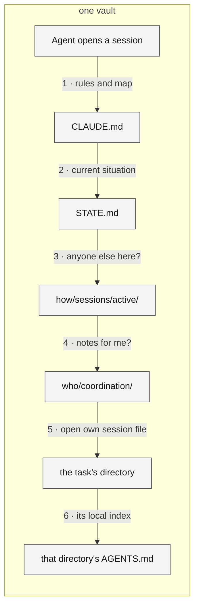
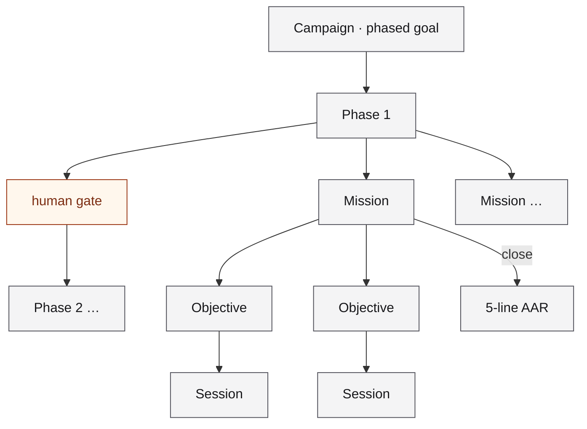
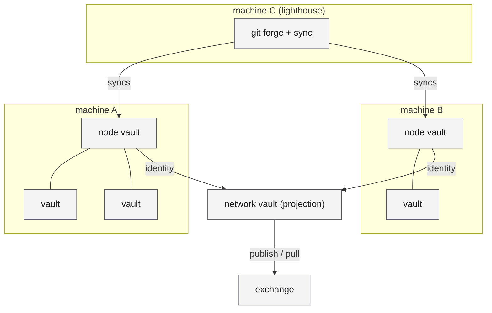
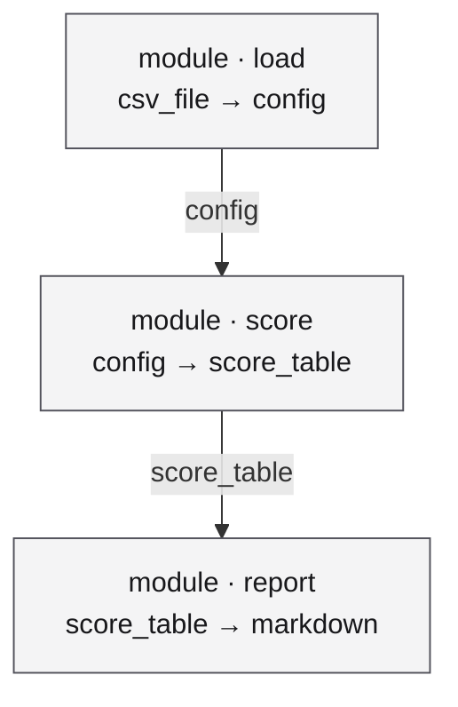

# aDNA for data engineers

*A primer for people who already run pipelines, contracts, lineage and catalogs, and want to know what this is, what it does for them, and which parts are actually the rules.*

A note on words used throughout: an **operator** is the human who owns a project and takes its binding decisions; an **agent** is an AI model running with tools inside that project; a **vault** (also called a **graph**) is one project organised the aDNA way; a **node** is one machine that hosts vaults. A **persona** is the named role an agent plays in a given vault, declared in that vault's root file; it is optional.

---

## 0. In one paragraph

aDNA (Agentic DNA) is a standard for organising a project's knowledge so that AI agents and humans can both find their way around it. It is folders, Markdown files and a handful of conventions. Every project gets three directories, `who/`, `what/` and `how/`, five short governance files at the root, and YAML frontmatter on every content file. An agent opening the project reads the governance files first, then only the directory it is working in. That is the whole trick: the structure tells the agent what to load, so it never has to read everything. On top of the standard sits a layer of *practice*, built by one group running dozens of such projects as a **network** (their word for the fleet of vaults and machines they operate together): how work is budgeted in tokens, how agents coordinate without overwriting each other, and how many such projects federate into a network. This document covers both, and the closing appendix says plainly which is which.

*Short on time? Ten minutes: this paragraph, §2.1–§2.4, then §7 (the crossmap) and §8 (what to try). The whole document is about 40 minutes (the number is derived from the word count at write time).*

## 1. The problem: context for agents is a data problem

You already know what happens to an undocumented pipeline. It runs until someone leaves, then nobody knows which table is the source of truth, which transform was a hack, or whether last Tuesday's load is safe to rebuild. The failure is slow erosion: a schema nobody wrote down, lineage nobody can trace, a freshness guarantee never stated, access rules that live in one person's head.

Context for AI agents fails the same four ways.

| Axis | The undocumented pipeline | The undocumented agent context | What aDNA gives it |
|---|---|---|---|
| **Schema** | Column types drift; consumers break silently | Prompts and chat logs have no shape; a decision and a draft look the same | Frontmatter on every file |
| **Provenance** | Nobody knows where a number came from | Nobody knows whether a claim was verified, inferred, or copied | Attribution fields; provenance tags on findings |
| **Freshness** | A stale snapshot looks like a current one | A status note from March reads exactly like one from today | An `updated` field stamped on every write and read before overwriting |
| **Access control** | Credentials in a config file somewhere | A secret pasted into a conversation, now in a transcript forever | Secrets referenced by name, never by value |

Most teams' first attempt at agent context is a long system prompt and a folder of notes. That is a pipeline built from one giant SQL file and a wiki page. It works for one person for one month. aDNA treats agent context as data; the rest of this document is how.

## 2. The vault standard

An aDNA project is called a **vault**. The standard that defines it is one document, the aDNA Standard, at version 2.5. Everything in this section is drawn from it and cites its section numbers.

### 2.1 Three directories, one question

Every vault has three top-level directories (Standard §3.1):

| Directory | The question it answers | What lives there |
|---|---|---|
| `what/` | What does this project **know**? | Context, decisions, reference material, domain objects |
| `how/` | How does this project **work**? | Missions, sessions, templates, pipelines, skills |
| `who/` | Who is **involved**? | People, teams, coordination notes, governance |

Any piece of project knowledge belongs in exactly one of the three. Three categories are deliberately few; more create sorting ambiguity.

The three can sit at the project root (a **bare** triad) or inside a `.agentic/` folder in an existing code repository (an **embedded** triad). The ontology is identical; only the nesting differs (§3.2–§3.4). A vault directory should carry the `.aDNA` suffix, the way a macOS bundle carries `.app`, so tools can discover vaults with a glob (§3.5). The standard also gives the name part a pattern (lowercase, digits, underscores); the suffix is a *should* and the name pattern a *must*; in practice the pattern is honoured loosely, and the one vault named in this document (§5.1) would fail it.

### 2.2 The files an agent reads first

At the root sit five ALLCAPS governance files (§4.1). The standard is in tension with itself about how many are required: §4.1 marks four as *must* and `STATE.md` as *should*, while the Starter conformance level checks only three (`CLAUDE.md`, `MANIFEST.md`, `README.md`); `STATE.md` and the root `AGENTS.md` become required at Standard (§5.5). Read the table as what a mature vault carries.

| File | Job | Changes |
|---|---|---|
| `CLAUDE.md` | The agent's root context: who it is here, the project map, safety rules, the startup protocol | When structure or rules change |
| `STATE.md` | Where the project **is right now**: phase, blockers, recent decisions, next steps | Every session close |
| `MANIFEST.md` | What the project **is**: identity, architecture, entry points | Rarely |
| `AGENTS.md` | Per-directory guide: purpose, key files, local conventions | When a directory changes |
| `README.md` | For humans browsing the repository | When onboarding changes |

About the first name: the standard names the root file after the agent CLI that auto-loads it, Claude Code (§4.2). The *structure* is vendor-neutral; the *filename* is not. Other agent tools read `AGENTS.md`, which is a widely used convention, or are pointed at `CLAUDE.md` by a one-line include. If you run a different agent, expect to add that line.

The design point is the split between rules and state. A rule that should still be true in six months lives in `CLAUDE.md`; a fact about this week lives in `STATE.md`. If you have had a `README` that mixed "how to deploy" with "currently broken, see Dave", you know why these are separate.

The standard prescribes a five-step agent quickstart (§4.2): read `CLAUDE.md`, read `STATE.md`, check for other active sessions, check the coordination directory, then create your own session file and begin. Each directory's `AGENTS.md` is its local index (§4.5). The standard's load rule is for the context library: read the index first, load only what the task needs (§10.3). The network extends that into a practice for every directory: read the `AGENTS.md` where you are working, not all of them. The directory tree *is* the index.



*Figure 1. The first reads of a session, all inside one vault; `MANIFEST.md` is read when identity or architecture is in question, not every time.*

### 2.3 Entity types: the base schema

Content inside the three directories is typed by a `type` field. The standard's skeleton names the directories each leg must or should have (`context/`, `missions/`, `sessions/`, `templates/`, `coordination/`, `governance/` required; `decisions/`, `backlog/` recommended; others optional — §5.1–§5.3). The network's reference ontology, set by a decision record, extends that skeleton to sixteen base types, each a directory under its leg:

| Leg | Base types (reference ontology; the standard's required set is in bold) |
|---|---|
| `who/` | **governance** · team · **coordination** · identity¹ |
| `what/` | **context** · decisions · modules · lattices · inventory¹ |
| `how/` | campaigns · **missions** · **sessions** · **templates** · skills · pipelines · backlog |

¹ `inventory` and `identity` are also named by the standard itself as optional base directories since v2.3 (§5.1, §5.2). A vault extends the base with its own types under the right leg; the vault this document was written in adds concepts, tutorials, glossary entries and reviewer personas, among others. Two of the base types are explained later: *lattices* in §5.4; *inventory* is the list of what is installed on a machine (§5.1).

### 2.4 Frontmatter is the schema

Every content file inside the triad, and each root governance file, carries YAML frontmatter with six base fields (§7.1, §7.2). Two classes are exempt from one of them: directory indexes and coordination memos have no lifecycle state, so `status` is optional there.

```yaml
---
type: decision          # entity classification
status: accepted        # lifecycle state, entity-specific values
created: 2026-06-18
updated: 2026-10-03     # stamped on every write; read before overwriting
last_edited_by: agent_rosetta
tags: [adr, ontology]
---
```

Two of these do real work. `updated` is the freshness field. Read-before-write is mandatory everywhere (§13.2): an agent reads the current content immediately before writing, never from a cached read. The touched-today check is a *should* for multi-agent projects (§13.4): if the file was changed today by someone else, the agent confirms with a human before overwriting. `last_edited_by` is attribution: every modification sets it.

Why a date field when git has a log? Because vaults travel through sync tools and are read by agents with no git context; the field is the freshness signal that survives both. It is a schema by convention: nothing rejects a bad write at write time; the reference validator (see §2.5) checks after the fact.

Templates add type-specific fields (§7.5). Custom fields may be added freely, should carry a project prefix if they might collide with future standard fields, and must never be stripped by migration tooling (§7.6). That last rule is what lets you extend the schema without fear. Naming is strict on purpose (§6): underscores, never hyphens; `type_descriptive_name.md`; ALLCAPS for governance files only.

### 2.5 Conformance levels

Three levels (§5.5). **Starter**: `CLAUDE.md`, `MANIFEST.md`, `README.md`, the three directories, six required subdirectories, frontmatter on every content file. **Standard**: adds `STATE.md`, a root `AGENTS.md` and one per leg, the recommended directories (`what/decisions/`, `how/backlog/`, `how/sessions/active/`, `how/sessions/history/`) as requirements, and the session lifecycle. **Full**: adds a context library with token estimates, FAIR metadata on deployable objects, an ontology diagram, and a template for every content type in use. A vault *may* declare its level in `MANIFEST.md`; undeclared means unverified. The standard mentions a reference validator, `adna_validate.py`, which reports the level a tree actually meets (§5.5; the tool is informative, not required). It checks the presence of files, directories and frontmatter fields, not their values (at Full it checks structure only, not FAIR fields, token estimates or per-type templates), and exits non-zero on failure, so it can run in CI.

### 2.6 The template and the fork

A workspace holds many vaults side by side. The base template, the standard tree itself, lives in a hidden directory at the workspace root and is never edited; new vaults are forked from it. Two public repositories exist: the workspace image you clone to start, and the standard's own development vault, which is itself a conformant vault and is where this document lives. The standard is authored in the standard, which is why the examples here are real files. In practice every vault is also a git repository; where this document says *commit* or *untracked*, it means what git means.

### 2.7 Archive, never delete

The session file is the audit trail of a sitting (§8.1). The standard's retention rule is modest: archive sessions to dated history directories (§15.1), and do not auto-delete session history (§15.2, a *should not*; manual cleanup after six months is acceptable). The network's stricter rule, never delete missions, decisions or campaign records, is practice. When a live file such as `STATE.md` grows past what an agent can read in one pass, aged content graduates verbatim into an append-only history file. This is hot/cold tiering, not event sourcing: the live file is the authority, the history is overflow, and you cannot replay the history to rebuild the state.

## 3. Work as data

The standard is quiet about how work is organised above a single mission. What follows is the practice the vault network built on top of it. The appendix marks it as such.

### 3.1 Campaign, mission, objective, session

| Unit | Scale | What it is |
|---|---|---|
| **Session** | one agent, one sitting | A bounded unit of work with a file in `how/sessions/active/`, created *before* any other file is modified (Standard §8.1); the file has a standard ID format and a tier set by what it edits, which adds safeguards for shared configuration (§8.2, §8.3) |
| **Objective** | session-sized | The atomic unit inside a mission |
| **Mission** | one to five sessions | A task too large for one session, decomposed into objectives with acceptance criteria and per-objective status (§9.1) |
| **Campaign** | ten to forty sessions | Several missions toward a strategic goal, in phases, with a gate between phases *(practice)* |

Sessions and missions are in the standard. Campaigns, phases and gates are practice; the standard mentions "campaign" once, in a diagram.

A session ends with a **SITREP**: completed, in progress, next up, blockers, files touched (§8.4), then a self-contained **next-session prompt** a fresh agent can resume from (§8.5). A mission ends with a five-line **after-action review**: worked, didn't, finding, change, follow-up *(practice)*. The rule is that no mission is marked complete without one; the vault this was written in has broken it. Agents claim objectives by session and must not claim an objective another active session already holds (§9.3); §4 covers what enforces that across vaults.



*Figure 2. The hierarchy (one mission expanded), with the only path from phase 1 to phase 2 running through a human; a session file is opened first and closed with a SITREP.*

**Phase gates are human gates.** An agent may prepare all the evidence for a gate and recommend an outcome; it may not open the next phase. The same rule governs decision records: an agent may author one in full and leave it `proposed`; moving it to `accepted` is an operator act, and the record must say who ratified it, when, under what reference, and with what scope (§7.7). Agents author, humans ratify. In CI terms: the agent makes the build green; a human presses deploy.

### 3.2 Token economics

Agent work is metered in tokens, and a session has a hard ceiling: the context window. The standard's one sizing rule is the **75% rule**: scope each session to about three quarters of the window, leaving the rest for thinking and recovery (§8.7). Everything else is calibration the network did on its own corpus; your constants will differ, and the transferable part is the loop: estimate, log, compare, retrospective at twofold drift.

The unit of account is **content-load**, written kT: thousands of tokens of material the agent must actually read and write. It is estimated per mission:

```
session_cost ≈ transition_tax + Σ per_objective_work
  transition_tax      ≈ 23 kT     (cold-start orientation: governance files, STATE, the mission — one network's measurement)
  per_objective_work  ≈ 5–80 kT   (planning < reconnaissance < implementation < verification)
```

The estimate is a required field in the mission file, the actual is logged at session close, and the after-action review reports both. Drift beyond twofold triggers a retrospective. The bands decide the session shape:

| Content-load | Shape |
|---|---|
| under 50 kT | one session; splitting costs more in transition tax than it saves |
| 50–80 kT | one or two sessions |
| 80–200 kT | two or three (design, build, close) |
| 200 kT and over | split into several missions; pay the decomposition tax at campaign level instead of snowballing a session |

Each level of the hierarchy narrows the set of files the agent needs, so the lower the level, the fewer tokens and the higher the signal; the per-directory indexes make the narrowing cheap. One companion rule matters for anyone who pays the bill: the **two-metric rule**. Content-load is what you budget; API billing, dominated by cached re-reads and scaling with turn count, is a different quantity, reported alongside but never substituted.

### 3.3 Model-tiered execution

Not every unit of work needs the most capable model. Each mission declares a planned **executor tier**. The pattern defines three classes by decision properties and binds model names to them in a versioned table, so the rule survives model generations; in practice the field carries the bound model's name.

| Class | Decision properties | Used for |
|---|---|---|
| **judgment** | novel design, ambiguous requirements, irreversible or outward-facing consequences, review | planning, design, review, gate sittings, adversarial passes |
| **build** | well-briefed execution with local decisions inside stated guardrails | implementation, verification, hotfixes |
| **mechanical** | enumerable, verifiable, low-ambiguity transforms | an explicit opt-down for provably mechanical sweeps, never a default |

What makes a cheaper tier safe is the **brief**: a mission may run at a lower tier only if its brief was written, and will be reviewed, at the judgment tier. The brief states the objective, the acceptance criteria the executor can check itself, the guardrails, the command that proves completion, the conditions under which the executor halts and escalates instead of improvising, and the budget. The senior engineer writes the ticket and reviews the PR; aDNA makes the ticket's required contents explicit and attaches a budget.

### 3.4 OODA, optionally

Each level can run an observe-orient-decide-act loop: continuous within a session, at session close for the mission, at phase gates for the campaign. Anomalies propagate upward (a session finding that affects the mission is flagged in the mission file; a mission blocker that affects the campaign is flagged in the campaign document, tagged for a human); restructuring flows downward. It is opt-in; the hierarchy works without it.

## 4. How agents coordinate

Several agents work in the same workspace, sometimes in the same vault, sometimes in vaults belonging to different people, and none share memory. Almost everything below is practice layered on three short normative rules.

### 4.1 The normative floor

Cross-agent notes live in `who/coordination/`, the single location for agent-to-agent communication, and every session checks it at startup (§11.1, §11.3). A note says who wrote it and for whom, what the concern is, when it was created and when it expires, and what action is needed. Notes carry an urgency: `urgent` is read before any other work, `info` during startup, `fyi` when convenient (§11.2). In multi-agent projects, sessions that edit shared configuration declare in their session file which files they will modify, and an agent confirms with a human before overwriting a file someone else touched today (§13.4).

### 4.2 Memos, drop-boxes and receipts

A **coordination memo** is a Markdown file with frontmatter: sender, recipient, subject, whether an acknowledgement is required, and a status that moves from `staged` to `delivered`. Sending means copying the file into the recipient vault; the recipient may be mid-session, and the sender cannot know the memo was read. The **drop-box** answers both: a vault that expects mail publishes a `who/coordination/inbox/` directory where senders write new files only and never modify existing ones, no check that the recipient is idle is needed, and **the recipient's commit of the file is the read-receipt**. A sender can prove it wrote; only the recipient can prove it read.


Delivery follows one of three branches, decided by a probe at the moment of the write: the recipient has a drop-box, so write into it; no drop-box and the recipient is quiet (no live session, no recent file motion, no agent process in the vault), so write a new untracked file at its `who/coordination/`; no drop-box and the recipient is live, so **hold**, and record the hold with a retry. A hold nobody wrote down is a dropped message. The probe and the write are not atomic (the recipient can wake between them); the new-files-only rule bounds the damage to one stray file. Memos travel between vaults on the same machine by file copy; across machines, by whatever carries the vaults (git, sync).

Bodies are hashed on both sides and compared; identity fields are stamped *before* the copy so the copies match byte for byte. **Replies are derived**, never read off the sender: the question is "is there an outbound memo naming this sender, dated after their last inbound?". **Authorship is three-valued**: the persona that wrote it, the vault it was sent from, and the authority it was sent under, because one persona writes from several vaults. Receivers never rewrite a sender's self-identification.

Discovery is the unsolved half: memos arrive untracked, so every session opens with an untracked-file sweep over the coordination directory, recorded even when zero.

```mermaid
sequenceDiagram
  accTitle: Memo delivery, three branches
  accDescr: The sender stamps identity fields and hashes the body, probes the recipient, then either writes into the drop-box, writes a new file into a quiet recipient's coordination directory, or records a hold and retries later. Hashes are compared on both sides; a mismatch re-syncs. The recipient's commit is the read-receipt.
  participant S as Sender vault
  participant I as Recipient vault
  participant R as Recipient agent
  S->>S: stamp identity fields, hash body
  S->>S: probe: drop-box? live?
  alt branch 1 · drop-box exists
    S->>I: copy into inbox/ (new file)
  else branch 2 · no drop-box, recipient quiet
    S->>I: copy beside the notes (new file)
  else branch 3 · no drop-box, recipient live
    S->>S: record HOLD + retry date
  end
  S->>S: compare body hashes both sides
  opt hashes differ
    S->>I: re-sync the delivered copy
  end
  S->>S: stamp status delivered
  Note over I: file sits untracked
  R->>I: session open: sweep untracked files
  R->>R: commit the memo
  Note over S,R: that commit is the read-receipt
  R-->>S: reply, if owed (a new memo, dated later)
```



*Figure 3. Delivery with its three branches and the hash-mismatch leg.*

### 4.3 Single-writer lease

Within a vault, shared configuration and high-collision entities (governance files, inventories, identity records, credential indexes) have **one writer at a time**. The lease is the session: it declares its scope in its file, and a peer session that sees a non-empty active session does not co-write those files. Before writing, the agent reads the current content and checks `updated`; on writing, it stamps `updated` and `last_edited_by`. For inventory, identity and credential types the network's governance doctrine makes it required, because two concurrent writers silently corrupt node state; nothing enforces it at runtime. Its limits are plain: it is a convention with no expiry, no atomic acquire and no token; a crashed session leaves its file in `active/`, and the stale-session case is swept at the next session open. The only mechanism in this document that is a lease in the distributed-systems sense is the next one.

### 4.4 Claim-lease with fencing tokens

When tasks are published for any available agent to pick up, across vaults and machines, the session lock is not enough. The network's operations vault defines a **task** entity and a claim-lease contract over it. A claim returns a lease identifier, an expiry, a task manifest and a **fencing token**, a monotonically increasing integer. Heartbeats extend the lease; a lease whose heartbeat stops is not silently reassigned but moved to a state awaiting human review with the reason recorded. Writes from the task carry the token, and any consumer that sees an older token than the last it accepted rejects the write. The expiry handles liveness; the token handles the zombie that wakes up believing it still holds the lease. This is the fencing-token pattern from distributed-systems practice, applied to agents. Its status is honest but early: the lease service issues tokens and its own tests reject a stale one, but fencing only works if each downstream *consumer* checks the token, and on the one node where this runs the known consumer does not yet; at the time of writing no task card records a claimed token.

### 4.5 Two mechanisms that share a name

Two network mechanisms share the name *airlock*; you will meet the word in vault documents, so here they are side by side.

| | **Vault-to-vault traffic contract** | **Action-mediation gate** |
|---|---|---|
| Owner | a framework vault (one that defines a methodology others conform to; categories: §5.3) | a platform vault that lets an agent act on a real computer |
| Governs | how agents and artifacts cross a vault boundary | whether a single action is permitted, on any wire |
| Surfaces | **entry** (an agent comes into vault B and works with B's context) · **request** (A commissions B, the result ships back) · **federation awareness** (A observes B's state without entering) | one enforcement point: is this a declared capability with its posture bound in advance; do the rules permit this caller, this capability, these arguments, now |
| Guarantees | a shape contract, a routing rule, a safety contract for secrets (they do not cross), a versioning rule | records that the action happened; preserves the means to undo it where undo exists |
| Does not | govern what happens inside a vault's own sessions | sandbox the action, or verify it achieved what the caller intended |

One is a protocol between knowledge graphs; the other is a policy gate in front of actuators.

### 4.6 Agent-to-agent protocols, provisionally

A research note set the posture: an editor or terminal hosts a local agent through the Agent Client Protocol (ACP, an editor-to-agent interface); graphs on the network talk to each other over the Agent-to-Agent protocol (A2A), each machine publishing **one signed agent card**, a small signed document saying what its agents can do; and tools are reached through the Model Context Protocol (MCP), the common interface through which an agent calls a tool. Treat all of it as a build direction with named components, not a ratified part of the standard. Related and also early: a **staff-officer graph** is a vault whose agent watches a portfolio of campaigns between missions, assembles the next-mission packet and escalates in a form a human can rule on quickly; it drafts and never decides.

### 4.7 Secrets by name

The rule is names only. One vault per machine holds the secrets, backed by the operating system's secure store; every other vault refers to a credential **by name** and reads it from an environment variable at use time. Rotation and onboarding are requests to that vault. The rule is enforced where it can be: a secret scanner runs as a pre-push hook, installed per clone (on most of this node's vaults, not all) and bypassable by anyone who skips hooks. It is not enforced on transcripts, and it has been broken; when a value leaks into a conversation, the repair is rotation, not a sentence. If you have moved a team from secrets-in-config to a secrets manager with named references, this is that, with the rule that the name is the only thing an agent is allowed to see.

## 5. The network of graphs

A vault is one knowledge graph. The interesting part is what happens when there are dozens on one machine and many machines.

### 5.1 Node, network, exchange, lighthouse

| Unit | What it holds | Posture |
|---|---|---|
| **Node vault** (the one named in this document is `Home.aDNA`) | which vaults are installed on this machine, the machine's state, its memberships | local by default; never pushed unless the operator configures a remote; read first in any cross-vault session |
| **Network vault** | the master graph of the fleet: a node is on the network once its node vault has been received, verified and placed | read-mostly projection; the source of truth is always each node's own vault |
| **Exchange** | a **registry** that gives every published artifact a content-addressed identity (its name is a hash of its bytes), version, signature and provenance; a **commons**, the default, open on protocol with open licensing; a **market**, opt-in, where a revoked grant stops access rather than failing open | an artifact registry in the package-index sense, not a data catalog; *same artifact, different manifest*: identity never changes when an artifact moves between commons and market |
| **Lighthouse** | a deployable node that runs its own git forge (a self-hosted GitHub-like service) and keeps a group of vaults in sync | planning stage; nothing deployed |



*Figure 4. Each node vault is the source of truth for its machine; the network vault only projects.*

### 5.2 Consumer, never fork

When one vault needs what another knows (a site generator's patterns, a quality framework's review loop, a git-operations standard), it does not copy the files. It adds a small wrapper directory, `how/federation/<name>/`, holding a `CLAUDE.md` with a `federation_ref` block that pins the source vault, the topic or lattice, a version and a version policy:

```yaml
federation_ref:
  source_vault: <Source>.aDNA            # the graph being consumed
  source_topic: <topic>
  version: "1.0.0"
  version_policy: minor                   # a declared intent: follow patch and minor, or stay locked
```

The agent loads the referenced context at session start; the consumer supplies only configuration and overrides; the source stays canonical in its own graph. The wrapper lives under `how/federation/`, an optional directory the standard names (§5.3); what goes inside the `federation_ref` block is practice. Read it as a declared dependency with a human-reviewed pin: the agent reads the pin at session start, and there is no resolver and no failure mode when the pin is wrong. The maintainers keep the canonical copy; the consumer keeps a pointer.

### 5.3 The categories

Vaults are typed by what they are for. The taxonomy is still moving: the ecosystem specifications define five types, decision records add a network type, and the network's practice adds node and coordination vaults. The main types:

| Category | What it is | Verb |
|---|---|---|
| **Forge** | Produces artifacts for other vaults (sites, images, videos, molecules, speeches) | build-with → produce |
| **Framework** | Defines a protocol or methodology others conform to; no artifact, no runtime | build-with → conform |
| **Platform** | Governs a deployable, running system; a subtype gives one installed software its own graph | deploy-and-run → operate |
| **Org-vault** | An organisation governing itself through the vault (inside-out) | — |
| **Org-graph** | Modelling someone else's organisation as a subject (outside-in) | — |
| **Network** | The live aggregate of nodes transmitting their node vaults | — |
| **Node** | One machine's operational vault (§5.1) | — |

The first three share the access mechanism of §5.2; the others model organisations, machines and aggregates, not software.

### 5.4 Lattices: the executable DAG

A **lattice** is a directed acyclic graph of **modules**, each with typed inputs and outputs, described in a `.lattice.yaml` file validated by a JSON Schema the standard's home vault ships. It is a DAG *specification* with typed edges; execution belongs to whatever platform consumes it, not to the standard. Modules are atomic: one function, one model, one tool. The type vocabulary has nineteen I/O types in four tiers (primitives, structured, molecular — the network's first lattices were in genomics — and media); snake_case, file types ending in `_file`. A lattice declares its type (pipeline, agent, context graph, workflow, infrastructure, context set, or skill) and its execution mode: `workflow` for a deterministic DAG, `reasoning` for model-driven step selection, `hybrid` for a fixed structure with reasoning at decision points.



*Figure 5. A lattice in data-engineering terms: three modules, two typed edges, one YAML file.*

Every lattice carries a **FAIR** block (findable, accessible, interoperable, reusable): license, creators, keywords, an optional persistent identifier, provenance. At Full conformance the standard requires `keywords` and `license` on every deployable object (§5.5). Publishing to a registry runs readiness checks; pulling fetches by name and optional version; composing joins two lattices, either side by side with edges between them or by merging one into the other. A **skill**, a reusable agent recipe, is the one-module case of a lattice and publishes the same way. Where a lattice is also drawn on a visual canvas, the YAML is authoritative and the drawing is a view.

### 5.5 Compute tiers

Four tiers of where work runs: **L0**, knowledge architecture only, an editor and an agent and no compute services; **L1**, edge compute on a laptop or local GPU; **L2**, an institutional cluster; **L3**, cloud and large-scale centres. A vault is L0 until connected to something, and adoption can start there. The knowledge architecture is useful before any compute is.

## 6. Why it holds up

Three checks that two of the network's campaigns adopted, each written after a specific failure, given as the incident and the check it produced:

- **An index said seven lessons; the page it described rendered two.** The page derived its count from the data; the index had typed it. Check: **derive, never type** — any count a document narrates is produced by a command at the moment of writing, and a stale index is a defect even when the artifact is right.
- **A validator counted a history comment as a live total and reported drift that did not exist.** Check: **an instrument is not believed until it has been seen to fail** — every new assertion is red-proved by planting the defect it should catch before its green is trusted, and when the instrument is wrong the instrument is fixed, never the history.
- **A status table reported a page as missing for twenty-two days after it had gone live;** one request to the live address would have shown it. Check: **"live" and "missing" are statements with a timestamp** and the command that verified them against the live surface; a negative result is only as wide as the command that produced it.

Behind all three: findings carry a provenance marker (derived, inferred, reported, asserted); and the transitions that bind (accepting a decision, opening a phase, pushing to a public origin, delivering to a third party) are human acts with a recorded gate.

## 7. A data-engineer's crossmap

| What you run | The aDNA counterpart | How exact |
|---|---|---|
| **A dbt project** (models in folders, `schema.yml` beside them, a manifest) | **A vault** (content in three folders, frontmatter in each file, `MANIFEST.md` at the root) | Close in layout only. No compiler, no reference resolution, no tests; the manifest is hand-written prose, not generated. |
| **A schema registry / data contract** | **Frontmatter**, a JSON Schema for its base fields that ships with the standard (older than the current per-class profile), and **LinkML** as the preferred vocabulary for vaults that publish machine-checkable shapes (optional) | Loose. Enforced by convention and a validator run after the fact, not by a registry that rejects writes. The compatibility rule is nearly exact: fields may be added, never repurposed or stripped (§7.6). |
| **Lineage** | **Provenance tags** on findings, `last_edited_by` on files, ratification blocks on decisions | Loose. Attribution, not derivation; per claim and per file, not per column. |
| **A catalog** | The per-directory `AGENTS.md` indexes and the context library's topic index with token estimates (§10.3) | Loose. Hand-maintained indexes, no crawler. |
| **An orchestration DAG** | **A lattice** of typed modules | Loose (spec only). Typed I/O at the node boundary, a FAIR block, a reasoning mode; no executor is part of the standard. |
| **A package index** | **The registry** and **exchange** (content-addressed identity, versions, signatures, a commons and a market) | Close at the registry; the market is early. |
| **Hot/cold storage tiering** | **STATE graduation** (a small live `STATE.md`, an append-only history file, nothing deleted) | Close. Not event sourcing: the live file is the authority and the history cannot be replayed to rebuild it. |
| **A distributed lock with a fencing token** | **Claim-lease** (lease, heartbeat, monotonic token, stuck leases to human review) | Exact in design; consumer-side enforcement not yet exercised in production (§4.4). |
| **A CI gate with a required manual approval** | **A phase gate** (verifiable exit criteria, evidence presented, a human advances) | Close. A manual-approval gate is ordinary; what differs is that *every* phase has one, and that it is enforced by an instruction the agent follows, not by the runner. |
| **A pinned dependency** | **A federation wrapper** (`federation_ref` with a version and a policy) | Loose. A human-reviewed pin; no resolver, no lockfile. |

## 8. Getting started

**Prerequisites**: git; Python 3 with PyYAML (for the validator); the Claude Code CLI (the `claude` command) with a signed-in account, or another agent CLI pointed at `CLAUDE.md`; about fifteen minutes. The public one-liner clones a workspace image with the standard embedded and starts an agent in it:

```bash
git clone https://github.com/aDNA-Network/aDNA.git ~/aDNA && cd ~/aDNA && claude
```

**What you should see**: the agent greets you from the workspace's root file, notices there are no vaults yet, and offers to create your first one from the template, asking a short series of questions. From then on every session begins the same way: `CLAUDE.md`, `STATE.md`, active sessions, coordination notes, then its own session file. To check a tree you have made by hand, the validator is already in the clone: `python3 .adna/what/lattices/tools/adna_validate.py --level starter <path>` reports what is missing and exits non-zero.

To see a live vault first, the public site at adna.network publishes the standard, a guided learning path, the glossary, and the standard's development vault rendered as pages. That vault is also a public GitHub repository under the aDNA-Network organisation; the standard (`what/docs/`) and most of the decision records this document leans on (`what/decisions/`) are in it. Records owned by other vaults in the network, and the newest ones awaiting publication, are not.

**One thing to try on Monday**: take any repository you maintain, add a `CLAUDE.md` with four sections (what the project is, a directory map, three safety rules, the five-step startup) and a `STATE.md` with the current phase and blockers. Create empty `how/sessions/active/` and `who/coordination/` directories so steps three and four of the startup have somewhere to look. Open an agent session and watch what it reads first. This exercise will not pass Starter conformance (no `MANIFEST.md`, no full triad); it is meant to show the orientation, not to conform.

**The month-one set for a team of three**, before the second agent arrives: the governance files (§2.2); a session file per sitting, opened first and closed with a SITREP (§3.1); the memo rule for anything one agent needs another to know (§4.1–§4.2); and one mission file with acceptance criteria and a budget (§3.1–§3.2). Everything else in §3–§5 can wait until something breaks.

## 9. Glossary and reading paths

Each term: a plain line, then the technical line.

- **Vault (graph).** A project organised the aDNA way. *The triad, governance files, frontmatter on every content file; conformance Starter, Standard, Full (§5.5).*
- **Operator.** The human who owns a project and takes its binding decisions. *Ratifies decisions, opens phases, authorises pushes and deliveries (§7.7; practice).*
- **Persona.** The named role an agent plays in one vault. *Declared in the vault's root file (Standard Appendix A).*
- **Node.** One machine hosting vaults. *Has a node vault (practice).*
- **Triad.** The three folders: who, what, how. *The universal ontology; every item in exactly one leg (§3.1).*
- **Governance file.** An ALLCAPS root file that orients an agent. *`CLAUDE.md`, `STATE.md`, `MANIFEST.md`, `AGENTS.md`, `README.md`; §4.1 marks four as must; Starter conformance checks three (§5.5).*
- **Frontmatter.** The YAML header that gives a file a schema. *Six base fields; `status` optional for indexes and memos; custom fields preserved (§7).*
- **Entity type.** What kind of thing a file is. *The standard names the required directories; the reference ontology has sixteen base types (practice).*
- **Template.** The skeleton file a new content file is copied from. *One per content type in use at Full conformance (§5.5; conventions in §12).*
- **Decision record.** A dated record of a significant decision and its rationale. *`what/decisions/`; `proposed` until a human ratifies (§7.7, §19.6).*
- **Session.** One agent's bounded sitting. *Create → execute → SITREP → archive; the 75% rule (§8).*
- **Mission.** Work too big for one session, broken into objectives. *Acceptance criteria, per-objective status, claimed by session (§9).*
- **Campaign.** Several missions toward one goal, in phases. *Practice; phase gates are human gates.*
- **Ratification.** A human accepting a decision an agent wrote. *Ratifier, gate reference, date, scope (§7.7).*
- **Content-load (kT).** What an agent must read and write for a job, in thousands of tokens. *Estimated per mission, logged per session, drift over 2× reviewed (practice).*
- **Executor tier.** The capability class a mission is planned for. *Judgment, build, or mechanical; a down-tier needs a judgment-tier brief (practice).*
- **Coordination memo.** A letter from one vault's agent to another's. *Note contents and urgency levels are the standard's (§11); the cross-vault letter and its delivery rules are practice (§4.2).*
- **Drop-box.** The inbox a vault publishes for memos. *New-files-only; the recipient's commit is the read-receipt (practice).*
- **Claim-lease.** A lease on a task with a fencing token. *Lease id, expiry, heartbeat, monotonic token (practice).*
- **Airlock.** Overloaded: either the vault-to-vault traffic contract or the action-mediation gate. *See §4.5 (practice).*
- **Federation wrapper.** The small directory that lets one vault consume another. *The `how/federation/` directory is the standard's (§5.3); the pinned `federation_ref` contents are practice.*
- **Skill.** A reusable agent procedure, written as a file. *`how/skills/`; publishable as the one-module case of a lattice (§19.3; practice).*
- **Module.** One function, model or tool with typed inputs and outputs. *The node of a lattice (practice).*
- **Lattice.** A typed DAG of modules. *`.lattice.yaml`, nineteen I/O types, FAIR block (practice; FAIR required at Full, §5.5).*
- **FAIR.** Findable, accessible, interoperable, reusable: the metadata block on anything publishable. *The standard requires `keywords` and `license` at Full (§5.5); creators, identifier and provenance are practice.*
- **Network.** The fleet of vaults and machines one group operates together. *Practice; its master graph is the network vault (§5.1).*
- **Node vault; network vault; exchange.** The per-machine vault; the fleet's master projection; where published artifacts live. *All practice (§5.1).*

**Three reading paths.** Ten minutes: §0, §2.1–§2.4, §7, §8. The whole document: about 40 minutes. Deep: the aDNA Standard §§1–5 and §7 (the vault), §§8–9 and §13 (sessions, missions, collisions), §11 (coordination); then the decision records on per-mission budgets, memo authorship, wrapper placement and LinkML; then the patterns on model-tiered execution and the software-element context graph; then the coordination drop-box doctrine.

## Appendix A — normative vs practice

Every mechanism in §2–§6 with its authority. **Normative**: the aDNA Standard v2.5 requires or defines it at the cited section. **Practice**: defined by a decision record, pattern or doctrine in the network and adopted by the vaults that run it; the standard does not require it. **Provisional**: a stated direction with no ratified record. For practice rows, *Authority* gives the kind of record, who owns it and when it was set (month precision), and *Adoption* is a reading of one node's vaults in October 2026, in four bands: **network-wide** = carried by the governance template every vault is forked from; **several** = more than three vaults; **few** = three or fewer; **one** = a single vault. Where a count was derived it is given. Neither column is a link, by design.

| Mechanism | § here | Authority | Adoption | Class |
|---|---|---|---|---|
| The who/what/how triad | §2.1 | Standard §3.1 | — | normative |
| Bare and embedded deployment forms | §2.1 | §3.2–§3.4 | — | normative |
| The `.aDNA` suffix, name pattern, glob discovery; the hidden template location | §2.1, §2.6 | §3.5 | — | normative (suffix and glob SHOULD; name pattern MUST) |
| Governance files and their jobs; the five-step quickstart | §2.2 | §4.1–§4.6 | — | normative |
| Context-library load rule (index first, load only what is needed) | §2.2 | §10.3 | — | normative |
| Per-directory `AGENTS.md` read discipline | §2.2 | standing order · reference vault · 2026-04 | network-wide | practice |
| Frontmatter on root governance files | §2.4 | §7.1 | — | normative |
| Required and recommended subdirectories per leg | §2.3 | §5.1–§5.3 | — | normative |
| Sixteen base entity types | §2.3 | decision record · reference vault · 2026-06 (decided alongside standard v2.3; `inventory` and `identity` named by §5.1–§5.2 as optional directories, the rest not in the standard text) | network-wide | practice |
| Six base frontmatter fields; per-class profile; extension policy | §2.4 | §7.2, §7.6 | — | normative |
| Read-before-write; attribution | §2.4 | §13.2 | — | normative |
| Touched-today check; Tier-2 scope declarations | §2.4, §4.1 | §13.4 | — | normative (SHOULD) |
| Naming | §2.4 | §6 | — | normative |
| Conformance levels | §2.5 | §5.5 | — | normative |
| The reference validator | §2.5, §8 | §5.5 mentions it; ships with the standard | — | informative |
| The fork model and "the template is never edited" | §2.6 | workspace router + fork skill · reference vault · 2026-05 | network-wide | practice |
| Session file as audit trail; archive pattern; retention (no auto-delete) | §2.7 | §8.1, §15.1, §15.2 | — | normative (retention SHOULD NOT) |
| Never delete missions, decisions, campaigns | §2.7 | standing order · reference vault · 2026-04 | network-wide | practice |
| STATE graduation to a history file | §2.7 | skill · reference vault · 2026-07 (template release v8.9) | several vaults | practice |
| Session lifecycle, ID format, tiers, SITREP, next-session prompt | §3.1 | §8.1–§8.5 | — | normative |
| The 75% rule | §3.2 | §8.7 | — | normative |
| Mission structure; claiming by session | §3.1 | §9.1, §9.3 | — | normative |
| Human ratification; the four-field block | §3.1 | §7.7 | — | normative |
| Campaigns, phases, human phase gates; the five-line AAR | §3.1 | campaign protocol + standing orders · reference vault · 2026-04 | network-wide | practice |
| Content-load unit, formula, bands, drift, two metrics; heavy-file reads | §3.2 | decision record · reference vault · 2026-05 | network-wide | practice |
| Executor tiers; the brief contract | §3.3 | pattern · reference vault · 2026-07 | several campaigns | practice |
| OODA cascade | §3.4 | context document · reference vault · 2026-04; opt-in | few | practice |
| Coordination directory, note contents, urgency | §4.1 | §11 | — | normative |
| Drop-box, delivery branches, receipts, hashes, replies derived; three-valued authorship | §4.2 | doctrine + decision record · reference vault · 2026-09 | several (47 of 124 vaults on one node publish an `inbox/`, October 2026) | practice |
| Single-writer lease | §4.3 | governance doctrine · reference vault · 2026-07 | network-wide | practice |
| Claim-lease with fencing tokens | §4.4 | task ontology + decision record · operations vault · 2026-06 | one node | practice |
| Airlock: vault-to-vault traffic contract | §4.5 | specification · a framework vault · 2026-09 | few | practice |
| Airlock: action-mediation gate | §4.5 | doctrine + decision record · a platform vault · 2026-09 | one vault | practice |
| ACP / A2A / MCP posture; one signed card per node | §4.6 | research note · reference vault · 2026-09 | — | provisional |
| Staff-officer graph | §4.6 | decision record · coordination vault · 2026-09 (mandate accepted) | one vault | practice |
| Credential routing by name | §4.7 | doctrine · node vault + reference vault · 2026-05 | network-wide | practice |
| Node vault; network vault; received-verified-placed | §5.1 | governance + decision record · node and network vaults · 2026-05 | network-wide | practice |
| Exchange: registry, commons, market; one artifact, many manifests | §5.1 | doctrine · exchange vault · 2026-09 | one vault | practice |
| Lighthouse node | §5.1 | planning vault; nothing deployed | — | provisional |
| `how/federation/` as the wrapper directory | §5.2 | §5.3 (optional directory) | — | normative (optional) |
| `federation_ref` contents, version policy, consumer-never-fork | §5.2 | pattern + decision record · reference vault · 2026-07 | network-wide | practice |
| Vault categories | §5.3 | ecosystem specifications + decision records · reference vault · 2026-05 onward | network-wide | practice |
| Lattice schema, I/O types, lattice types, execution modes | §5.4 | schema + decision record · reference vault · 2026-04 | several vaults | practice |
| LinkML as preferred schema vocabulary | §7 | decision record · reference vault · 2026-10; optional | few | practice |
| Compute tiers L0–L3 | §5.5 | governance · reference vault · 2026-04 | network-wide | practice |
| Derive-never-type; red-proved instruments; timestamped "live" | §6 | campaign directives · reference vault · 2026-08 onward | two campaigns | practice (campaign directive) |

Adopt only the normative rows and you have a conformant vault and an agent that orients from a handful of short files. The practice rows are what one network built to run dozens of such vaults, offered as worked practice, not as the standard.

*Row count, derived at write time: 46 mechanisms — 19 normative, 24 practice, 2 provisional, 1 informative.*
