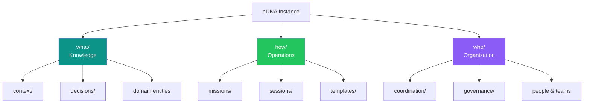
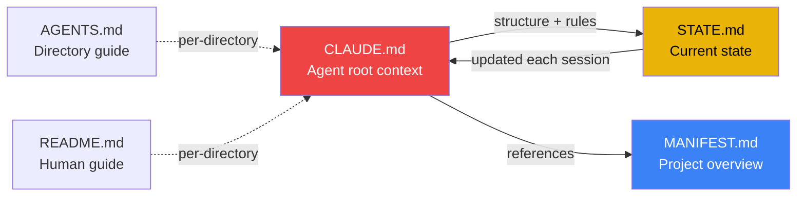
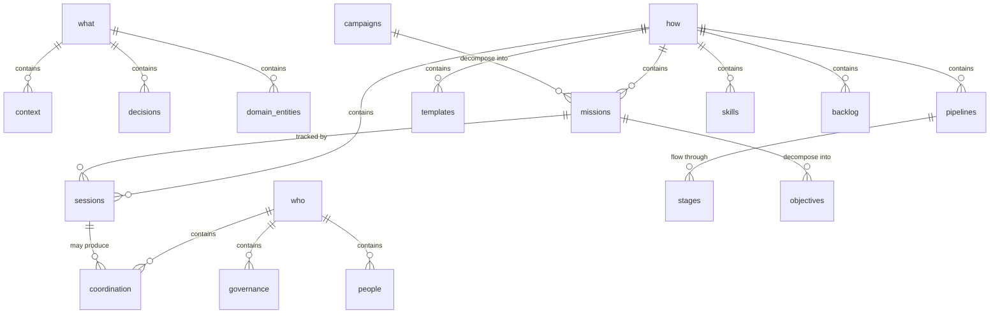
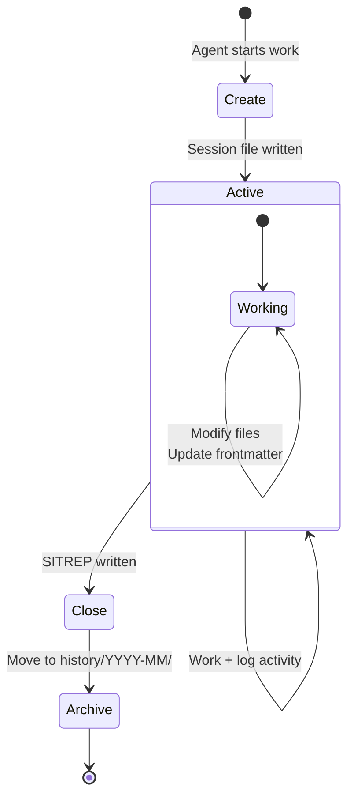
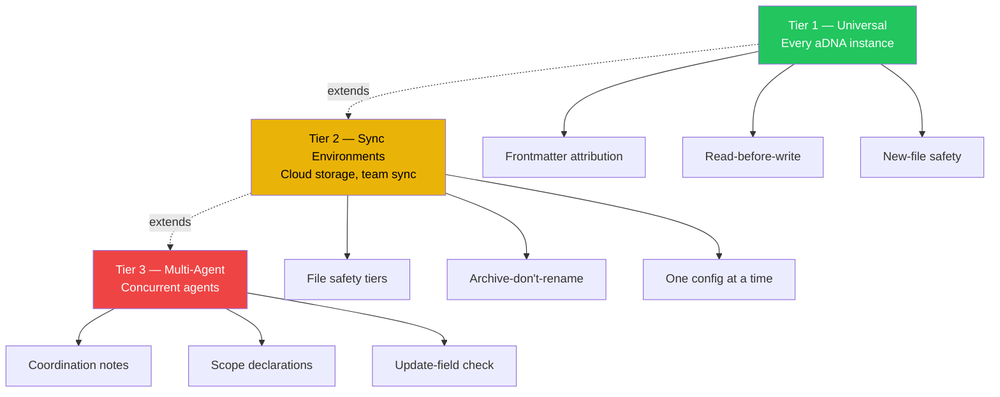
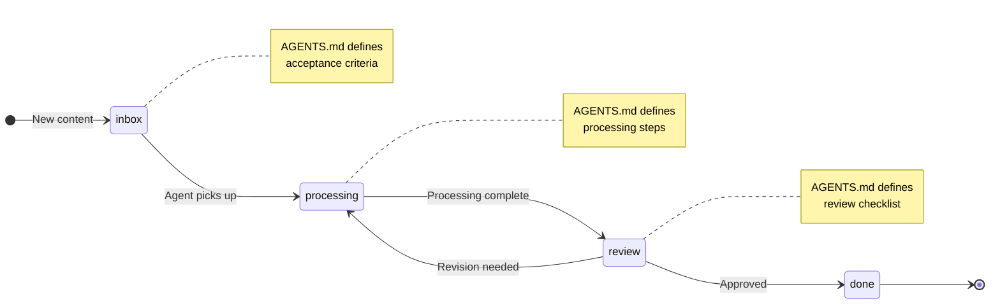
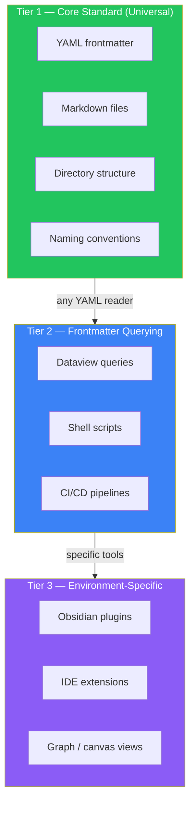
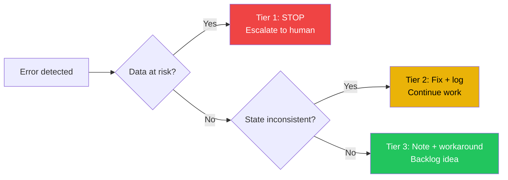
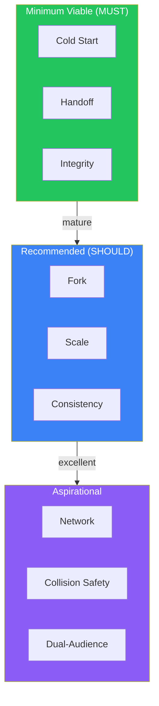

# aDNA Universal Standard

<!-- v2.2 | 2026-03-20 -->

**Agentic DNA (aDNA)** — A knowledge architecture standard for AI-native projects.

---

## 1. Introduction & Scope

> **Scan**: What aDNA is, who it's for, and RFC 2119 normative keywords.

### 1.1 What Is aDNA

aDNA (Agentic DNA) is a standard for organizing project knowledge so that AI agents can orient, operate, and coordinate within any project — alongside humans. It defines a directory structure, governance files, metadata conventions, and operational protocols that together form a project's "knowledge genome."

An aDNA instance is the complete set of governance files, triad directories, and operational infrastructure that implements this standard within a project.

### 1.2 Audience

This standard is written for:

- **Agents** — AI assistants that read, write, and navigate project knowledge
- **Agent operators** — humans who configure and manage agent-augmented projects
- **Project bootstrappers** — anyone starting a new project that will use AI agents

### 1.3 Scope

**In scope**: Project knowledge architecture — how project information is organized, how agents orient and operate, how multiple agents coordinate, and how knowledge persists across sessions.

**Out of scope**: Application source code structure, CI/CD pipeline configuration, deployment infrastructure, and agent model internals. These belong to the project content layer, not to aDNA.

### 1.4 Normative Language

This document uses RFC 2119 keywords:

| Keyword | Meaning |
|---------|---------|
| **MUST** | Absolute requirement |
| **MUST NOT** | Absolute prohibition |
| **SHOULD** | Recommended; may be omitted with good reason |
| **MAY** | Truly optional |

---

## 2. Terminology

> **Scan**: 12 key terms — triad, governance file, bare/embedded deployment, session, SITREP, content-as-code.

| Term | Definition |
|------|-----------|
| **aDNA** | Agentic DNA — the knowledge architecture standard defined by this document |
| **Triad** | The `what/how/who` directory ontology that organizes all aDNA content |
| **what/** | Knowledge layer — WHAT the project knows (context, decisions, reference, domain objects) |
| **how/** | Operations layer — HOW the project works (missions, sessions, templates, pipelines) |
| **who/** | Organization layer — WHO is involved (people, teams, coordination, governance) |
| **Governance file** | A root-level ALLCAPS markdown file that governs the aDNA instance: CLAUDE.md, MANIFEST.md, STATE.md, AGENTS.md, README.md |
| **Bare triad** | Deployment form where `what/`, `how/`, `who/` sit directly at project root. Used for knowledge bases and standalone agent workspaces |
| **Embedded triad** | Deployment form where the triad is wrapped inside `.agentic/` (i.e., `.agentic/what/`, `.agentic/how/`, `.agentic/who/`). Used for git repositories |
| **Deployment form** | How the triad is physically instantiated — bare or embedded |
| **Session** | A bounded unit of agent work with a defined lifecycle: creation, execution, and close-out |
| **SITREP** | Structured status report at session close: Completed, In Progress, Next Up, Blockers, Files Touched |
| **Content-as-code** | A pipeline paradigm where a file's directory location represents its processing state |
| **AGENTS.md** | Per-directory agent-facing guide — purpose, key files, patterns, conventions |
| **README.md** | Per-directory human-facing guide — navigation, context, useful links |
| **Conformance level** | A graduated tier (Starter, Standard, Full) defining the minimum requirements an aDNA instance MUST meet to claim conformance at that level |
| **Conformant instance** | A directory tree that satisfies all MUST requirements for at least the Starter conformance level defined in §5.5 |

---

## 3. Triad Architecture

> **Scan**: The `who/what/how` ontology, bare vs. embedded deployment forms, classification question test.

*Decisions: C1, C8*

### 3.1 The what/how/who Ontology

Every aDNA instance organizes knowledge into three categories:

| Layer | Question | Contains |
|-------|----------|----------|
| **what/** | WHAT does this project know? | Knowledge objects, context library, decisions, reference material, domain entities |
| **how/** | HOW does this project work? | Missions, sessions, templates, pipelines, tasks, skills, processes |
| **who/** | WHO is involved? | People, teams, coordination notes, governance policies, communications |

The triad is the universal ontology. Any piece of project knowledge belongs in exactly one of the three legs. When classifying content, apply the question test: "Is this about WHAT we know, HOW we work, or WHO is involved?"

**Classification examples**:

| Content | Question | Triad Leg |
|---------|----------|-----------|
| "How does ancient DNA extraction work?" | WHAT do we know? | `what/context/` |
| "Mission plan for Q2 deployment" | HOW do we work? | `how/missions/` |
| "Contact info for the partnership lead" | WHO is involved? | `who/contacts/` |

The triad is deliberately minimal. Three categories are sufficient because they map to the three dimensions of any project: its knowledge, its operations, and its people. Additional categories create sorting ambiguity.



### 3.2 Bare Triad

In a bare triad deployment, `what/`, `how/`, and `who/` sit as top-level directories at the project root. Governance files sit alongside them at root level.

**When to use**: Knowledge bases, standalone agent workspaces, and any project where aDNA IS the primary content.

```
{project_root}/
├── CLAUDE.md
├── MANIFEST.md
├── STATE.md
├── AGENTS.md
├── README.md
├── what/
├── how/
├── who/
└── {project_content}/
```

### 3.3 Embedded Triad

In an embedded triad deployment, the triad is wrapped inside `.agentic/` at the repository root. Governance files remain at the repository root (not inside `.agentic/`).

**When to use**: Any git-tracked codebase adding agent support. The `.agentic/` prefix follows the convention of dot-prefixed directories for meta/config in git repositories (like `.github/`, `.vscode/`).

```
{repo_root}/
├── CLAUDE.md
├── MANIFEST.md
├── STATE.md
├── AGENTS.md
├── README.md
├── .agentic/
│   ├── AGENTS.md
│   ├── what/
│   ├── how/
│   └── who/
└── {codebase}/
```

### 3.4 Deployment Form Selection

Both deployment forms are first-class. The triad ontology is identical in both — only the physical nesting differs. CLAUDE.md in each environment bridges any path differences.

An aDNA instance MUST use exactly one deployment form. A project MUST NOT mix bare and embedded triads.

### 3.5 Directory Convention

An aDNA project directory SHOULD use the `.aDNA` suffix to indicate it follows the Agentic DNA knowledge architecture standard. This suffix serves as a visual type marker, analogous to `.app` bundles in macOS or `.git` directories in version control.

**Naming rules:**

- The base template repository (`Agentic-DNA/`) MUST NOT use the `.aDNA` suffix — it is the source, not an instance.
- Forked projects SHOULD use the pattern `ProjectName.aDNA/` (e.g., `zeta.aDNA/`, `my_research.aDNA/`).
- The project name portion MUST match `[a-z][a-z0-9_]{0,63}` — lowercase letters, digits, and underscores only, starting with a letter, maximum 64 characters.
- The suffix `.aDNA` uses mixed case (capital D, N, A) matching the abbreviation branding.
- Nesting `.aDNA` directories inside other `.aDNA` directories is NOT RECOMMENDED.
- Existing projects MAY adopt the convention by renaming their directory. This is optional.

**Discovery:**

Tools SHOULD discover aDNA projects via `*.aDNA` glob patterns:

```bash
# List aDNA projects in workspace
ls -d *.aDNA 2>/dev/null
find . -maxdepth 1 -name "*.aDNA" -type d
```

**Workspace convention:**

```
~/lattice/
├── Agentic-DNA/           # Base template (source repo, no suffix)
├── my_research.aDNA/      # Forked project (aDNA instance)
├── zeta.aDNA/             # Another project
└── CLAUDE.md              # Workspace-level governance
```

---

## 4. Governance Files

> **Scan**: Five ALLCAPS files (CLAUDE, MANIFEST, STATE, AGENTS, README) — purpose, required contents, quickstart sequences, progressive enrichment.

*Decisions: C2, C3, D1, D2, D6, D19, D25*

Every aDNA instance MUST have governance files at the project root. These are the agent's primary orientation documents.

### 4.1 Governance File List

The following ALLCAPS files constitute the governance layer:

| File | Required | Purpose | Update Cadence |
|------|----------|---------|----------------|
| **CLAUDE.md** | MUST | Agent root context — persona, project map, safety rules, startup protocol | When structure or protocols change |
| **MANIFEST.md** | MUST | Static project overview — what the project is, architecture, entry points | When project scope or architecture changes |
| **STATE.md** | SHOULD | Dynamic operational state — current phase, blockers, recent decisions, next steps | Every session close-out |
| **AGENTS.md** | MUST | Root-level agent guide — directory purpose, key files, patterns | When directory structure changes |
| **README.md** | MUST | Root-level human guide — navigation, setup, how to browse | When onboarding experience changes |



### 4.2 CLAUDE.md — Agent Root Context

CLAUDE.md is the primary agent orientation document. It MUST exist at the project root in both deployment forms. It is auto-loaded by Claude Code and serves as the agent's first read on every session.

**Required sections**:

1. **Identity**: Project name, agent persona (if defined — see Appendix A), mission statement. The agent MUST know what project it is operating in and what role it plays.
2. **Project Map**: Directory structure diagram, key files table. The agent MUST be able to navigate the project from this section alone.
3. **Safety Rules**: Collision prevention tier (see §13), escalation protocol, data integrity rules. The agent MUST know what it can and cannot do.
4. **Agent Protocol**: Startup checklist, session tracking rules, closure requirements. The agent MUST know how to begin and end work.
5. **Quickstart**: A concise startup sequence for cold-start orientation. MUST enable a fresh agent to begin useful work within one session. Include both agent and human quickstarts:

   **Agent Quickstart** (5 steps):
   1. Read CLAUDE.md — understand project structure, safety rules, persona
   2. Read STATE.md — understand current phase, blockers, recent decisions
   3. Check `how/sessions/active/` — identify any conflicting sessions
   4. Check `who/coordination/` — read urgent cross-agent notes
   5. Create session file in `how/sessions/active/` and begin work

   **Human Quickstart** (4 steps):
   1. Read README.md — understand what this project is and how to navigate
   2. Read MANIFEST.md — understand architecture and entry points
   3. Browse the triad (`what/`, `how/`, `who/`) — explore the knowledge structure
   4. Open STATE.md — see current operational status and next steps

**Optional sections** (add when relevant):

- Domain Knowledge — project-specific context the agent needs
- Working with Content — naming, metadata, linking conventions
- Machine Setup — multi-machine path patterns and tool requirements
- Environment-Specific Rules — sync, IDE, CI/CD integration

**Versioning**: CLAUDE.md SHOULD include a version comment in its header: `<!-- vX.Y | YYYY-MM-DD -->`. Major version for structural changes, minor for significant updates. Session history serves as the detailed changelog.

**Persona framework**: When a persona is defined, it MUST include: identity (name, role metaphor, mission), operating style (3-5 behavioral principles), and communication norms (tone, greeting/close patterns). See Appendix A for the full framework and reference implementation.

### 4.3 MANIFEST.md — Project Overview

MANIFEST.md describes what the project IS. It changes infrequently — only when project scope, architecture, or major workstreams change.

**Contents**:
- Project identity and purpose
- Architecture overview
- Key entry points and navigation
- Active missions / major workstreams (stable references, not dynamic status)

### 4.4 STATE.md — Dynamic Operational State

STATE.md captures where the project IS RIGHT NOW. It SHOULD be updated on every session close-out. It MUST be updated when phase, blockers, or priorities change.

**Contents**:
- Current phase / milestone
- Recent decisions (last 3-5)
- Active blockers
- What's working well
- Next steps / recommended priorities

STATE.md enables fast cold-start orientation: a fresh agent reads CLAUDE.md (structure and rules) then STATE.md (current situation) and is ready to work.

### 4.5 AGENTS.md — Per-Directory Agent Guide

Every aDNA instance MUST have a root-level AGENTS.md (listed in §4.1). Beyond root, every directory where agents operate SHOULD have an AGENTS.md file. AGENTS.md is agent-facing: optimized for machine consumption with structured, scannable content.

**Lightweight core** (every AGENTS.md):
- Purpose — what this directory contains and why
- Key files — important files with brief descriptions
- Patterns — naming, structure, or workflow conventions specific to this directory

**Enrichment layers** (add as the directory matures):
- Quick reference table
- Modification guide — how to add or change content
- Dependencies — what this directory relies on
- Testing / validation notes
- Current state / recent changes
- Troubleshooting

AGENTS.md files grow through progressive enrichment: start lightweight, add detail when agents or humans repeatedly need information that is not yet documented.

### 4.6 README.md — Per-Directory Human Guide

README.md is human-facing: optimized for browsing in GitHub, an IDE, or a knowledge-base tool. It complements AGENTS.md by providing navigation context for humans.

Every aDNA instance MUST have a root README.md. Subdirectory README.md files are OPTIONAL — create them when human navigation would benefit.

---

## 5. Directory Structure

> **Scan**: Required/recommended/optional subdirectories for each triad leg, registry pattern, ontology artifact, starter/standard/full skeletons.

*Decisions: C5, C6, C7, C11, C12, C14, C15*

### 5.1 what/ — Knowledge Layer

what/ contains everything the project KNOWS.

**Required subdirectories**:

| Directory | Purpose |
|-----------|---------|
| `context/` | Agent context library — synthesized knowledge agents load before domain work |

**Recommended subdirectories**:

| Directory | Purpose |
|-----------|---------|
| `decisions/` | Architecture Decision Records (ADRs) — significant decisions and their rationale |

**Optional subdirectories** (add based on project domain):

| Directory | Purpose |
|-----------|---------|
| `reference/` | Bounded exception for code-adjacent reference material (see §19.5) |
| `{domain}/` | Project-specific knowledge: `models/`, `hardware/`, `datasets/`, `specs/`, etc. |

**Registry pattern**: what/ serves as a registry layer. Entries in what/ subfolders describe and link to objects — they do not duplicate source material. Example registry entry:

```yaml
# what/models/model_llama_3.md
---
type: model
status: active
source: "src/models/llama3/"    # link to implementation
tags: [model, llm, inference]
---
Brief description, capabilities, constraints. Links to source — does not duplicate code.
```

**Ontology artifact**: An aDNA instance SHOULD include `what/ontology.md` with a Mermaid ER diagram mapping entity types, triad categories, and relationships. Minimal skeleton:



Projects extend this skeleton with domain-specific entities (e.g., `customers`, `models`, `hardware`). Knowledge-base environments MAY additionally maintain `what/ontology.canvas` for interactive exploration.

### 5.2 who/ — Organization Layer

who/ contains everything about WHO is involved and WHY.

**Required subdirectories**:

| Directory | Purpose |
|-----------|---------|
| `coordination/` | Cross-agent notes — handoffs, urgency signals, ephemeral coordination |
| `governance/` | Team roles, decision authority, policies, escalation paths |

**Optional subdirectories** (add based on organizational needs):

| Directory | Purpose |
|-----------|---------|
| `{domain}/` | Project-specific organization: `customers/`, `partners/`, `contacts/`, `communications/`, `roadmap/` |

### 5.3 how/ — Operations Layer

how/ contains everything about HOW the project works.

**Required subdirectories**:

| Directory | Purpose |
|-----------|---------|
| `missions/` | Missions — objective decomposition, dependencies, claiming protocol |
| `sessions/` | Session tracking — execution records with SITREP close-outs |
| `templates/` | Reusable templates for all aDNA file types |

**Recommended subdirectories**:

| Directory | Purpose |
|-----------|---------|
| `backlog/` | Ideation and improvement tracking (see §19.2) |

**Optional subdirectories**:

| Directory | Purpose |
|-----------|---------|
| `pipelines/` | Content-as-code workflows (see §14) |
| `tasks/` | Granular task tracking |
| `skills/` | Reusable agent procedures (see §19.3) |
| `processes/` | Human-readable workflow documentation |
| `deliverables/` | Output artifacts |

### 5.4 Universal Skeleton

The minimum viable aDNA instance. Graduated by project complexity:

**Starter Skeleton** (minimum for any aDNA project):

```
{root}/
├── CLAUDE.md
├── MANIFEST.md
├── README.md
├── what/
│   └── context/
├── how/
│   ├── missions/
│   ├── sessions/
│   └── templates/
└── who/
    ├── coordination/
    └── governance/
```

**Standard Skeleton** (active multi-agent projects — adds STATE.md, AGENTS.md, backlog):

```
{root}/
├── CLAUDE.md
├── MANIFEST.md
├── STATE.md
├── AGENTS.md
├── README.md
├── what/
│   ├── AGENTS.md
│   ├── context/
│   │   └── AGENTS.md
│   └── decisions/
├── how/
│   ├── AGENTS.md
│   ├── missions/
│   ├── sessions/
│   │   ├── active/
│   │   └── history/
│   ├── templates/
│   └── backlog/
└── who/
    ├── AGENTS.md
    ├── coordination/
    └── governance/
```

**Full Skeleton** (large projects — adds domain-specific directories):

Extends the Standard Skeleton with project-specific subdirectories in each triad leg. Examples: `what/models/`, `what/hardware/`, `who/customers/`, `how/pipelines/`, `how/skills/`.

For embedded triad deployments, the same skeletons apply inside `.agentic/`, with governance files remaining at the repository root.

### 5.5 Conformance Levels

The skeletons defined in §5.4 establish three normative **conformance levels**. A project claiming aDNA conformance MUST satisfy all MUST requirements at its declared level.

#### Level 1: Starter Conformance

An aDNA instance at Starter conformance MUST have:

1. **Governance files**: `CLAUDE.md`, `MANIFEST.md`, `README.md` at the root (bare) or repository root (embedded)
2. **Triad directories**: `what/`, `how/`, `who/` (bare) or `.agentic/what/`, `.agentic/how/`, `.agentic/who/` (embedded)
3. **Required subdirectories**: `what/context/`, `how/missions/`, `how/sessions/`, `how/templates/`, `who/coordination/`, `who/governance/`
4. **Frontmatter**: All content files inside the triad MUST include the base fields defined in §7.2 (`type`, `status`, `created`, `updated`, `last_edited_by`, `tags`)

Starter conformance represents the minimum viable aDNA instance — sufficient for a single-agent project with basic session tracking.

#### Level 2: Standard Conformance

An aDNA instance at Standard conformance MUST satisfy all Starter requirements AND:

5. **Additional governance files**: `STATE.md` and a root `AGENTS.md`
6. **Per-directory AGENTS.md**: Every triad leg (`what/`, `how/`, `who/`) MUST have an `AGENTS.md` file
7. **Recommended directories**: `what/decisions/`, `how/backlog/`, `how/sessions/active/`, `how/sessions/history/`
8. **Session lifecycle**: Sessions MUST follow the lifecycle defined in §8 (creation → execution → close-out with SITREP)

Standard conformance represents an active multi-agent project with operational discipline.

#### Level 3: Full Conformance

An aDNA instance at Full conformance MUST satisfy all Standard requirements AND:

9. **Context library**: `what/context/` MUST contain at least one topic directory with its own `AGENTS.md` and at least one context file with `token_estimate` in frontmatter
10. **FAIR metadata**: Deployable objects (modules, datasets, lattices) MUST include a `fair:` frontmatter block with at minimum `keywords` and `license`
11. **Ontology artifact**: `what/ontology.md` MUST exist with a Mermaid ER diagram (per §5.1)
12. **Template compliance**: All content types used in the project MUST have corresponding templates in `how/templates/`

Full conformance represents a mature, federatable aDNA instance ready for cross-instance interoperation.

#### Conformance Declaration

Projects MAY declare their conformance level in `MANIFEST.md` using the `adna_conformance` frontmatter field:

```yaml
adna_conformance: starter  # or: standard, full
```

An instance that does not declare a conformance level is assumed to be unverified. The `adna_validate.py` tool (see `what/lattices/tools/`) can determine conformance level programmatically.

---

## 6. Naming Conventions

> **Scan**: Underscores not hyphens, `type_descriptive_name.md` pattern, ALLCAPS governance list, directory naming, `type_` prefix convention.

*Decisions: C3*

### 6.1 File Naming

Content files MUST use **underscores** for word separation. Hyphens MUST NOT be used in aDNA content files.

**Pattern**: `type_descriptive_name.md`

Examples:
- `mission_adna_standard.md`
- `session_{username}_20260211_120000_gap_analysis.md`
- `customer_acme_corp.md`
- `context_research_ancient_dna.md`

**Exception**: Code-adjacent files in the project content layer (not inside the triad) MAY use hyphens to respect ecosystem conventions (npm, pip, etc.).

**Exception**: Tool-generated files (e.g., `how/tasks/` with plugin-generated names) MAY retain their generated naming format.

### 6.2 Governance File Naming

Governance files MUST use ALLCAPS names. The exhaustive list:

- `CLAUDE.md`
- `MANIFEST.md`
- `STATE.md`
- `AGENTS.md`
- `README.md`

No other files SHOULD use ALLCAPS naming. This list MUST NOT be extended without a standard revision.

### 6.3 Directory Naming

Directories MUST use lowercase with underscores: `context_library/`, `missions/`.

**Exception**: `.agentic/` uses a dot prefix (embedded triad convention).

### 6.4 Type Prefix Convention

The `type_` prefix pattern is RECOMMENDED for aDNA content files. It enables sorting, filtering, and at-a-glance identification. Common prefixes:

| Prefix | Content |
|--------|---------|
| `mission_` | Missions (legacy: `plan_`) |
| `session_` | Session files |
| `template_` | Templates |
| `customer_` | Customer records |
| `context_` | Context library files |
| `idea_` | Backlog ideas |
| `skill_` | Skill procedures |

---

## 7. Frontmatter System

> **Scan**: Required base fields (`type`, `status`, `created`, `updated`, `last_edited_by`, `tags`), tag conventions, priority field, type-specific extensions.

*Decisions: C4, D18, D20*

### 7.1 Scope

YAML frontmatter MUST be present on all aDNA content files — files inside the triad (`what/`, `how/`, `who/` or `.agentic/what/`, etc.) and root governance files.

Project content files (source code, external documentation) outside the triad are exempt from frontmatter requirements.

### 7.2 Required Base Fields

Every aDNA content file MUST include these frontmatter fields:

```yaml
---
type: <entity_type>
status: <lifecycle_status>
created: YYYY-MM-DD
updated: YYYY-MM-DD
last_edited_by: agent_<username> | <username>
tags: []
---
```

| Field | Purpose |
|-------|---------|
| `type` | Entity classification (e.g., `session`, `mission`, `customer`, `context_research`) |
| `status` | Lifecycle state (e.g., `active`, `completed`, `draft`, `abandoned`) — entity-specific values |
| `created` | Date of file creation |
| `updated` | Date of last modification — critical for collision prevention |
| `last_edited_by` | Attribution — who or what last modified this file |
| `tags` | Categorization array for filtering and discovery |

### 7.3 Tag Conventions

Tags MUST use lowercase with underscores (e.g., `mission`, `context_research`).

Every aDNA content file MUST have at least one tag (the type tag is sufficient).

No formal tag registry is prescribed. Projects SHOULD document their tag conventions in AGENTS.md files when the tag set exceeds a dozen unique tags.

### 7.4 Priority Field

Content items that need prioritization (tasks, backlog ideas, customers) MAY include a `priority` field using a simple numeric scale: `0` (highest) through `N` (lowest).

Rule/guardrail conflict resolution is a separate concern. Projects that need rule precedence SHOULD define their own mechanism in CLAUDE.md or governance files.

### 7.5 Type-Specific Fields

Templates (§12) define additional frontmatter fields per content type. For example, a session template adds `session_id`, `plan_id` (legacy field name), `tier`; a customer template adds `segment`, `deal_stage`, `contacts`.

Frontmatter is the integration layer between human tools (Dataview queries, IDE search) and agent queries. Consistent frontmatter enables consistent querying across any tool.

### 7.6 Frontmatter Extension Policy

Instance-specific frontmatter fields MAY be added to any entity type. The following rules govern extensions:

1. **Custom fields** MAY be added freely to any content file's frontmatter
2. Custom fields SHOULD use a project-specific prefix (e.g., `bio_target_class`, `crm_deal_stage`) when the field name could conflict with future standard fields
3. Standard fields (those defined in §7.2 and per-type templates) MUST NOT be repurposed to carry different semantics
4. Migration tools MUST preserve custom fields — standard version upgrades MUST NOT strip unrecognized frontmatter fields
5. Projects SHOULD document their custom fields in the relevant `AGENTS.md` or template files

---

## 8. Session Model

> **Scan**: Bounded units of agent work — lifecycle (create → execute → close → archive), session tiers, SITREP close-out, next-session prompt, the 75% rule.

*Decisions: D3, D4, D5*

### 8.1 Session Lifecycle

A session is a bounded unit of agent work. Every session follows this lifecycle:

1. **Create**: Write a session file in `how/sessions/active/`
2. **Execute**: Perform work, logging activity
3. **Close**: Write SITREP + next-session prompt
4. **Archive**: Set `status: completed`, move to `how/sessions/history/YYYY-MM/`

A session file MUST be created before an agent modifies any other project files. This is the audit trail.



### 8.2 Session ID Format

Session IDs MUST use the timestamped format:

```
session_{user}_{YYYYMMDD}_{HHMMSS}_{descriptor}
```

Example: `session_{username}_20260211_120000_gap_analysis`

Timestamped IDs are machine-sortable, collision-free across agents, and self-documenting. The descriptor SHOULD be a brief lowercase-underscore slug describing the session's purpose.

### 8.3 Session Tiers

| Tier | When | Requirements |
|------|------|-------------|
| **Tier 1** (default) | Normal content work | Session file with intent, activity log, SITREP close-out |
| **Tier 2** | Shared config edits (governance files, plugin configs) | Tier 1 requirements + scope declaration + conflict scan + heartbeat |

Tier 1 is a lightweight audit trail. Tier 2 adds coordination safeguards for edits that affect shared infrastructure.

Sessions MAY include a **Technical Readiness Review (TRR)** quality gate before close-out — a structured check that deliverables meet acceptance criteria. TRR is particularly useful for code-generation sessions or sessions producing artifacts that downstream tasks depend on.

### 8.4 SITREP Close-Out

Every session MUST end with a SITREP:

```markdown
## SITREP

**Completed**: [what was finished]
**In progress**: [what was started but not finished, with handoff notes]
**Next up**: [recommended next actions]
**Blockers**: [anything preventing progress]
**Files touched**: [created, modified, moved]
```

### 8.5 Next-Session Prompt

Every session MUST include a next-session prompt after the SITREP:

```markdown
## Next Session Prompt

[Self-contained paragraph that a fresh agent can read to continue this work.
Include: what was accomplished, what remains, key context, recommended approach.]
```

The next-session prompt ensures continuity. A fresh agent reading this prompt and STATE.md SHOULD be able to continue the work without needing to read the full session history.

### 8.6 STATE.md Update

STATE.md SHOULD be updated on every session close. It MUST be updated when the current phase, blockers, or priorities change.

### 8.7 The 75% Rule

Agents MUST scope each session to use no more than approximately 75% of the context window. The remaining 25% is reserved for thinking, debugging, and course correction.

If a task requires more than 75% of the context window, the agent MUST split the work across sessions, checkpointing progress in the session close-out.

No other session sizing prescriptions are universal. Time, task count, and line-count guidelines are project-specific — different work paradigms (code generation, knowledge synthesis, CRM maintenance) have different natural session sizes.

---

## 9. Mission System

> **Scan**: Multi-session work decomposition — objectives, acceptance criteria, stages, claiming protocol, handoff between agents.

*Decisions: D12, D16, D17*

### 9.1 Mission Structure

Missions live in `how/missions/`. A mission decomposes work that spans multiple sessions into trackable objectives.

**Single-file missions** (small scope):
```
how/missions/mission_simple_task.md
```

**Subdirectory missions** (large scope with deliverables):
```
how/missions/mission_complex_project/
├── mission_complex_project.md    # Master mission
├── deliverable_a.md              # Phase/deliverable files
└── deliverable_b.md
```

The mission file MUST include:
- **Objectives**: What the mission achieves
- **Acceptance criteria**: How you know it is done
- **Constraints**: What limits apply (time, scope, dependencies)
- **Objective list**: Individual objectives with dependencies and status
- **Status tracking**: Per-objective status (pending, in_progress, completed, blocked)

### 9.2 Mission Stages

Missions MAY define stage-based subdirectories for multi-phase work:

```
how/missions/{mission_slug}/
├── mission_{slug}.md
├── 00_research/
├── 01_requirements/
├── 02_design/
└── 03_implementation/
```

Stage names and count are mission-specific. The convention is: numbered prefix for ordering, descriptive name for clarity.

### 9.3 Mission Handoff

Agents claim mission objectives by session. A session file's `plan_id` and `task` frontmatter fields (legacy names, retained for compatibility) link it to the mission. When an objective spans multiple sessions, each session's SITREP provides the handoff. Agents MUST NOT claim objectives already in progress by another active session.

---

## 10. Context Library

> **Scan**: `what/context/` organization — topic structure, context subtypes (research, guide, core), token budget awareness and the 75% rule.

*Decisions: D8*

### 10.1 Location and Structure

The context library lives in `what/context/`. It is the single location for all agent context — synthesized knowledge that agents load before domain work.

```
what/context/
├── AGENTS.md              # Library protocol, topic index, token budgets
├── {topic}/
│   ├── AGENTS.md          # Topic overview, subtopic index
│   ├── subtopic_a.md
│   └── subtopic_b.md
└── {topic}/
    └── ...
```

### 10.2 Context Subtypes

Context files use the `type` frontmatter field to distinguish content subtypes:

| Subtype | Purpose | Pattern |
|---------|---------|---------|
| `context_research` | Synthesized domain knowledge from external sources | Dense, citational, comprehensive |
| `context_guide` | Prescriptive component or tool guides | Step-by-step, actionable, reference-oriented |
| `context_core` | Foundational project definitions (conventions, guardrails, stack) | Concise, authoritative, rarely changing |

All subtypes coexist in `what/context/` organized by topic. The subtype informs how agents use the content, not where it lives.

### 10.3 Token Budget Awareness

The context library AGENTS.md SHOULD include token estimates per topic in a scannable format:

```markdown
| Topic | ~Tokens | Subtopics |
|-------|---------|-----------|
| ancient_dna | ~8,000 | extraction, sequencing, analysis |
| compute_infra | ~5,000 | gpu_clusters, edge_devices |
```

Agents MUST read the topic index first and load only the subtopics needed for the current task. Loading the entire context library into a single session is wasteful and violates the 75% rule (§8.7).

---

## 11. Coordination Protocol

> **Scan**: `who/coordination/` for cross-agent communication — urgency levels (urgent/info/fyi), ephemeral notes, required contents.

*Decisions: D9*

### 11.1 Cross-Agent Coordination

Cross-agent notes live in `who/coordination/`. This is the single location for agent-to-agent communication.

Coordination notes are **ephemeral by design**: created when needed, consumed by the target agent, and archived when resolved.

### 11.2 Urgency Levels

| Level | Meaning | When to Read |
|-------|---------|-------------|
| `urgent` | Immediate action needed | Read before any other work |
| `info` | Important context | Read during startup checklist |
| `fyi` | Non-blocking background information | Read when convenient |

### 11.3 Coordination Note Contents

A coordination note MUST include:
- **Who** created it and who it targets
- **What** the coordination concern is
- **When** it was created and when it expires
- **Action needed** — what the target agent should do

Agents MUST check `who/coordination/` during every session startup.

---

## 12. Template System

> **Scan**: Graduated template sets (starter/standard/full), `template_{type}.md` naming, template index recommendation.

*Decisions: D11*

### 12.1 Graduated Template Sets

Templates live in `how/templates/`. Projects grow their template sets:

**Starter set** (every aDNA instance MUST include):

| Template | Purpose |
|----------|---------|
| `template_session.md` | Session file with SITREP and next-session prompt sections |
| `template_mission.md` | Mission with objectives, acceptance criteria, objective list |
| `template_context.md` | Context library file with topic structure and token estimate |

**Standard set** (SHOULD include for active multi-agent projects):

| Template | Purpose |
|----------|---------|
| `template_coordination.md` | Cross-agent coordination note |
| `template_backlog.md` | Backlog idea with priority, effort, status |
| `template_adr.md` | Architecture Decision Record |

**Full set** (MAY include per project domain):

Additional templates for domain-specific content types (customer, partner, model, dataset, etc.).

### 12.2 Template Conventions

Templates MUST follow the naming pattern `template_{type}.md`.

Templates MUST include frontmatter with all required base fields (§7.2) plus type-specific fields pre-populated.

A template index (e.g., `template_library.md` in `how/templates/`) is RECOMMENDED for projects with 5 or more templates.

---

## 13. Collision Prevention

> **Scan**: Three tiers — universal (frontmatter attribution, read-before-write), sync (file safety tiers, archive-don't-rename), multi-agent (coordination notes, scope declarations).

*Decisions: D7*

### 13.1 Overview

Collision prevention protects against data loss when multiple agents or humans modify the same files. The system is tiered — projects adopt the tiers they need.



### 13.2 Tier 1 — Universal

Every aDNA instance MUST implement Tier 1:

1. **Frontmatter attribution**: Every file modification MUST update `last_edited_by` and `updated` in frontmatter.
2. **Read-before-write**: Agents MUST read current file content immediately before writing. Never rely on cached reads.
3. **New-file safety**: Creating a new file has no collision risk. New files are always safe.

### 13.3 Tier 2 — Sync Environments

Projects using file sync (cloud storage, team sync tools) SHOULD additionally implement:

1. **Safety tiers**: Classify files as Safe (content — low collision risk), Shared Config (governance, plugin configs — medium risk), or Volatile (auto-generated files like `workspace.json` — do not attempt to maintain).
2. **Archive-don't-rename**: Move files to `archive/` instead of renaming. Sync systems handle renames poorly.
3. **One config at a time**: Edit one shared config file, verify the write, then move to the next.

### 13.4 Tier 3 — Multi-Agent

Projects with multiple agents operating simultaneously SHOULD additionally implement:

1. **Coordination notes**: Use `who/coordination/` (§11) for strategic cross-agent communication.
2. **Session scope declarations**: Tier 2 sessions declare which files/directories they will modify.
3. **Update-field check**: Before modifying a file where `updated` is today and `last_edited_by` is not you, confirm with the user before overwriting.

---

## 14. Content-as-Code Pipelines

> **Scan**: Folder-based workflows where a file's directory location IS its processing state — pipeline structure, stage AGENTS.md, pipeline index.

*Decisions: D14*

### 14.1 Paradigm

Content-as-code is a universal paradigm for folder-based workflows: a file's directory location IS its processing state. Moving a file between stage directories advances it through the workflow.

This paradigm applies wherever content flows through defined stages — research ingestion, document review, approval workflows, deployment pipelines.



### 14.2 Pipeline Structure

Pipelines live in `how/pipelines/{pipeline_name}/`:

```
how/pipelines/{pipeline_name}/
├── AGENTS.md           # Pipeline overview, stage transitions
├── inbox/              # Stage 1
│   └── AGENTS.md       # Processing instructions for this stage
├── processing/         # Stage 2
│   └── AGENTS.md
├── review/             # Stage 3
│   └── AGENTS.md
└── done/               # Stage 4
    └── AGENTS.md
```

Each stage folder MUST have an AGENTS.md with processing instructions specific to that stage.

Stage names and count are pipeline-specific. The file's location is its state — no separate status tracking is needed.

### 14.3 Pipeline Index

The `how/pipelines/` directory SHOULD have an AGENTS.md documenting all pipelines, their purposes, and their stage flows.

---

## 15. Archive & Versioning

> **Scan**: Archive patterns for sync vs. git environments, retention policy, CLAUDE.md version tracking convention.

*Decisions: C9, C10*

### 15.1 Archive Pattern

The archive pattern varies by environment:

**Sync environments** (cloud storage, team sync tools):
- Archive directories within content folders (e.g., `how/backlog/archive/`)
- Session history uses `how/sessions/history/YYYY-MM/`
- Archive-don't-rename rule: move to `archive/` instead of renaming files
- Project-level `archive/` within the nearest triad directory for vault-level archival

**Git repositories**:
- Git history serves as the primary archive
- `archive/` subdirectories for visibly-deprecated items (documents users should see are retired)
- Session history follows the same `YYYY-MM/` pattern regardless of environment

### 15.2 Retention

Session history SHOULD NOT be auto-deleted. Manual cleanup after 6 months is acceptable if storage is a concern.

### 15.3 Versioning

aDNA instances track their own version via a comment in CLAUDE.md: `<!-- vX.Y | YYYY-MM-DD -->`.

Major version increments indicate structural changes. Minor version increments indicate significant content updates. Session history serves as the detailed changelog — no formal CHANGELOG.md is required.

### 15.4 Standard Versioning & Backwards Compatibility

The aDNA standard uses two versioning tracks:

- **Standard version** (this document, `adna_standard.md`): Governs the normative specification — triad architecture, required files, conformance levels, naming conventions. Follows semantic versioning: `vMajor.Minor`.
- **Governance version** (`CLAUDE.md` `version` field, `CHANGELOG.md`): Governs the operational implementation — protocols, templates, skills, tooling. Follows `Major.Minor` versioning.

**Backwards compatibility promise**:

- Standard **minor** versions (e.g., v2.0 → v2.1) MUST NOT invalidate conformant instances. An instance conformant to aDNA v2.0 MUST remain conformant to aDNA v2.1.
- Standard **major** versions (e.g., v2.x → v3.0) MAY introduce breaking changes. When they do, migration guidance MUST be provided.
- Governance version changes are operational and do not affect standard conformance.

---

## 16. Tool Integration Tiers

> **Scan**: Three tiers — core standard (Tier 1, universal), frontmatter querying (Tier 2, any YAML reader), environment-specific (Tier 3, IDE/plugin). Aggregation points.

*Decisions: C13, D22*

### 16.1 Three-Tier Model

| Tier | Scope | Examples | Universal? |
|------|-------|----------|-----------|
| **Tier 1** | Core standard | YAML frontmatter, markdown, directory structure, naming conventions | Yes — works with any tool |
| **Tier 2** | Frontmatter querying | Dataview, custom scripts, CI/CD that reads frontmatter | Recommended — any tool that parses YAML |
| **Tier 3** | Environment-specific | IDE extensions, knowledge-base plugins, graph view, canvas | No — tool-specific |

Everything in this standard is Tier 1 unless noted otherwise. Tier 1 features work with any tool that can read files and directories.



### 16.2 Aggregation Points

The following cross-directory views are useful in any aDNA instance. Their implementation is Tier 2/3 (tool-specific):

| Aggregation Point | Aggregates | Purpose |
|-------------------|-----------|---------|
| Active missions overview | `how/missions/` | All missions with current status |
| Context index | `what/context/` | All topics with token budgets |
| Session history | `how/sessions/history/` | Recent sessions with outcomes |
| Coordination status | `who/coordination/` | Active cross-agent notes |

Implementation examples: Dataview queries, shell scripts that parse frontmatter, CI/CD dashboard panels. Any tool that can read YAML frontmatter can implement these views.

---

## 17. Error & Recovery Protocol

> **Scan**: Three-tier response — data integrity threat (STOP + escalate), state inconsistency (fix + log), process issue (workaround + backlog).

*Decisions: D24*

### 17.1 Tiered Response

| Severity | Trigger | Response | Recovery |
|----------|---------|----------|----------|
| **Tier 1 — Data integrity threat** | Corrupt file, data loss, conflicting writes destroying content | Stop all writes immediately. Document the issue. Do NOT attempt automated repair. Escalate to human with `#needs-human` tag. | Human-guided only |
| **Tier 2 — State inconsistency** | Stale STATE.md, broken cross-references, missing frontmatter | Attempt recovery: re-read files, reconcile state, add missing fields. Log the issue and recovery action in session file. Continue work. | Agent-recoverable with documentation |
| **Tier 3 — Process issue** | Template not found, naming violation, ambiguous pipeline stage | Note the issue in session file. Work around it. Create a backlog idea for improvement. | Work around, improve later |



### 17.2 Escalation

Agents MUST log blockers with the `#needs-human` tag when:
- Data integrity is at risk (Tier 1 errors)
- A decision exceeds the agent's authority
- Ambiguous scope could lead to destructive actions

Agents MUST NOT proceed with destructive or irreversible actions when uncertain. When in doubt, stop and ask.

---

## 18. Success Criteria

> **Scan**: Three levels — minimum viable (cold start, handoff, integrity), recommended (fork, scale, consistency), aspirational (network, collision safety, dual-audience).

*Decisions: D21*



### 18.1 Minimum Viable (every aDNA MUST pass)

1. **Cold Start**: A fresh agent reads CLAUDE.md, then STATE.md (if present), and begins useful work within one session. No prior project knowledge is required.
2. **Handoff**: Agent A closes a session with SITREP + next-session prompt. Agent B reads the close-out and STATE.md and continues the work seamlessly.
3. **Integrity**: No data corruption or silent overwrites during multi-agent operation with collision prevention active.

### 18.2 Recommended (mature aDNA SHOULD pass)

4. **Fork**: The aDNA structure can be copied to a new project and adapted with only CLAUDE.md and domain content changes.
5. **Scale**: The aDNA supports 10+ missions, 50+ sessions, and 100+ content files without navigational degradation.
6. **Consistency**: Both deployment forms (bare and embedded) feel like the same system to agents and humans.

### 18.3 Aspirational (excellent aDNA)

7. **Network**: Multiple aDNA instances can discover and reference each other via documented patterns.
8. **Collision Safety**: Multi-agent concurrent operation produces no data loss even under heavy write contention.
9. **Dual-Audience**: Both humans (IDE, GitHub, knowledge-base tools) and agents find the content navigable and useful.

---

## 19. Optional Extensions

> **Scan**: Six opt-in subsystems — machine registry, backlog, skill files, testing/CI awareness, reference code, ADRs. Adopt based on need.

The following patterns are available but not required. Projects adopt them based on need.

### 19.1 Machine Registry

*Decision: D10*

For projects running on multiple machines or sync environments where path patterns vary.

**Location**: `what/hardware/machines/` or a similar what/ subfolder.

**Per-machine file contents**: hostname, user, OS, path patterns, installed tools, capabilities.

RECOMMENDED for sync-based environments (cloud storage, team sync tools) where file paths differ across machines. OPTIONAL for git repositories where environment variables handle path differences.

### 19.2 Backlog System

*Decision: D13*

Durable ideation and improvement tracking.

**Location**: `how/backlog/`

**Lifecycle**: idea → triage (priority/effort assessment) → graduation to `how/missions/` or archive.

**Frontmatter**: `type: idea`, `category`, `priority`, `effort`, `status`, `proposed_by`.

Agents SHOULD scan `how/backlog/` during session startup for ideas relevant to the current work. New ideas discovered during work SHOULD be captured as backlog files.

### 19.3 Skill Files

*Decision: D15*

Reusable agent procedures — step-by-step instructions agents can follow autonomously.

**Location**: `how/skills/skill_{name}.md`

**Sections**: purpose, prerequisites, steps, verification, rollback, notes.

Skills are distinct from processes: skills are agent-executable (precise steps, verification checks); processes are human-readable (guidelines, decision trees).

### 19.4 Testing/CI Awareness

*Decision: D23*

aDNA does not prescribe test frameworks or CI/CD configurations — these belong to the project content layer. However, agents SHOULD be aware of test status.

**Awareness pattern**:
- CLAUDE.md includes an optional section on testing: where to check, how to run, what signals mean
- AGENTS.md for code directories includes testing guidance as an enrichment layer
- STATE.md reports test status when relevant (pass/fail, coverage, regressions)
- CI/CD configuration lives in project content (`.github/`, `Makefile`, `pyproject.toml`, etc.)

### 19.5 Reference Code

*Decision: C11*

Bounded exception for code-adjacent reference material inside the aDNA structure.

**Location**: `what/reference/`

**Rules**:
- Executable code MUST live in `what/reference/` or in the project content layer — nowhere else in the triad
- what/reference/ MUST be bounded — no unbounded growth
- Entries SHOULD link to source implementations rather than duplicating code
- Documentation-only projects skip this entirely

### 19.6 Architecture Decision Records (ADRs)

*Decision: C12*

Lightweight records of significant project decisions.

**Location**: `what/decisions/`

**Template sections**: context, decision, consequences.

ADRs are knowledge artifacts — decisions outlive the process that produced them. A 2-year-old ADR is reference knowledge, not an active operation. This is why they live in what/, not how/.

---

## 20. Appendices

> **Scan**: Persona framework (App A), aggregation points (App B), deferred topics (App C), decision traceability matrix (App D — 40 decisions mapped to spec sections).

### Appendix A: Persona Framework

*Decision: D6*

A persona is OPTIONAL but structured when present. The persona framework defines what a persona includes and why it matters — consistency, predictability, and character continuity across sessions.

#### A.1 Framework Structure

| Section | Contents | Purpose |
|---------|----------|---------|
| **Identity** | Name, role metaphor, mission statement | Establish who the agent is in this project |
| **Operating Style** | 3-5 behavioral principles | Define predictable working patterns |
| **Communication Norms** | Tone, formatting, greeting/close patterns | Ensure consistent interaction style |
| **Domain Awareness** | What the persona should know about the project domain | Ground the agent in project context |

#### A.2 Reference Implementation

The following is a reference persona. Projects MAY adopt it directly or use the framework to create their own.

**Identity**: Chief of staff to the operation — a role inspired by the military chief of staff archetype, who turns strategic vision into operational reality.

**Operating Style**:
1. Orient first, act second — assess the operational picture before diving into any task
2. Think in lines of effort — maintain awareness across parallel workstreams
3. Be direct and precise — clear status updates, early risk flags, recommendations with rationale
4. Coordinate, don't just execute — coherence across the full operation matters more than speed on any single task

**Communication Norms**: Direct, no filler. Structured updates (SITREP format). Greets with operational state summary on planning sessions. Proceeds directly on execution sessions.

**Domain Awareness**: Defined per project in CLAUDE.md.

### Appendix B: Aggregation Points

*Decision: D22*

Standard aggregation points for cross-directory views. Implementation is tool-specific (Tier 2/3).

| Point | Source | Query Pattern |
|-------|--------|--------------|
| **Active missions** | `how/missions/` | All files where `type: mission` and `status: active` |
| **Context index** | `what/context/` | All topic directories with their AGENTS.md token estimates |
| **Recent sessions** | `how/sessions/history/` | Last 10 session files, sorted by `updated` descending |
| **Open coordination** | `who/coordination/` | All files where `status: open` or `status: urgent` |
| **Backlog overview** | `how/backlog/` | All files where `type: idea` and `status: active`, sorted by `priority` |

**Knowledge-base implementation**: Dataview queries in bridge pages (e.g., `how/missions.md`, `how/context_library.md`).

**Script implementation**: Any tool that parses YAML frontmatter from markdown files can produce these views.

### Appendix C: Deferred Topics

The following topics were identified during the planning arc but deferred from v1.0. They are acknowledged here for future standard revisions. (Retained from v1.0; no new deferrals in v2.0.)

| Gap | Topic | Disposition |
|-----|-------|-------------|
| G2 | **Multi-model / model-agnostic design** | "CLAUDE.md" is a convention name — projects using other models use the same structure. The persona framework (§ App A) is model-agnostic. A future revision MAY define model-neutral naming. |
| G3 | **Documentation generation** | Projects that generate external-facing docs from aDNA content will develop project-specific patterns. No universal standard needed at this time. |
| G7 | **Context staleness detection** | The `updated` field + session cycling naturally address staleness (fresh reads on each session start). Formal staleness detection is Tier 2/3 tooling, not a standard concern. |
| G8 | **Cross-instance aDNA awareness** | Addressed by bridge patterns (informational companion, SHOULD-level guidance). Defines composition patterns (nesting, sibling, monorepo), discovery protocol, scope boundaries, cross-referencing conventions, and agent behavior rules. Addresses §18.3 #7 Network criterion. |
| G10 | **Agent capability declaration** | Most aDNA instances target specific agent capabilities. CLAUDE.md can note capability assumptions. A formal capability schema is deferred pending broader agent ecosystem maturity. |

### Appendix D: Decision Traceability Matrix

This appendix maps every design decision to its location in the standard, ensuring complete coverage.

#### D.1 Structural Decisions (C1-C15)

| ID | Decision | Spec Section(s) |
|----|----------|-----------------|
| C1 | Pattern-appropriate deployment (bare + embedded triad) | §3.2, §3.3, §3.4 |
| C2 | Dual-file: AGENTS.md + README.md everywhere | §4.5, §4.6 |
| C3 | Vault naming + repo exceptions, ALLCAPS governance list | §6.1, §6.2, §6.3, §6.4 |
| C4 | Frontmatter mandatory for aDNA content, optional for project | §7.1, §7.2 |
| C5 | what/ context/ mandatory, rest project-specific | §5.1 |
| C6 | who/ coordination/ + governance/ mandatory | §5.2 |
| C7 | how/ tiered: missions/sessions/templates required, backlog recommended | §5.3 |
| C8 | Seeding guidance via triad principle, not prescriptive table | §3.1 (triad question test) |
| C9 | Git-supplemented archive | §15.1 |
| C10 | Lightweight versioning in CLAUDE.md, sessions as changelog | §15.3 |
| C11 | what/reference/ as bounded exception for code | §19.5 |
| C12 | ADRs in what/decisions/ | §19.6 |
| C13 | Tiered tool integration (Tier 1/2/3) | §16.1 |
| C14 | Ontology artifact: Mermaid (Tier 1) + Canvas (Tier 3) | §5.1 (ontology artifact) |
| C15 | what/ as registry layer | §5.1 (registry pattern) |

#### D.2 Process Decisions (D1-D25)

| ID | Decision | Spec Section(s) |
|----|----------|-----------------|
| D1 | Universal CLAUDE.md template, required + optional sections | §4.2 |
| D2 | Separate MANIFEST.md + STATE.md | §4.3, §4.4 |
| D3 | Session model with environment enrichments | §8.1, §8.2, §8.3 |
| D4 | SITREP + mandatory next-session prompt | §8.4, §8.5 |
| D5 | 75% rule only, no sizing prescriptions | §8.7 |
| D6 | Persona framework with reference implementation | §4.2 (persona), App A |
| D7 | Tiered collision prevention (universal/sync/multi-agent) | §13 |
| D8 | Flexible what/context/ with subtypes | §10 |
| D9 | who/coordination/ only | §11 |
| D10 | Machine registry as optional extension | §19.1 |
| D11 | Graduated template set (Starter/Standard/Full) | §12 |
| D12 | Separated missions + subdirectories | §9 |
| D13 | Backlog recommended, not required | §19.2 |
| D14 | Content-as-code paradigm universal, pipelines optional | §14 |
| D15 | Skill files optional in how/skills/ | §19.3 |
| D16 | Generalized mission stages | §9.2 |
| D17 | Lightweight requirements in missions, full specs as extension | §9.1 (mission contents) |
| D18 | Minimal tag rules, no formal taxonomy | §7.3 |
| D19 | Progressive enrichment for AGENTS.md | §4.5 |
| D20 | Separate content priority (0-N) from rule precedence | §7.4 |
| D21 | Tiered success criteria (minimum/recommended/aspirational) | §18 |
| D22 | Aggregation points identified, implementation tool-specific | §16.2, App B |
| D23 | Testing/CI as project-specific with awareness pattern | §19.4 |
| D24 | Tiered error/recovery protocol | §17 |
| D25 | Quickstart in CLAUDE.md + README.md | §4.2 (quickstart section) |

#### D.3 Gap Dispositions (G1-G12)

| Gap | Topic | Disposition | Location |
|-----|-------|-------------|----------|
| G1 | Testing/CI integration | Addressed by D23 | §19.4 |
| G2 | Multi-model design | Deferred | App C |
| G3 | Documentation generation | Deferred | App C |
| G4 | Versioning/changelog | Addressed by C10 | §15.3 |
| G5 | Team roles/governance | Subsumed into C6 (who/governance/) | §5.2 |
| G6 | Error/recovery protocol | Addressed by D24 | §17 |
| G7 | Context staleness | Deferred (subsumed into D5/D7) | App C |
| G8 | Cross-instance awareness | Addressed by bridge patterns (informational) | App C |
| G9 | Onboarding/bootstrap | Addressed by D25 | §4.2 (quickstart) |
| G10 | Agent capability declaration | Deferred | App C |
| G11 | Ontology schema artifact | Addressed by C14 | §5.1 (ontology artifact) |
| G12 | Object standard integration | Addressed by C15 + execution phase | §5.1 (registry pattern) |

---

*End of aDNA Universal Standard v2.0*
