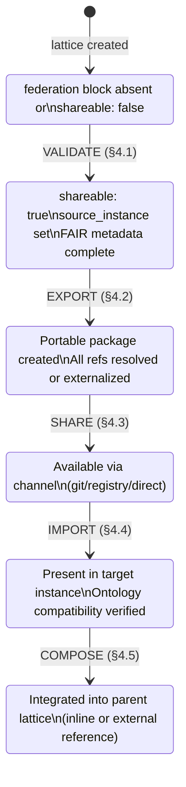
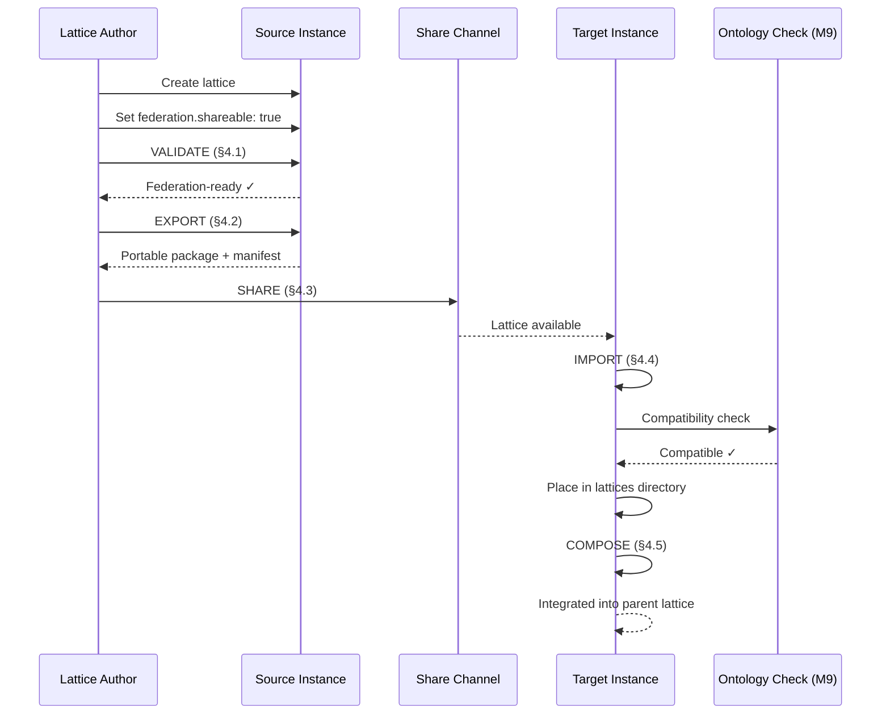
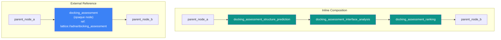
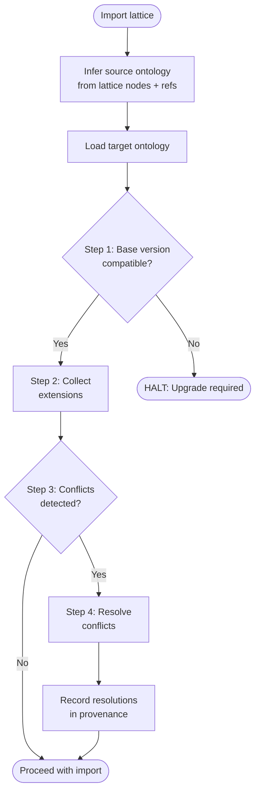

# Lattice Federation & Sharing Protocol

## 1. Overview

### 1.1 Purpose

This document defines the operational protocol for how lattice artifacts move between aDNA instances: validation for federation readiness, export as portable packages, sharing through defined channels, import with ontology compatibility checks, and composition into larger workflows. It is the complement to the [Ontology Unification Protocol](ontology_unification.md) — that document defines how ontologies merge; this one defines how lattice YAML files federate.

### 1.2 Scope

| In Scope | Out of Scope |
|----------|-------------|
| Federation lifecycle (private → shared → composed) | Automated tooling implementation |
| Five federation capabilities (validate, export, share, import, compose) | Runtime lattice execution |
| URI scheme for cross-instance references | Authentication and access control |
| Inline and external reference composition patterns | Registry service architecture |
| Node ID resolution and collision handling | Network transport protocols |

### 1.3 Prerequisites

| Dependency | Document | Relevance |
|-----------|----------|-----------|
| Lattice YAML schema | [`lattice_yaml_schema.json`](../lattices/lattice_yaml_schema.json) | Authoritative schema with federation block (5 properties) |
| Ontology Unification Protocol | [`ontology_unification.md`](ontology_unification.md) | Import triggers M9 merge algorithm for ontology compatibility |
| Bridge Patterns | [`adna_bridge_patterns.md`](adna_bridge_patterns.md) | Instance composition context — nesting, siblings, discovery |
| Validator tool | [`lattice_validate.py`](../lattices/tools/lattice_validate.py) | Reference implementation for federation-readiness validation |

### 1.4 Design Principles

1. **Schema-sufficient** — M7's federation block (5 properties: `shareable`, `source_instance`, `parent_lattice`, `version_policy`, `extracted_nodes`) is sufficient. No schema changes required.
2. **Two composition patterns** — Inline (merge child nodes with namespace prefix) and external reference (child as opaque node via URI). No hybrid pattern in v1.0.
3. **Import triggers unification** — Every import runs the M9 ontology compatibility check. Federation is not just file transfer — it is semantic integration.
4. **Protocol over tooling** — This document defines the protocol. Tooling implementation is deferred per Decision Point 3.

---

## 2. Federation Metadata Semantics

### 2.1 Schema Reference

The federation block is defined in `lattice_yaml_schema.json` under `lattice.federation`. All five properties are optional — their presence signals federation intent.

| Property | Type | Default | Semantic Meaning |
|----------|------|---------|-----------------|
| `shareable` | boolean | `false` | Lattice is federation-ready and may be exported/shared. Setting to `true` is a declaration of intent, not automatic publication. |
| `source_instance` | string | — | Identifier of the originating aDNA instance. Establishes provenance. Format: lowercase, hyphenated (e.g., `adna`, `bio-research-vault`). |
| `parent_lattice` | string | — | Name of the lattice this was extracted from. Creates a traceability link from sub-lattice to parent. |
| `version_policy` | enum | `minor` | How this lattice tracks upstream changes: `locked` (pinned), `patch` (auto-update patches), `minor` (auto-update minor), `latest` (always latest). |
| `extracted_nodes` | array[string] | — | Node IDs extracted from `parent_lattice`. Cross-references must resolve to this lattice's nodes array. |

### 2.2 Federation Lifecycle

A lattice progresses through five states. Each state transition corresponds to a federation capability (§4).



### 2.3 Federation Readiness Criteria

A lattice is **federation-ready** when:

| # | Criterion | Validation |
|---|-----------|-----------|
| 1 | Passes schema validation | `lattice_validate.py` returns no errors |
| 2 | `federation.shareable: true` | Explicit opt-in |
| 3 | `federation.source_instance` set | Provenance established |
| 4 | `fair.license` declared | Legal clarity for recipients |
| 5 | `fair.keywords` populated (≥1) | Findability |
| 6 | All `ref` fields resolve or use URIs | No broken internal references |

---

## 3. URI Scheme

### 3.1 Format Specification

Cross-instance references use the `lattice://` URI scheme:

```
lattice://<instance_id>/<lattice_name>[/<node_id>]
```

| Component | Required | Pattern | Example |
|-----------|----------|---------|---------|
| `instance_id` | Yes | `[a-z][a-z0-9-]*` | `adna` |
| `lattice_name` | Yes | `[a-z][a-z0-9_]*` | `docking_assessment` |
| `node_id` | No | `[a-z][a-z0-9_]*` | `structure_prediction` |

Examples:

```
lattice://adna/docking_assessment
lattice://adna/docking_assessment/structure_prediction
lattice://bio-research-vault/protein_binder_design
lattice://bio-research-vault/protein_binder_design/backbone_design
```

### 3.2 Resolution Rules

URI resolution follows a three-step process:

1. **Instance resolution** — Locate the target aDNA instance by `instance_id`. Resolution depends on context:
   - **Same machine**: Filesystem path lookup via instance registry (bridge patterns §4)
   - **Git-based**: Repository URL mapped from instance identifier
   - **Registry-based**: Query a lattice registry service (future)

2. **Lattice resolution** — Within the resolved instance, locate `<lattice_name>.lattice.yaml` in the lattices directory (typically `what/lattices/` or `what/lattices/examples/`).

3. **Node resolution** — If `node_id` is present, locate the node within the lattice's `nodes` array by matching `node.id`.

### 3.3 Fallback Behavior

| Failure | Behavior |
|---------|----------|
| Instance not found | ERROR — cannot resolve reference. Log the URI and the resolution method attempted. |
| Lattice not found in instance | ERROR — instance exists but lattice does not. May indicate version mismatch or deletion. |
| Node not found in lattice | WARNING — lattice found but node absent. May indicate the lattice was updated and the node was removed or renamed. |
| Network unreachable (remote instance) | DEGRADE — treat as opaque reference. Composition proceeds but the node is marked as unresolved. |

### 3.4 URI Grammar (Pseudo-BNF)

```
lattice-uri    = "lattice://" instance-id "/" lattice-name [ "/" node-id ]
instance-id    = ALPHA *( ALPHA / DIGIT / "-" )
lattice-name   = ALPHA *( ALPHA / DIGIT / "_" )
node-id        = ALPHA *( ALPHA / DIGIT / "_" )
ALPHA          = %x61-7A                          ; lowercase a-z
DIGIT          = %x30-39                          ; 0-9
```

Note: `instance_id` uses hyphens (DNS-safe), while `lattice_name` and `node_id` use underscores (matching the schema pattern `^[a-z][a-z0-9_]*$`).

---

## 4. Federation Capabilities

Five capabilities form the federation workflow. Each capability maps to a lifecycle state transition (§2.2).

### 4.1 Validate — Federation Readiness Check

**Purpose**: Verify a lattice meets all prerequisites for federation.

**Prerequisite**: A lattice YAML file exists and passes basic schema validation.

**Procedure**:

```
function validate_for_federation(lattice_path):
    # Step 1: Run schema validation
    result = validate_lattice_file(lattice_path)
    if not result.valid:
        return FAIL("Schema validation errors", result.errors)

    lattice = load(lattice_path)

    # Step 2: Check federation block
    fed = lattice.federation
    if not fed or not fed.shareable:
        return FAIL("federation.shareable is not true")
    if not fed.source_instance:
        return FAIL("federation.source_instance not set")

    # Step 3: Check FAIR completeness
    fair = lattice.fair
    if not fair.license:
        return FAIL("fair.license not declared")
    if not fair.keywords or len(fair.keywords) == 0:
        return FAIL("fair.keywords empty")

    # Step 4: Check ref resolution
    for node in lattice.nodes:
        if node.ref:
            if not is_resolvable(node.ref):
                return FAIL(f"Node '{node.id}' ref '{node.ref}' not resolvable")

    return PASS("Federation-ready")
```

**Output**: Federation readiness report (pass/fail with specific failures).

### 4.2 Export — Portable Packaging

**Purpose**: Package a federation-ready lattice for transfer to another instance.

**Prerequisite**: Lattice passes federation validation (§4.1).

**Procedure**:

```
function export_lattice(lattice_path, export_dir):
    lattice = load(lattice_path)

    # Step 1: Resolve or externalize refs
    for node in lattice.nodes:
        if node.ref and is_local_path(node.ref):
            # Convert local vault path to lattice:// URI
            node.ref = to_lattice_uri(
                instance_id=lattice.federation.source_instance,
                ref_path=node.ref
            )

    # Step 2: Ensure FAIR metadata is complete
    if not lattice.fair.provenance:
        lattice.fair.provenance = f"Exported from {lattice.federation.source_instance}"
    if not lattice.fair.creators:
        lattice.fair.creators = [lattice.federation.source_instance]

    # Step 3: Write portable lattice file
    write(export_dir / f"{lattice.name}.lattice.yaml", lattice)

    # Step 4: Generate export manifest
    manifest = {
        lattice_name: lattice.name,
        version: lattice.version,
        source_instance: lattice.federation.source_instance,
        export_date: today(),
        node_count: len(lattice.nodes),
        edge_count: len(lattice.edges),
        external_refs: [n.ref for n in lattice.nodes if n.ref and is_uri(n.ref)],
    }
    write(export_dir / "export_manifest.yaml", manifest)

    return manifest
```

**Output**: A directory containing the portable `.lattice.yaml` file and an `export_manifest.yaml`.

### 4.3 Share — Distribution Channels

**Purpose**: Make an exported lattice available to other aDNA instances.

**Prerequisite**: Lattice has been exported (§4.2).

Three sharing channels, each with specific metadata requirements:

| Channel | Mechanism | Required Metadata | Use Case |
|---------|-----------|-------------------|----------|
| **Git** | Push lattice file to a shared repository or branch | `source_instance`, `version`, commit SHA | Teams sharing via version control |
| **Registry** | Publish to a lattice registry service | Full FAIR metadata, `identifier` (DOI) | Public or organizational sharing |
| **Direct** | Transfer file directly (email, file share, API) | Export manifest, `source_instance` | Ad-hoc sharing between known parties |

```
function share_lattice(export_dir, channel, channel_config):
    manifest = load(export_dir / "export_manifest.yaml")
    lattice = load(export_dir / f"{manifest.lattice_name}.lattice.yaml")

    if channel == "git":
        # Requires: repo_url, branch
        git_add(lattice, repo=channel_config.repo_url, branch=channel_config.branch)
        git_commit(message=f"Share lattice: {manifest.lattice_name} v{manifest.version}")
        git_push()

    elif channel == "registry":
        # Requires: registry_url, authentication
        assert lattice.fair.identifier, "Registry sharing requires fair.identifier (DOI)"
        registry_publish(lattice, url=channel_config.registry_url)

    elif channel == "direct":
        # Package export_dir as transferable artifact
        package(export_dir, output=f"{manifest.lattice_name}-v{manifest.version}.tar.gz")

    return SHARED(channel, manifest)
```

### 4.4 Import — Ingestion with Ontology Check

**Purpose**: Bring a shared lattice into a target aDNA instance with compatibility verification.

**Prerequisite**: A shared lattice is available. The target instance has a defined ontology.

**Procedure**:

```
function import_lattice(lattice_path, target_instance):
    lattice = load(lattice_path)

    # Step 1: Schema validation
    result = validate_lattice(lattice)
    if not result.valid:
        return FAIL("Imported lattice fails schema validation", result.errors)

    # Step 2: Ontology compatibility check (triggers M9)
    #   See ontology_unification.md §3 — 4-step merge algorithm
    source_ontology = infer_ontology(lattice)
    target_ontology = load_ontology(target_instance)
    merge_result = validate_base_compatibility(source_ontology, target_ontology)
    if merge_result == INCOMPATIBLE:
        return FAIL("Base version mismatch — upgrade required before import")

    # Step 3: Node ID collision check
    existing_lattices = list_lattices(target_instance)
    for existing in existing_lattices:
        collisions = detect_node_id_collisions(lattice, existing)
        if collisions:
            # Apply qualified names (see §5)
            for collision in collisions:
                resolve_node_collision(collision, strategy="qualify")

    # Step 4: Resolve external references
    for node in lattice.nodes:
        if node.ref and is_lattice_uri(node.ref):
            resolution = resolve_uri(node.ref, target_instance)
            if resolution == UNRESOLVED:
                log WARNING(f"Unresolved ref: {node.ref} — marked as external")

    # Step 5: Place lattice in target instance
    target_path = target_instance.lattices_dir / f"{lattice.name}.lattice.yaml"
    write(target_path, lattice)

    # Step 6: Post-import validation
    final_result = validate_lattice_file(target_path)
    assert final_result.valid, "Post-import validation failed"

    return IMPORTED(lattice.name, target_path)
```

**Key integration**: Step 2 triggers the [Ontology Unification Protocol](ontology_unification.md) merge algorithm. If the source lattice introduces entity types not present in the target instance's ontology, the full 4-step merge (validate base → collect extensions → detect conflicts → resolve) executes before the import proceeds.

### 4.5 Compose — Lattice Integration

**Purpose**: Integrate an imported lattice into a parent lattice, either by inlining its nodes or referencing it as an opaque external node.

**Prerequisite**: The child lattice has been imported (§4.4). A parent lattice exists.

**Procedure**:

```
function compose_lattice(parent_path, child_name, pattern):
    parent = load(parent_path)
    child = load_imported(child_name)

    if pattern == "inline":
        # Merge child nodes into parent with namespace prefix
        for node in child.nodes:
            namespaced_id = f"{child.name}_{node.id}"
            parent.nodes.append(node.copy(id=namespaced_id))

        # Rewrite child edges with namespaced IDs
        for edge in child.edges:
            parent.edges.append(edge.copy(
                from_node=f"{child.name}_{edge.from_node}",
                to_node=f"{child.name}_{edge.to_node}"
            ))

        # Add seam edges (parent → child entry, child exit → parent)
        # Seam edges are manually specified by the composer

    elif pattern == "external_reference":
        # Add child as single opaque node with lattice:// URI
        parent.nodes.append({
            id: child.name,
            type: "module",
            ref: f"lattice://{child.federation.source_instance}/{child.name}",
            description: child.description,
        })

        # Add seam edges connecting parent nodes to the opaque child node
        # Seam edges are manually specified by the composer

    return parent
```

**Output**: Modified parent lattice with child integrated via chosen pattern.

### 4.6 Lifecycle Sequence



---

## 5. Node ID Resolution

### 5.1 Scoping Rules

Node IDs are scoped by their containing lattice:

| Scope Level | Format | Example | Uniqueness Guarantee |
|-------------|--------|---------|---------------------|
| **Local** | `node_id` | `structure_prediction` | Unique within one lattice |
| **Qualified** | `lattice_name.node_id` | `docking_assessment.structure_prediction` | Unique across all lattices in an instance |
| **Global** | `lattice://instance_id/lattice_name/node_id` | `lattice://adna/docking_assessment/structure_prediction` | Unique across all instances |

### 5.2 Collision Detection

A node ID collision occurs when two lattices in the same instance share a node ID. This is not an error — node IDs are lattice-scoped — but it matters during composition.

```
function detect_node_id_collisions(incoming, existing):
    incoming_ids = {node.id for node in incoming.nodes}
    existing_ids = {node.id for node in existing.nodes}
    return incoming_ids & existing_ids  # Set intersection
```

### 5.3 Collision Resolution

When composing lattices with overlapping node IDs, resolve via namespace prefix:

| Strategy | When to Use | Result |
|----------|------------|--------|
| **Namespace prefix** | Inline composition (§6.1) | `docking_assessment_structure_prediction` |
| **No resolution needed** | External reference (§6.2) | Child is opaque — internal IDs not exposed |
| **Qualified reference** | Cross-lattice edge references | `docking_assessment.structure_prediction` |

---

## 6. Composition Model

Two patterns for integrating lattices. They are mutually exclusive per composition — choose one pattern for each child lattice.

### 6.1 Inline Composition

The child lattice's nodes and edges are merged into the parent, with the child's lattice name as a namespace prefix on all node IDs.

**When to use**: The parent needs to route data to/from individual nodes in the child.

**Properties**:
- Child nodes become first-class nodes in the parent
- All child node IDs are prefixed: `{child_name}_{node_id}`
- Child internal edges are preserved (prefixed)
- **Seam edges** connect parent nodes to child entry/exit points
- The parent's node count increases by the child's node count

**Seam edge requirements**:
- At least one edge from a parent node to a child entry node (data flows in)
- At least one edge from a child exit node to a parent node (results flow out)
- Seam edges require explicit `data_mapping` — no implicit pass-through

### 6.2 External Reference

The child lattice appears as a single opaque node in the parent, referenced via `lattice://` URI.

**When to use**: The parent treats the child as a black-box module — inputs go in, outputs come out.

**Properties**:
- Child appears as one node of type `module` with a `lattice://` URI in `ref`
- Child internal structure is not visible to the parent
- **Seam edges** connect parent nodes to/from the opaque child node
- The parent's node count increases by 1

**Seam edge requirements**:
- Edges to the child node specify inputs via `data_mapping`
- Edges from the child node specify outputs via `data_mapping`
- Port names on seam edges correspond to the child lattice's entry/exit node interfaces

### 6.3 Pattern Comparison



### 6.4 Data Flow Across Boundaries

| Aspect | Inline | External Reference |
|--------|--------|-------------------|
| **Data into child** | Seam edge → child entry node, explicit `data_mapping` | Seam edge → opaque node, `data_mapping` maps to child entry node interface |
| **Data out of child** | Child exit node → seam edge, explicit `data_mapping` | Opaque node → seam edge, `data_mapping` maps from child exit node interface |
| **Internal routing** | Visible — parent can inspect child edges | Opaque — parent cannot see child internal edges |
| **Granularity** | Fine — parent can tap into any child node | Coarse — parent sees only entry/exit |

### 6.5 Edge Semantics at Seams

Seam edges follow standard edge schema but require additional discipline:

```yaml
# Inline seam edge — parent feeds child entry node
- from: parent_sequence_design
  to: docking_assessment_structure_prediction      # namespaced child entry
  label: "designed sequences for validation"
  data_mapping:
    sequences: input_sequences                      # explicit mapping required

# External reference seam edge — parent feeds opaque child
- from: parent_sequence_design
  to: docking_assessment                            # opaque child node
  label: "designed sequences for validation"
  data_mapping:
    sequences: input_sequences
  port: structure_prediction                        # port identifies child entry
```

---

## 7. Import Algorithm

### 7.1 Pre-Import Checklist

Before importing a lattice from another instance:

- [ ] Source lattice file is accessible and parseable
- [ ] Source lattice passes schema validation
- [ ] Source `federation.source_instance` is set (provenance known)
- [ ] Target instance ontology is documented (`ontology.md` exists)
- [ ] No naming conflict with existing lattices in target (or resolution planned)

### 7.2 Schema Compatibility

The imported lattice must validate against the target instance's copy of `lattice_yaml_schema.json`. Schema versions should match — if the source uses a newer schema version, the target should update its schema before importing.

### 7.3 Ontology Compatibility Check

Import triggers the [Ontology Unification Protocol](ontology_unification.md) merge algorithm:



**Ontology inference from lattice**: A lattice implies ontology types through its node types and refs. For example, a lattice with `type: module` nodes referencing `what/modules/` implies the `modules` entity type. A lattice with `type: dataset` nodes implies the `datasets` entity type. The import algorithm collects all implied entity types and checks them against the target ontology.

### 7.4 Node ID Collision Resolution During Import

When the imported lattice shares node IDs with existing lattices in the target:

```
function resolve_import_collisions(imported, target_instance):
    existing_ids = collect_all_node_ids(target_instance)
    imported_ids = {node.id for node in imported.nodes}
    collisions = imported_ids & existing_ids

    if not collisions:
        return  # No action needed

    # Resolution: do NOT rename during import — only during composition
    # Node IDs are lattice-scoped, so collisions are informational at import time
    log INFO(f"Node ID overlap with existing lattices: {collisions}")
    log INFO("Collisions will be resolved during composition via namespace prefix")
```

Node ID collisions are **not blocking** at import time because node IDs are scoped to their lattice. Collisions become relevant only during inline composition (§6.1), where namespace prefixing resolves them.

### 7.5 Post-Import Validation

After placing the lattice in the target instance:

- [ ] File parses as valid YAML
- [ ] Passes `lattice_validate.py` in the target context
- [ ] `federation.source_instance` preserved (provenance chain intact)
- [ ] All `lattice://` URIs logged (some may be unresolvable in target — this is acceptable)
- [ ] Target instance's lattice index updated (if maintained)

---

## 8. Federation and Token Convergence

### 8.1 Convergent Narrowing Preserved

Federation does not break the convergent narrowing pattern. When a federated lattice is composed into a parent, the total token scope at each level of the execution hierarchy still decreases monotonically:

| Level | Token Scope | Behavior |
|-------|------------|----------|
| **Instance** | All lattices (local + imported) | Maximum scope — all available lattices |
| **Campaign** | Lattices relevant to the campaign's domain | Prune lattices from other domains |
| **Mission** | Lattices relevant to the mission's objective | Further narrowing to specific lattices |
| **Objective** | Specific nodes within one lattice | Minimum scope — only the nodes being worked |

### 8.2 Worked Convergence Table

Using real node counts from existing examples:

| Level | Scope | Nodes in Context | Reduction |
|-------|-------|-----------------|-----------|
| **Full instance** | `protein_binder_design` (6 nodes) + `docking_assessment` (3 nodes) + `composed_therapeutics` (4 local + 1 ref) | 14 total | — |
| **Campaign: therapeutics** | `protein_binder_design` + `composed_therapeutics` | 11 | 14 → 11 (21%) |
| **Mission: validate binders** | `docking_assessment` only | 3 | 11 → 3 (73%) |
| **Objective: run interface analysis** | `interface_analysis` node only | 1 | 3 → 1 (67%) |

The 14 → 11 → 3 → 1 progression demonstrates convergent narrowing across a federated lattice collection.

### 8.3 Composition and Token Cost

| Pattern | Token Impact | When to Prefer |
|---------|-------------|----------------|
| **Inline** | +N tokens (all child nodes materialized) | When parent needs fine-grained access to child nodes |
| **External reference** | +1 token (single opaque node) | When parent treats child as black-box — significantly cheaper |

External reference is the default recommendation for federation because it minimizes token cost while preserving composability.

---

## 9. Worked Example: Federation Round-Trip

### 9.1 Scenario

A bio-research vault (`bio-research-vault`) wants to use the `docking_assessment` pipeline from `adna`. The full round-trip:

1. **Validate** `docking_assessment` for federation readiness
2. **Export** it as a portable package
3. **Share** via git
4. **Import** into `bio-research-vault`
5. **Compose** into a new parent lattice (`composed_therapeutics`)

### 9.2 Step 1: Validate

Check the existing `docking_assessment.lattice.yaml`:

```yaml
# Already present in the lattice:
federation:
  shareable: true              # ✓ Opt-in
  source_instance: adna # ✓ Provenance
  parent_lattice: protein_binder_design  # ✓ Traceability
  version_policy: locked       # ✓ Policy set
  extracted_nodes:             # ✓ Cross-references
    - structure_prediction
    - interface_analysis
    - ranking

fair:
  license: "MIT"               # ✓ License declared
  keywords:                    # ✓ Keywords populated
    - protein docking
    - structure prediction
    - interface analysis
    - sub-lattice
    - federation
```

**Result**: All 6 federation readiness criteria met. PASS.

### 9.3 Step 2: Export

Convert local refs to `lattice://` URIs:

```yaml
# Before export (local refs):
nodes:
  - id: structure_prediction
    type: module
    ref: "what/modules/module_chai_1"
  - id: interface_analysis
    type: module
    ref: "what/modules/module_pinal"

# After export (portable URIs):
nodes:
  - id: structure_prediction
    type: module
    ref: "lattice://adna/docking_assessment/structure_prediction"
  - id: interface_analysis
    type: module
    ref: "lattice://adna/docking_assessment/interface_analysis"
```

Export manifest generated:

```yaml
lattice_name: docking_assessment
version: "1.0.0"
source_instance: adna
export_date: 2026-02-19
node_count: 3
edge_count: 3
external_refs:
  - "lattice://adna/docking_assessment/structure_prediction"
  - "lattice://adna/docking_assessment/interface_analysis"
```

### 9.4 Step 3: Share (Git)

```
# Push to shared repository
git add docking_assessment.lattice.yaml export_manifest.yaml
git commit -m "Share lattice: docking_assessment v1.0.0"
git push origin main
```

### 9.5 Step 4: Import into bio-research-vault

1. **Schema validation**: PASS
2. **Ontology check**: `bio-research-vault` uses base ontology v3.0 — compatible with `adna` v3.0. No extension conflicts (bio-research-vault has `bio_` extensions, no overlap with adna extensions).
3. **Node ID collision**: bio-research-vault has no existing `structure_prediction` or `interface_analysis` node IDs — no collision.
4. **Placement**: `bio-research-vault/what/lattices/docking_assessment.lattice.yaml`

### 9.6 Step 5: Compose (External Reference)

Create `composed_therapeutics.lattice.yaml` in `bio-research-vault`, referencing `docking_assessment` as an opaque node:

```yaml
lattice:
  name: composed_therapeutics
  version: "1.0.0"
  lattice_type: pipeline
  description: >
    Therapeutics discovery pipeline composing local target selection
    with imported docking assessment from adna.
  execution:
    mode: workflow
    runtime: ray
    tier: L2
  nodes:
    - id: target_selection
      type: process
      description: "Select therapeutic targets from disease gene list"
    - id: candidate_generation
      type: module
      ref: "what/modules/module_rfdiffusion"
      description: "Generate binder candidates for selected targets"
    - id: docking_assessment
      type: module
      ref: "lattice://adna/docking_assessment"
      description: "Validate candidates via structure prediction and interface analysis"
    - id: clinical_ranking
      type: process
      description: "Rank validated candidates by clinical feasibility"
  edges:
    - from: target_selection
      to: candidate_generation
      label: "selected targets"
      data_mapping:
        target_structures: input_pdb
    - from: candidate_generation
      to: docking_assessment
      label: "binder candidates"
      data_mapping:
        designed_sequences: input_sequences
    - from: docking_assessment
      to: clinical_ranking
      label: "validation results"
      data_mapping:
        binding_scores: candidate_scores
  fair:
    license: "MIT"
    creators:
      - "Bio Research Vault"
      - "Lattice Labs"
    keywords:
      - therapeutics
      - drug discovery
      - protein binder
      - docking
      - composition
    provenance: >
      Composed pipeline — local target selection and clinical ranking
      with imported docking_assessment from adna instance.
  federation:
    shareable: true
    source_instance: bio-research-vault
    version_policy: minor
```

This composed lattice has 4 local nodes + 1 external reference to `docking_assessment` (which internally has 3 nodes). The external reference pattern keeps the parent compact while leveraging the child's full capability.

---

## 10. Implementation Guidance

### 10.1 Pre-Federation Checklist

Before federating any lattice from your instance:

- [ ] Lattice YAML passes `lattice_validate.py` with no errors
- [ ] `federation.shareable: true` is set deliberately (not by default)
- [ ] `federation.source_instance` matches your instance identifier
- [ ] `fair.license` is set and accurate
- [ ] All `ref` fields either resolve locally or are valid `lattice://` URIs
- [ ] No sensitive or proprietary data embedded in node configs
- [ ] `fair.provenance` describes the lattice's origin clearly

### 10.2 Post-Federation Checklist

After importing and composing a federated lattice:

- [ ] Imported lattice passes validation in the target context
- [ ] Ontology compatibility verified (or conflicts resolved per M9)
- [ ] Composed parent lattice passes validation
- [ ] All seam edges have explicit `data_mapping`
- [ ] Unresolved `lattice://` URIs logged and documented
- [ ] Provenance chain intact — can trace from composed lattice back to source instance

### 10.3 Tooling Recommendations (Deferred)

Per Decision Point 3, tooling implementation is deferred. Recommended tools for future development:

| Tool | Purpose | Priority |
|------|---------|----------|
| `lattice_federation_validate` | Run §4.1 federation readiness check | High |
| `lattice_export` | Execute §4.2 export with ref conversion | High |
| `lattice_import` | Execute §4.4 import with ontology check | Medium |
| `lattice_compose` | Execute §4.5 inline/external composition | Medium |
| `lattice_uri_resolve` | Resolve `lattice://` URIs against instance registry | Low |

---

## Appendix A: URI Grammar (Formal)

```
; Lattice URI — cross-instance reference format
; Compatible with RFC 3986 generic URI syntax

lattice-uri    = "lattice://" instance-id "/" lattice-name [ "/" node-id ]

instance-id    = LALPHA *( LALPHA / DIGIT / "-" )
                 ; lowercase letters, digits, hyphens
                 ; matches DNS label conventions

lattice-name   = LALPHA *( LALPHA / DIGIT / "_" )
                 ; matches lattice_yaml_schema.json name pattern
                 ; ^[a-z][a-z0-9_]*$

node-id        = LALPHA *( LALPHA / DIGIT / "_" )
                 ; matches lattice_yaml_schema.json node id pattern
                 ; ^[a-z][a-z0-9_]*$

LALPHA         = %x61-7A    ; lowercase a-z
DIGIT          = %x30-39    ; 0-9
```

## Appendix B: Cross-References

| Document | Relationship |
|----------|-------------|
| [`ontology_unification.md`](ontology_unification.md) | Import (§4.4) triggers the 4-step merge algorithm |
| [`adna_bridge_patterns.md`](adna_bridge_patterns.md) | Instance discovery, scope boundaries, cross-referencing conventions |
| [`adna_standard.md`](adna_standard.md) | Normative aDNA specification — triad structure, FAIR metadata |
| [`adna_design.md`](adna_design.md) | Deployment forms (bare/embedded) relevant to federation topology |
| [`lattice_yaml_schema.json`](../lattices/lattice_yaml_schema.json) | Authoritative schema — federation block definition (5 properties) |
| [`lattice_validate.py`](../lattices/tools/lattice_validate.py) | Reference validator — federation readiness baseline |
| [`context_quality_rubric.md`](context_quality_rubric.md) | Quality evaluation applicable to federated context files |

## Appendix C: Federation Property Quick Reference

| Property | Required for Federation? | Set By | When |
|----------|------------------------|--------|------|
| `federation.shareable` | Yes | Author | Before validate |
| `federation.source_instance` | Yes | Author | Before validate |
| `federation.parent_lattice` | Only for sub-lattices | Author | At extraction time |
| `federation.version_policy` | Recommended | Author | Before export |
| `federation.extracted_nodes` | Only with `parent_lattice` | Author | At extraction time |
| `fair.license` | Yes | Author | Before validate |
| `fair.keywords` | Yes | Author | Before validate |
| `fair.provenance` | Recommended | Author/Export tool | Before export |
| `fair.creators` | Recommended | Author/Export tool | Before export |
| `fair.identifier` | Only for registry sharing | Author | Before registry publish |

---

*Protocol version: 1.0.0*
*Author: aDNA Template*
*Campaign: campaign_adna_review, Mission M10*
