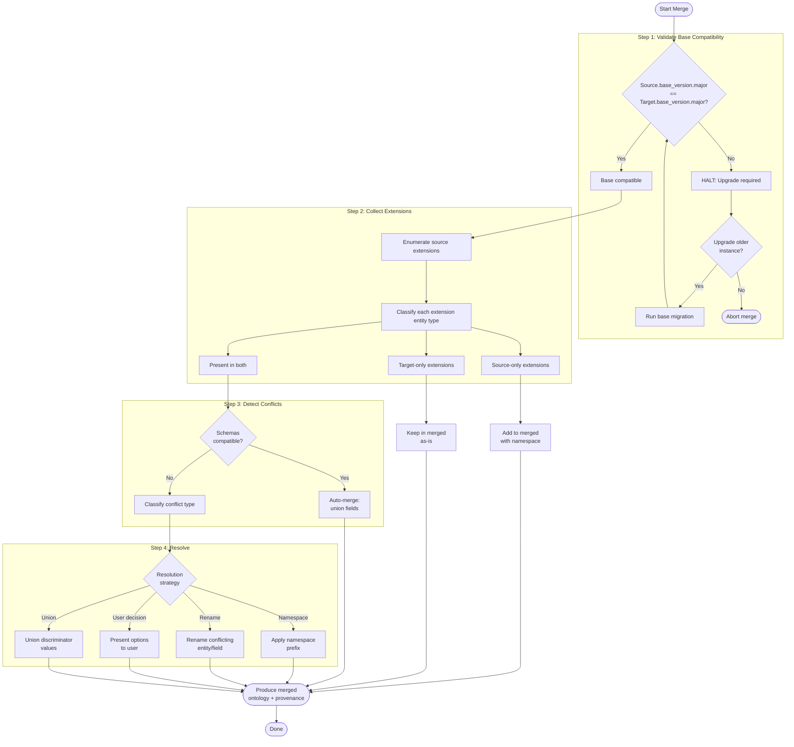
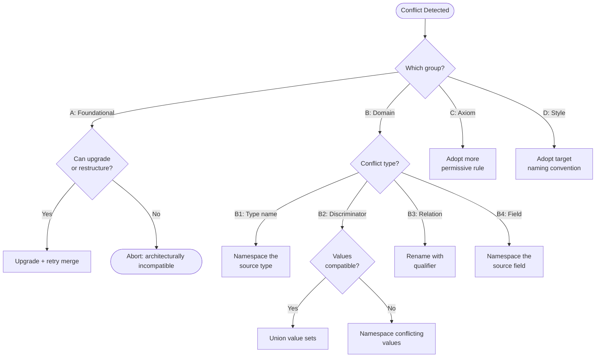
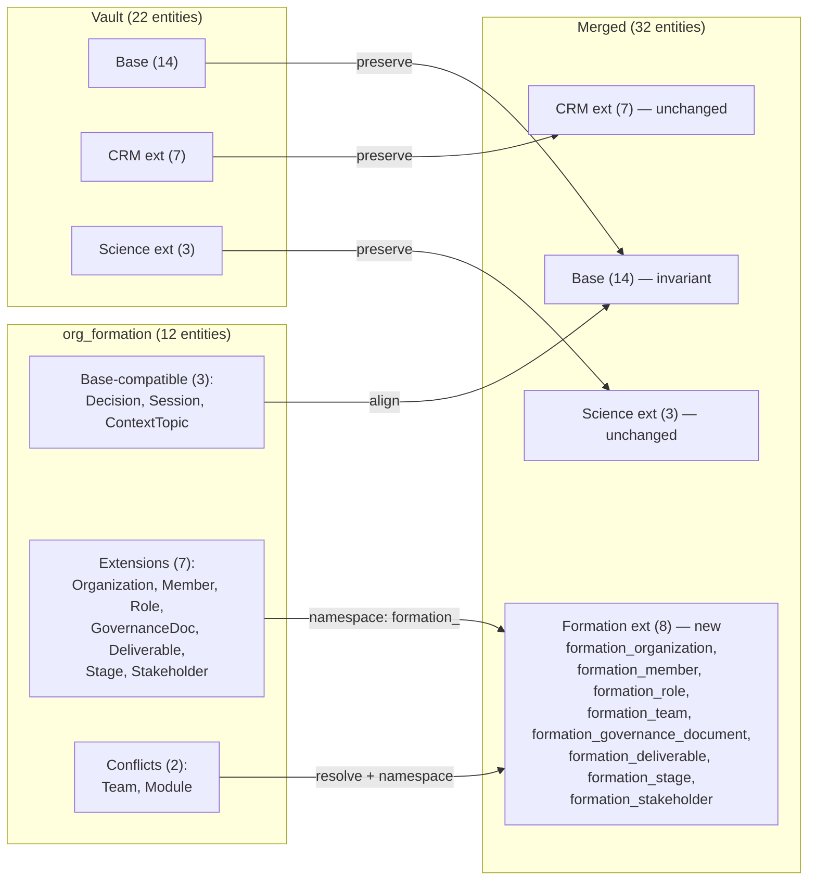

# aDNA Ontology Unification Protocol

## 1. Overview

### 1.1 Purpose

This document defines the formal protocol for merging ontologies when aDNA instances integrate. When a sub-lattice (e.g., an org_formation instance) is imported into a parent instance (e.g., a full Lattice Labs vault), their ontologies must be unified — base entities aligned, extensions reconciled, conflicts resolved, and a merged artifact produced.

### 1.2 Scope

| In Scope | Out of Scope |
|----------|-------------|
| Ontology merge algorithm (4-step) | Runtime data migration tooling |
| Conflict detection and resolution | Automated merge scripts |
| Namespace specification for extensions | UI/CLI for merge operations |
| Base invariance rule | Cross-instance query federation |
| Worked example with real ontologies | Schema migration tooling |

### 1.3 Terminology

| Term | Definition |
|------|-----------|
| **Base ontology** | The 14 entity types universal to every aDNA instance (WHO: 3, WHAT: 4, HOW: 7) |
| **Extension** | Domain-specific entity types added by an instance (e.g., CRM, Science, Formation) |
| **Namespace** | A prefix that scopes extension entity types to avoid cross-instance collisions (e.g., `crm_`, `bio_`) |
| **Unification** | The process of merging two ontologies into a single coherent schema |
| **Source instance** | The aDNA instance being imported (the sub-lattice or external ontology) |
| **Target instance** | The aDNA instance receiving the import (the parent vault) |
| **Conflict** | Any incompatibility between two ontologies that prevents automatic merge |
| **Discriminator** | A field that distinguishes sub-types within a merged entity type (e.g., `module_type: tool\|model`) |
| **Base version** | The version of the base aDNA ontology (e.g., v3.0), determining base entity compatibility |

### 1.4 Design Principles

1. **Base invariance** — Base entity types are immutable across all instances. No instance may modify, remove, or rename a base entity type.
2. **Additive extension** — Extensions only add entity types; they never modify or remove base types.
3. **Namespace isolation** — Extension entity types are namespaced to prevent cross-instance collisions.
4. **Merge determinism** — Given two ontologies and a set of conflict resolutions, the merge algorithm always produces the same output.
5. **Provenance preservation** — The merged ontology records which entities came from which source.
6. **Backward compatibility** — Merging never invalidates existing files in either instance.

---

## 2. Base Invariance Rule

### 2.1 Base Entity Types

The aDNA base ontology defines 14 entity types that are universal to every instance:

| Triad Leg | Entity Types | Count | Purpose |
|-----------|-------------|-------|---------|
| **WHO** | `governance`, `team`, `coordination` | 3 | Who decides, who works, how they sync |
| **WHAT** | `context`, `decisions`, `modules`, `lattices` | 4 | What you know, what you've decided, what you build, how you compose |
| **HOW** | `campaigns`, `missions`, `sessions`, `templates`, `skills`, `pipelines`, `backlog` | 7 | Plan, decompose, execute, track, automate, ideate |

### 2.2 Invariance Specification

**Rule**: Base entity types are **structurally invariant** across all aDNA instances at the same base version.

| Property | Invariant? | Meaning |
|----------|-----------|---------|
| Entity type name | YES | `governance` is always `governance` — no renaming |
| Triad assignment | YES | `governance` is always WHO — no reassignment |
| Directory location | YES | `who/governance/` is canonical — no relocation |
| Base frontmatter fields | YES | `type`, `created`, `updated`, `status`, `last_edited_by`, `tags` always present |
| Execution hierarchy | YES | Campaign → Mission → Objective is invariant |
| Type-specific fields | NO | Instances may add fields to base types (additive only) |
| File content within type | NO | Each instance has its own files — content is per-instance |
| Extension relationships | NO | Extensions may define new relationships to/from base types |

### 2.3 Base Version Compatibility

Two instances are **base-compatible** when they share the same major version of the base ontology:

```
Base version format: vX.Y
  X = major (structural changes — entity additions/removals/renames)
  Y = minor (field additions, discriminator value additions)

Compatibility rule:
  Source.X == Target.X → COMPATIBLE (proceed to merge)
  Source.X != Target.X → INCOMPATIBLE (upgrade required before merge)
  Source.Y != Target.Y → COMPATIBLE (minor differences resolved during merge)
```

**Current base version**: v3.0 (14 entities, consolidated from v2.0's 17 and v1.0's 20).

### 2.4 What Instances MAY Do to Base Types

- **Add fields** to base entity frontmatter (e.g., instance adds `priority` to missions)
- **Define relationships** from extension entities to base entities (e.g., `customers` → `projects`)
- **Add discriminator values** to existing discriminators (minor version bump)
- **Create files** of base entity types with instance-specific content

### 2.5 What Instances MUST NOT Do to Base Types

- **Rename** a base entity type (e.g., `missions` → `quests`)
- **Remove** a base entity type from their ontology
- **Reassign** a base entity to a different triad leg
- **Remove** a base frontmatter field
- **Change** the execution hierarchy semantics (Campaign → Mission → Objective)

---

## 3. Merge Algorithm

### 3.1 Algorithm Overview

The merge algorithm takes two ontologies (source and target) and produces a unified ontology:

```
Input:  Source ontology (S), Target ontology (T)
Output: Merged ontology (M), Conflict report (C)

Step 1: Validate base version compatibility
Step 2: Collect and classify extensions from both instances
Step 3: Detect conflicts between extensions
Step 4: Resolve conflicts and produce merged artifact
```

### 3.2 Flowchart



### 3.3 Step-by-Step Specification

#### Step 1: Validate Base Version Compatibility

```
function validate_base_compatibility(source, target):
    if source.base_version.major != target.base_version.major:
        return ERROR("Base version mismatch: {source.base_version} vs {target.base_version}.
                       Upgrade the older instance before merging.")

    # Minor version differences are OK — the merge will union any additive changes
    if source.base_version.minor != target.base_version.minor:
        log WARNING("Minor version difference: {source.base_version} vs {target.base_version}.
                      Additive fields from the newer version will be included in merge.")

    # Verify all 14 base entity types are present in both
    for entity in BASE_ENTITIES:
        assert entity in source.entities, f"Source missing base entity: {entity}"
        assert entity in target.entities, f"Target missing base entity: {entity}"

    return OK
```

#### Step 2: Collect and Classify Extensions

```
function collect_extensions(source, target):
    source_ext = source.entities - BASE_ENTITIES    # Set difference
    target_ext = target.entities - BASE_ENTITIES

    return {
        source_only:  source_ext - target_ext,      # New to target
        target_only:  target_ext - source_ext,       # Already in target
        both:         source_ext & target_ext,       # Present in both — check compatibility
    }
```

#### Step 3: Detect Conflicts

For each extension entity type present in both instances:

```
function detect_conflicts(source_entity, target_entity):
    conflicts = []

    # 3a. Type name collision — same type name, different schema
    if source_entity.type == target_entity.type:
        if source_entity.schema != target_entity.schema:
            conflicts.append(TypeNameCollision(source_entity, target_entity))

    # 3b. Discriminator conflict — same discriminator, different valid values
    for disc in shared_discriminators(source_entity, target_entity):
        if source_entity.disc_values[disc] != target_entity.disc_values[disc]:
            if values_are_compatible(source_entity, target_entity, disc):
                # Union is safe
                pass
            else:
                conflicts.append(DiscriminatorConflict(disc, source_entity, target_entity))

    # 3c. Relationship ambiguity — same relation name, different semantics
    for rel in shared_relations(source_entity, target_entity):
        if rel.source_semantics != rel.target_semantics:
            conflicts.append(RelationshipAmbiguity(rel))

    # 3d. Field semantics mismatch — same field name, different meaning
    for field in shared_fields(source_entity, target_entity):
        if field.source_meaning != field.target_meaning:
            conflicts.append(FieldSemanticsMismatch(field))

    return conflicts
```

#### Step 4: Resolve Conflicts and Produce Merged Artifact

```
function resolve_and_merge(source, target, conflicts, classification):
    merged = copy(target)  # Start from target as base

    # Add source-only extensions with namespace
    for entity in classification.source_only:
        namespaced = apply_namespace(entity, source.namespace)
        merged.add_entity(namespaced)
        merged.provenance[namespaced.type] = source.instance_id

    # Keep target-only extensions as-is
    for entity in classification.target_only:
        merged.provenance[entity.type] = target.instance_id

    # Resolve conflicts for shared extensions
    for conflict in conflicts:
        resolution = resolve(conflict)  # See §4 Conflict Resolution
        merged.apply_resolution(resolution)

    # Auto-merge compatible shared extensions (union fields)
    for entity in classification.both:
        if entity not in [c.entity for c in conflicts]:
            merged_entity = union_fields(source.entity, target.entity)
            merged.update_entity(merged_entity)
            merged.provenance[entity.type] = "both"

    # Record merge metadata
    merged.metadata = {
        merged_from: [source.instance_id, target.instance_id],
        merge_date: today(),
        base_version: max(source.base_version, target.base_version),
        conflict_count: len(conflicts),
        resolution_count: len([c for c in conflicts if c.resolved]),
    }

    return merged
```

---

## 4. Conflict Resolution Taxonomy

### 4.1 Overview

The taxonomy adapts Keet's (2021) systematic conflict resolution framework for ontologies to aDNA's file-based knowledge architecture. Ten conflict types are organized into four groups.

### 4.2 Conflict Types

#### Group A: Foundational Conflicts

These affect the base ontology or fundamental structure. They are the most severe and block merging until resolved.

| # | Conflict Type | Description | Severity | Resolution Strategy |
|---|--------------|-------------|----------|-------------------|
| A1 | **Base version mismatch** | Source and target have different major base versions | Blocking | Upgrade the older instance to match. Run base migration. No merge until versions align. |
| A2 | **Triad assignment conflict** | An entity type is assigned to different triad legs | Blocking | Resolve manually. The base ontology's triad assignment is authoritative. If extension-only, the source instance's assignment takes precedence within its namespace. |
| A3 | **Foundational theory conflict** | Instances use incompatible organizational paradigms (e.g., different execution hierarchies) | Blocking | Cannot merge. Resolve at the architectural level. One instance must adopt the other's foundational model. |

#### Group B: Domain Conflicts

These affect extension entity types and their schemas. They are common in cross-domain merges and have well-defined resolution strategies.

| # | Conflict Type | Description | Severity | Resolution Strategy |
|---|--------------|-------------|----------|-------------------|
| B1 | **Type name collision** | Same `type:` value in both instances with different schemas | High | Apply namespace prefix to the source entity type. E.g., `type: project` in CRM vs. formation → `crm_project` vs. `formation_project`. |
| B2 | **Discriminator conflict** | Same discriminator field with incompatible value sets | Medium | If values are non-overlapping, union them. If values overlap with different meanings, namespace the conflicting values. |
| B3 | **Relationship ambiguity** | Same relation name with different semantics | Medium | Rename one relation with a descriptive qualifier. E.g., `owns` (CRM) vs. `owns` (governance) → `crm_owns` vs. `gov_owns`. |
| B4 | **Field semantics mismatch** | Same field name with different meaning across instances | Medium | Rename the source field with a namespace prefix. Document the mapping in provenance. |

#### Group C: Axiom Conflicts

These affect constraints and validation rules.

| # | Conflict Type | Description | Severity | Resolution Strategy |
|---|--------------|-------------|----------|-------------------|
| C1 | **Cardinality conflict** | Different cardinality constraints on the same relationship | Low | Adopt the more permissive cardinality. Document the original constraints from each source. |
| C2 | **Constraint conflict** | Different validation constraints on the same field | Low | Union constraints where possible. If contradictory, adopt the target's constraints and document the source's as advisory. |

#### Group D: Style Conflicts

These affect naming, formatting, and presentation — not structural semantics.

| # | Conflict Type | Description | Severity | Resolution Strategy |
|---|--------------|-------------|----------|-------------------|
| D1 | **Naming convention mismatch** | Different naming patterns (e.g., hyphens vs. underscores) | Low | Adopt the target instance's naming convention. Rename source entities during import. |

### 4.3 Resolution Decision Matrix



### 4.4 Conflict Resolution Record

Every conflict resolution is recorded in the merged ontology's provenance:

```yaml
conflict_resolutions:
  - conflict_type: B1  # Type name collision
    source_entity: "project"
    target_entity: "project"
    source_instance: "org_formation"
    resolution: "namespace"
    result: "formation_project (source) coexists with project (target)"
    rationale: "Different schemas — formation project tracks deliverables, CRM project tracks deal pipeline"
```

---

## 5. Namespace Specification

### 5.1 Namespace Syntax

Extension entity types use a **domain prefix** to prevent cross-instance collisions:

```
Format:  {domain}_{entity_type}
Rules:
  - domain  = lowercase alphanumeric + underscores, 2-20 characters
  - separator = single underscore
  - entity_type = standard aDNA entity type name (lowercase, underscores)

Examples:
  crm_customer        # CRM domain extension
  bio_target           # Science/biotech domain extension
  formation_member     # Org formation domain extension
  custom_workflow      # User-defined domain extension
```

### 5.2 Reserved Namespaces

| Namespace | Reserved For | Status |
|-----------|-------------|--------|
| `base_` | Base aDNA entity types (never used as prefix — base types are unprefixed) | Reserved |
| `crm_` | CRM and customer relationship management extensions | Active |
| `bio_` | Biotech and life science domain extensions | Active |
| `formation_` | Organization formation sub-lattice extensions | Active |
| `compute_` | Compute infrastructure and hardware extensions | Available |
| `custom_` | User-defined custom extensions | Available |

### 5.3 When to Apply Namespaces

| Scenario | Namespace Required? | Rationale |
|----------|-------------------|-----------|
| Extension entity type unique to one instance | Optional but recommended | Prevents future collisions if another instance introduces the same type name |
| Extension entity type present in both instances with compatible schemas | Not required | Auto-merge (union fields) is sufficient |
| Extension entity type present in both instances with conflicting schemas | **Required** | Namespace the source to disambiguate |
| Base entity type | **Never** | Base types are unprefixed by definition |
| Discriminator values | Only if conflicting | Namespace conflicting values; leave compatible values unprefixed |

### 5.4 Namespace Validation Rules

```
function validate_namespace(namespace):
    # Rule 1: Format check
    assert matches(namespace, r'^[a-z][a-z0-9_]{1,19}$'),
        "Namespace must be 2-20 lowercase alphanumeric + underscore characters"

    # Rule 2: No reserved prefix
    assert namespace not in RESERVED_NAMESPACES,
        f"Namespace '{namespace}' is reserved"

    # Rule 3: No double underscores
    assert '__' not in namespace,
        "Namespace must not contain double underscores"

    # Rule 4: Must not start with a digit
    assert not namespace[0].isdigit(),
        "Namespace must start with a letter"

    return VALID
```

### 5.5 Collision Detection Algorithm

Before merging, run collision detection across all entity types:

```
function detect_collisions(source, target):
    collisions = []

    # Check type name collisions (ignoring namespace prefixes)
    source_types = {strip_namespace(t): t for t in source.extension_types}
    target_types = {strip_namespace(t): t for t in target.extension_types}

    for base_name in source_types.keys() & target_types.keys():
        src_type = source_types[base_name]
        tgt_type = target_types[base_name]

        if not schemas_compatible(source.schema[src_type], target.schema[tgt_type]):
            collisions.append({
                base_name: base_name,
                source_type: src_type,
                target_type: tgt_type,
                source_schema: source.schema[src_type],
                target_schema: target.schema[tgt_type],
            })

    # Check discriminator value collisions
    for disc in shared_discriminators(source, target):
        src_values = source.discriminator_values[disc]
        tgt_values = target.discriminator_values[disc]
        overlap = src_values & tgt_values

        for value in overlap:
            if source.value_meaning[disc][value] != target.value_meaning[disc][value]:
                collisions.append({
                    type: "discriminator",
                    discriminator: disc,
                    value: value,
                    source_meaning: source.value_meaning[disc][value],
                    target_meaning: target.value_meaning[disc][value],
                })

    return collisions
```

---

## 6. Worked Example: org_formation Merge

### 6.1 Scenario

**Source instance**: `org_formation` sub-lattice — 12 entity types, deployed as a bare triad within the Lattice Labs vault at `what/lattices/org_formation/`.

**Target instance**: Lattice Labs vault — 22 entity types (14 base + 8 extension), ontology v3.0.

**Goal**: Unify the org_formation ontology with the vault ontology, demonstrating every step of the merge algorithm.

### 6.2 Source Ontology (org_formation)

| Entity | Triad Leg | Maps to Base? | Classification |
|--------|-----------|--------------|----------------|
| Organization | what | No — domain-specific | Extension |
| Member | what | Partially → `team` | Extension (distinct from base `team`) |
| Role | deliverables | No — domain-specific | Extension |
| Team | deliverables | Yes → base `team` | **Name collision with base** |
| Decision | what | Yes → base `decisions` | Base-compatible (same semantics) |
| GovernanceDocument | deliverables | No — domain-specific | Extension |
| Deliverable | deliverables | No — domain-specific | Extension |
| Module | — | Yes → base `modules` | **Semantic conflict** (formation modules ≠ compute modules) |
| Stage | how | Partially → `pipelines` | Extension (pipeline stages, not a separate entity in base) |
| Session | how | Yes → base `sessions` | Base-compatible (same semantics) |
| Stakeholder | who | No — domain-specific | Extension |
| ContextTopic | what | Yes → base `context` | Base-compatible (same semantics) |

### 6.3 Step 1: Validate Base Compatibility

```
Source base version: v3.0 (org_formation implements the base triad)
Target base version: v3.0 (vault ontology v3.0)

Major version match: 3 == 3 → COMPATIBLE ✓
Minor version match: 0 == 0 → IDENTICAL ✓

Base entity check:
  org_formation includes: sessions, decisions, context (via ContextTopic) → Present ✓
  org_formation as sub-lattice: Not all 14 base types need to be actively used,
    but the sub-lattice's schema must not contradict any base type definition.

Result: PROCEED TO STEP 2
```

### 6.4 Step 2: Collect and Classify Extensions

**Identify base-compatible entities** (same type name, same semantics — merge cleanly):

| Source Entity | Target Entity | Classification |
|--------------|--------------|----------------|
| Decision | decisions | Base-compatible — same ADR format and semantics |
| Session | sessions | Base-compatible — same session tracking semantics |
| ContextTopic | context | Base-compatible — maps to context entity type |

**Identify source-only extensions** (new to target):

| Source Entity | Namespace | Merged Type |
|--------------|-----------|-------------|
| Organization | `formation_` | `formation_organization` |
| Member | `formation_` | `formation_member` |
| Role | `formation_` | `formation_role` |
| GovernanceDocument | `formation_` | `formation_governance_document` |
| Deliverable | `formation_` | `formation_deliverable` |
| Stage | `formation_` | `formation_stage` |
| Stakeholder | `formation_` | `formation_stakeholder` |

**Identify conflicts** (same name, different semantics):

| Source Entity | Target Entity | Conflict Type |
|--------------|--------------|---------------|
| Team (org unit in formation) | team (vault base entity — people who work) | B1: Type name collision |
| Module (formation step M1-M14) | modules (compute modules) | B1: Type name collision + B4: Field semantics mismatch |

### 6.5 Step 3: Detect Conflicts

**Conflict 1: `Team` name collision (B1)**

```
Source "Team":
  - Triad: deliverables (in org_formation's structure)
  - Meaning: Organizational unit with reporting lines, function, assigned members
  - Fields: name, function, reports_to, members[]

Target "team":
  - Triad: WHO (base entity)
  - Meaning: People who work — individual profiles with roles and agent IDs
  - Fields: role, agent_id, status, devices[]

Assessment: Same name, DIFFERENT semantics and schemas.
  Source "Team" = organizational unit (group structure)
  Target "team" = individual team member profile
  → TYPE NAME COLLISION (B1)
```

**Conflict 2: `Module` semantic mismatch (B1 + B4)**

```
Source "Module":
  - Meaning: Formation process step (M1-M14) — e.g., "M5: Role Architecture"
  - Fields: module_id (M1-M14), description, recommended_for, key_deliverable
  - Not a file entity — referenced as enum values in session/deliverable metadata

Target "modules":
  - Triad: WHAT (base entity)
  - Meaning: Self-contained executable compute unit with I/O contract
  - Fields: module_type (tool|model|...), runtime, gpu_required, inputs[], outputs[]

Assessment: Same name, COMPLETELY different semantics.
  Source "Module" = formation process step (configuration concept)
  Target "modules" = compute module (technical artifact)
  → TYPE NAME COLLISION (B1) + FIELD SEMANTICS MISMATCH (B4)
```

### 6.6 Step 4: Resolve Conflicts

**Resolution 1: Team → `formation_team`**

| Property | Resolution |
|----------|-----------|
| Strategy | Namespace the source entity |
| Result | Source `Team` becomes `formation_team` in the merged ontology |
| Rationale | Base `team` is a base entity type and takes precedence. The formation concept of "organizational unit" is distinct from the base concept of "team member profile". |
| Provenance | `formation_team` originates from `org_formation` sub-lattice |

**Resolution 2: Module → `formation_module`**

| Property | Resolution |
|----------|-----------|
| Strategy | Namespace the source entity |
| Result | Source `Module` becomes `formation_module` in the merged ontology |
| Rationale | Base `modules` is a base entity type (compute modules). Formation "modules" (M1-M14 process steps) are a completely different concept — they are configurable formation stages, not executable compute units. |
| Provenance | `formation_module` originates from `org_formation` sub-lattice. Note: in the sub-lattice, formation modules are primarily a configuration concept referenced in CLAUDE.md, not individual file entities. |

### 6.7 Merged Ontology

After unification, the merged ontology contains:

| Category | Entity Types | Count |
|----------|-------------|-------|
| **Base (unchanged)** | governance, team, coordination, context, decisions, modules, lattices, campaigns, missions, sessions, templates, skills, pipelines, backlog | 14 |
| **CRM extension (unchanged)** | customers, partners, contacts, projects, communications, roadmap, data | 7 |
| **Science extension (unchanged)** | hardware, datasets, targets | 3 |
| **Formation extension (new)** | formation_organization, formation_member, formation_role, formation_team, formation_governance_document, formation_deliverable, formation_stage, formation_stakeholder | 8 |
| **Total** | | **32** |

### 6.8 Merge Provenance Record

```yaml
merge_provenance:
  merge_date: 2026-02-19
  source_instance: org_formation
  target_instance: lattice_labs_vault
  base_version: v3.0

  source_entity_count: 12
  target_entity_count: 22
  merged_entity_count: 32

  base_compatible: [Decision, Session, ContextTopic]
  source_only_extensions: [Organization, Member, Role, GovernanceDocument, Deliverable, Stage, Stakeholder]

  conflicts:
    - type: B1
      source: Team
      target: team
      resolution: namespace
      result: formation_team
    - type: "B1 + B4"
      source: Module
      target: modules
      resolution: namespace
      result: formation_module
      note: "Formation modules are process steps (M1-M14), not compute modules"

  namespace_applied: formation_
  conflict_count: 2
  auto_merged: 3
  new_extensions: 8
```

### 6.9 Merge Visualization



### 6.10 Token Narrowing Demonstration

The merge result shows how the convergence model applies:

| Level | Entities in Scope | Reduction |
|-------|------------------|-----------|
| **Full merged ontology** | 32 entity types | — |
| **Campaign: org_formation** | 14 base + 8 formation = 22 types (CRM + Science pruned) | 32 → 22 (31% reduction) |
| **Mission: Role Architecture (M5)** | formation_role, formation_member, formation_team, sessions, decisions | 22 → 5 (77% reduction) |
| **Objective: Draft role charters** | formation_role, formation_member | 5 → 2 (60% reduction) |

At each level of the execution hierarchy, irrelevant entity types are pruned — demonstrating the convergent narrowing property where token count decreases monotonically as specificity increases.

---

## 7. Implementation Guidance

### 7.1 Pre-Merge Checklist

Before initiating a merge:

- [ ] Confirm both instances are at the same base major version
- [ ] Identify the source namespace (e.g., `formation_`)
- [ ] Enumerate all source entity types
- [ ] Classify each as base-compatible, source-only extension, or potential conflict
- [ ] Run collision detection (§5.5)
- [ ] Prepare conflict resolution decisions for each detected conflict

### 7.2 Post-Merge Checklist

After completing a merge:

- [ ] Merged ontology document exists with all entity types
- [ ] Provenance record documents source of every entity type
- [ ] All conflict resolutions are recorded with rationale
- [ ] Namespace prefixes applied consistently to all source extension entities
- [ ] Cross-references updated (wikilinks, frontmatter relations)
- [ ] Both instances' AGENTS.md files updated to reference merged ontology
- [ ] Discriminator values updated in type standard documents

### 7.3 Merge Tooling Recommendations

This protocol is designed for **manual execution** in the current phase. Future tooling (deferred to campaign_repo_tech_debt or a federation tooling campaign) could automate:

| Tool | Purpose | Priority |
|------|---------|----------|
| `ontology_diff` | Compare two ontology.md files, produce conflict report | Medium |
| `ontology_merge` | Execute merge algorithm, produce merged artifact | Medium |
| `namespace_validate` | Validate namespace syntax and check for collisions | Low |
| `merge_verify` | Post-merge validation against both source ontologies | Low |

---

## 8. Appendix

### A. Base Entity Reference

Complete list of base aDNA entity types (v3.0):

| # | Entity | Triad | Directory | Purpose |
|---|--------|-------|-----------|---------|
| 1 | governance | WHO | `who/governance/` | Rules, charter, naming conventions |
| 2 | team | WHO | `who/team/` | People who work — profiles, roles, groups |
| 3 | coordination | WHO | `who/coordination/` | Cross-agent/cross-session sync notes |
| 4 | context | WHAT | `what/context/` | Knowledge library — domain topics, research |
| 5 | decisions | WHAT | `what/decisions/` | ADRs — architectural/design decisions |
| 6 | modules | WHAT | `what/modules/` | Executable units with I/O contracts |
| 7 | lattices | WHAT | `what/lattices/` | Composition graphs of modules + datasets |
| 8 | campaigns | HOW | `how/campaigns/` | Strategic multi-mission initiatives |
| 9 | missions | HOW | `how/missions/` | Decomposed multi-session tasks |
| 10 | sessions | HOW | `how/sessions/` | Execution tracking — one per work session |
| 11 | templates | HOW | `how/templates/` | File templates for consistent structure |
| 12 | skills | HOW | `how/skills/` | Reusable agent recipes + procedures |
| 13 | pipelines | HOW | `how/pipelines/` | Folder-based content-as-code workflows |
| 14 | backlog | HOW | `how/backlog/` | Ideas and improvement tracking |

### B. Keet (2021) Conflict Type Mapping

How this protocol's 10 conflict types map to Keet's original taxonomy:

| This Protocol | Keet (2021) Category | Keet Conflict Type | Adaptation Notes |
|--------------|---------------------|-------------------|-----------------|
| A1: Base version mismatch | Foundational | Ontology language conflict | Adapted: aDNA uses versioned base schema, not ontology languages |
| A2: Triad assignment | Foundational | Scope conflict | Adapted: triad (WHO/WHAT/HOW) is the aDNA scope structure |
| A3: Foundational theory | Foundational | Foundational theory conflict | Direct mapping |
| B1: Type name collision | Domain | Concept label conflict | Direct mapping — same label, different concept |
| B2: Discriminator conflict | Domain | Concept granularity conflict | Adapted: discriminator values as granularity mechanism |
| B3: Relationship ambiguity | Domain | Property label conflict | Direct mapping — same relation name, different semantics |
| B4: Field semantics mismatch | Domain | Concept attribute conflict | Direct mapping |
| C1: Cardinality conflict | Axiom | Constraint conflict (cardinality) | Direct mapping |
| C2: Constraint conflict | Axiom | Constraint conflict (general) | Direct mapping |
| D1: Naming convention | Style | Naming convention conflict | Direct mapping |

### C. Cross-References

- [[what/docs/adna_standard|aDNA Standard v2.1]] — Normative specification
- [[what/docs/adna_design|aDNA Design Rationale]] — Design decisions and deployment forms
- [[what/docs/adna_bridge_patterns|Bridge Patterns]] — Multi-vault composition patterns
- [Lattice Federation & Sharing Protocol](lattice_federation.md) — Federation lifecycle, import triggers this merge algorithm
- [[what/docs/context_quality_rubric|Context Quality Rubric]] — 6-axis evaluation framework
- [context_prompt_engineering_ontology_design](../context/prompt_engineering/context_prompt_engineering_ontology_design.md) — Ontology design principles for LLM agents
- [context_prompt_engineering_federation_composability](../context/prompt_engineering/context_prompt_engineering_federation_composability.md) — Federation & composability patterns
- Keet, C.M. (2021). "Toward a Systematic Conflict Resolution Framework for Ontologies." *Applied Sciences*, 11(15), 6903.

---

*Protocol version: 1.0.0*
*Author: aDNA Template*
*Campaign: campaign_adna_review, Mission M9*
