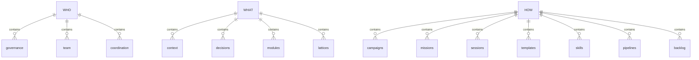
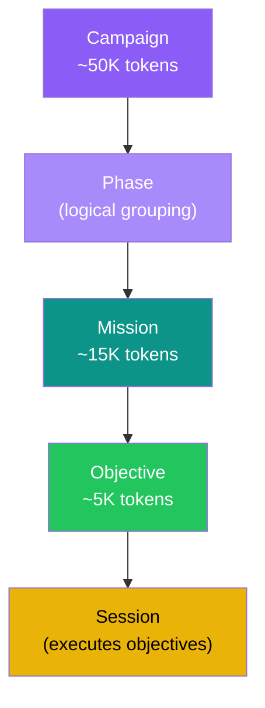
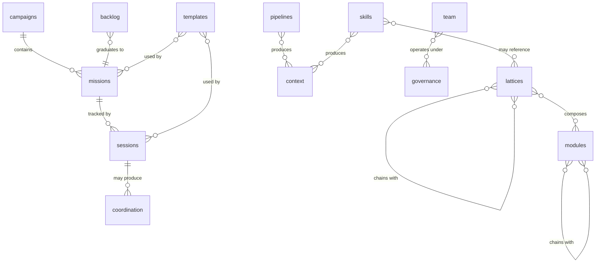
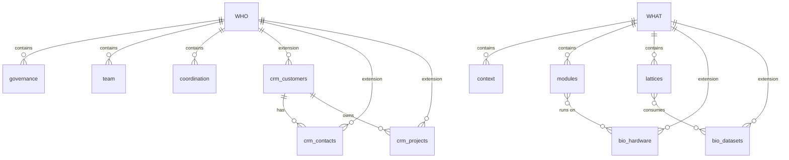
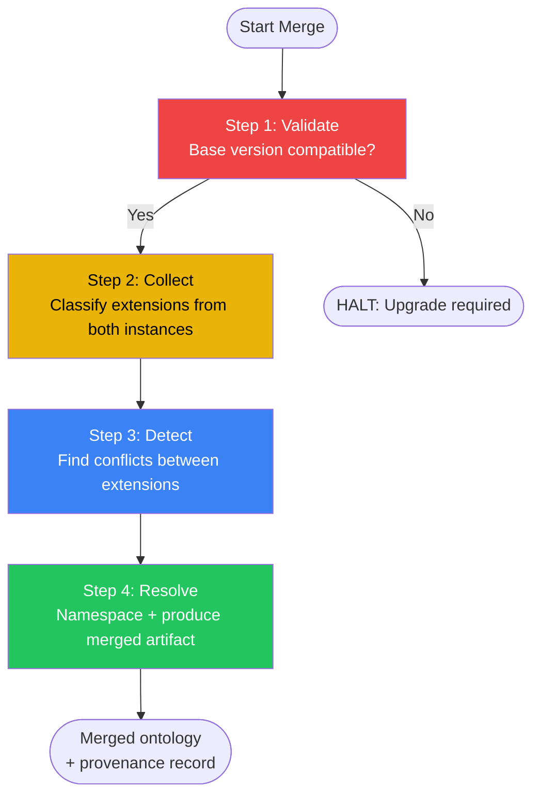

# aDNA Base Ontology

Entity relationship map for an aDNA instance. Defines the **14 base entity types** universal to every aDNA lattice, organized by the `who/what/how` triad.

**Base ontology version**: v3.0 (14 entity types)

## Scope

The aDNA ontology has two layers:

| Layer | Entity Types | Rule |
|-------|-------------|------|
| **Base** (this document) | 14 types | Structurally invariant — every aDNA instance shares these. No renaming, removal, or triad reassignment. |
| **Extensions** (per instance) | Additive | Namespaced, domain-specific. Extensions plug into base types but never modify them. See [Extension Patterns](#extension-patterns). |

This artifact documents the base layer in full. Extensions are shown as illustrative examples only — each instance defines its own.

---

## Base Entity Types

### Summary Table

| # | Entity | Triad | Directory | Purpose | Merge Behavior |
|---|--------|-------|-----------|---------|----------------|
| 1 | governance | WHO | `who/governance/` | Rules, charter, naming conventions, policies | invariant |
| 2 | team | WHO | `who/team/` | People who work — profiles, roles, groups | invariant |
| 3 | coordination | WHO | `who/coordination/` | Cross-agent/cross-session sync notes | invariant |
| 4 | context | WHAT | `what/context/` | Knowledge library — domain topics, research | invariant |
| 5 | decisions | WHAT | `what/decisions/` | ADRs — architectural/design decisions | invariant |
| 6 | modules | WHAT | `what/modules/` | Executable units with I/O contracts | invariant |
| 7 | lattices | WHAT | `what/lattices/` | Composition graphs of modules + datasets | invariant |
| 8 | campaigns | HOW | `how/campaigns/` | Strategic multi-mission initiatives | invariant |
| 9 | missions | HOW | `how/missions/` | Decomposed multi-session tasks | invariant |
| 10 | sessions | HOW | `how/sessions/` | Execution tracking — one per work session | invariant |
| 11 | templates | HOW | `how/templates/` | File templates for consistent structure | invariant |
| 12 | skills | HOW | `how/skills/` | Reusable agent recipes + procedures | invariant |
| 13 | pipelines | HOW | `how/pipelines/` | Folder-based content-as-code workflows | invariant |
| 14 | backlog | HOW | `how/backlog/` | Ideas and improvement tracking | invariant |

**Merge behavior**: All 14 base types are `invariant` — during [ontology unification](docs/ontology_unification.md), base types are never renamed, removed, or reassigned. Only extension types use `extension/namespace` merge behavior.

### Rosetta Extensions (10 Entity Types)

Domain-specific entity types added by the aDNA.aDNA project for documentation, education, and community architecture.

| # | Entity | Triad | Directory | Purpose | Merge Behavior |
|---|--------|-------|-----------|---------|----------------|
| 15 | concept | WHAT | `what/concepts/` | Core aDNA concepts — dual-audience depth | extension/rosetta |
| 16 | tutorial | WHAT | `what/tutorials/` | Step-by-step learning paths (beginner → advanced) | extension/rosetta |
| 17 | pattern | WHAT | `what/patterns/` | Reusable aDNA architectural patterns | extension/rosetta |
| 18 | glossary_entry | WHAT | `what/glossary/` | Canonical term definitions with spec refs | extension/rosetta |
| 19 | use_case | WHAT | `what/use_cases/` | Narrative adoption stories by domain | extension/rosetta |
| 20 | comparison | WHAT | `what/comparisons/` | aDNA vs. other knowledge architectures | extension/rosetta |
| 21 | community | WHO | `who/community/` | Community roles, contribution paths | extension/rosetta |
| 22 | adopter | WHO | `who/adopters/` | Adopter personas and deployment profiles | extension/rosetta |
| 23 | workshop | HOW | `how/workshops/` | Workshop kits and facilitation guides | extension/rosetta |
| 24 | publishing | HOW | `how/publishing/` | Vault-to-web content publishing pipeline | extension/rosetta |

### Network.aDNA Extensions (2 Entity Types)

Domain-specific entity types added by the `LatticeNetwork.aDNA` (Alpha Lattice) instance for the Network.aDNA pattern category (6th canonical pattern per LIP-0006; ratified at aDNA standard via [[decisions/adr_017_network_adna_pattern_category_and_namespace_ratification.md|ADR-017]] 2026-05-20 — single comprehensive ADR covering LIP-0006 countersign + `network_` namespace reservation + parallel-discharge of both entity-types per peer ADR-005 rule 6 + ADR-008 §f invariant). Namespace `network_` co-claim (peer ADR-005 rule 2(c)) — single namespace covers both rows. v8.0 P6 batch promotion to base ontology per ADR-017 §Decisions D5+D8.

| # | Entity | Triad | Directory | Purpose | Merge Behavior |
|---|--------|-------|-----------|---------|----------------|
| 25 | network_node_mirror | WHAT | `what/network/nodes/<hostname>.aDNA/` | Per-node mirror directory (source: each node's own `node.aDNA`; SO-7 read-mostly invariant; aggregator-side; full sub-triad structurally distinct from base `context` per peer ADR-002 §a) | extension/network |
| 26 | permission_edge | WHAT | `what/network/permissions/<edge_id>.yaml` | Directed authentication edge between nodes (10-field body per peer ADR-008 §g; lifecycle bound to LIP-0003 ledger events at peer arch_01 §6.4 call-site 3) | extension/network |

### Triad Structure (Diagram 1)

### Key Entity Attributes

```mermaid
erDiagram
    context {
        string subtype "context_research | context_guide | context_core"
        int token_estimate "approximate token count"
    }

    campaigns {
        string status "planning | active | completed | abandoned"
        int phase_count "number of phases"
        int mission_count "number of missions"
    }

    skills {
        string skill_type "agent | process"
        string category "setup | research | development | operations"
    }

    modules {
        string module_type "tool | model | model_wrapper | preprocessor | postprocessor"
        string runtime "python3.10 | python3.11 | python3.12 | container"
        bool gpu_required "requires GPU"
    }

    lattices {
        string lattice_type "pipeline | agent | context_graph | workflow"
        string execution_mode "workflow | reasoning | hybrid"
        string execution_tier "L1 | L2 | L3"
    }

    sessions {
        string session_id "timestamped unique ID"
        int tier "1 or 2"
        string status "active | completed"
    }

    team {
        string role "functional role category"
        string agent_id "agent identity for attribution"
        string status "active | onboarding | alumni"
    }
```

---

## Execution Hierarchy

The operational ontology encodes a strict execution hierarchy. Each level narrows scope — campaigns decompose into missions, missions into objectives, with sessions executing objectives.

### Hierarchy Diagram (Diagram 2)

**Hierarchy rules**:
- **Campaigns** contain missions (physically in `how/campaigns/campaign_<name>/missions/`)
- **Standalone missions** (no campaign) live in `how/missions/`
- **Objectives** are session-sized work units tracked within mission files and via task plugins
- **Sessions** claim and execute objectives, producing coordination notes as side effects

### Convergence Model

At each execution level, irrelevant knowledge is pruned — the working set decreases monotonically as specificity increases. This is the **convergent narrowing** property of aDNA.

**Token narrowing**:

| Level | Typical Scope | ~Tokens | Reduction |
|-------|--------------|---------|-----------|
| Instance (full vault) | All knowledge | ~500K | — |
| Campaign | Strategic initiative | ~50K | 90% |
| Mission | Decomposed task | ~15K | 70% |
| Objective | Single session work | ~5K | 67% |

**Entity-type narrowing** (worked example — an organization formation campaign):

| Level | Entity Types in Scope | Reduction |
|-------|----------------------|-----------|
| Full ontology | 34 types (14 base + 20 extension) | — |
| Campaign: org_formation | 22 types (CRM + Science pruned) | 32 → 22 (31%) |
| Mission: Role Architecture | 5 types (role, member, team, sessions, decisions) | 22 → 5 (77%) |
| Objective: Draft role charters | 2 types (role, member) | 5 → 2 (60%) |

At each level, the AGENTS.md routing mechanism selects the relevant subspace — load only what the current scope needs, skip everything else. For full detail see [context_adna_core_convergence_model](context/adna_core/context_adna_core_convergence_model.md).

---

## Base Entity Relationships (Diagram 3)

Cross-entity relationships among the 14 base types:

**Key relationship patterns**:

| Pattern | Entities | Relationship |
|---------|----------|-------------|
| **Execution** | campaigns → missions → sessions → coordination | Decompose → execute → sync |
| **Knowledge** | lattices ↔ modules, modules ↔ modules, lattices ↔ lattices | Compose → chain |
| **Operational** | pipelines/skills → context, skills → lattices | Produce knowledge, reference compositions |
| **Governance** | team ↔ governance | People operate under policies |
| **Lifecycle** | backlog → missions, templates ↔ sessions/missions | Ideas graduate, templates structure |

---

## Composition Concepts

The base ontology defines three related-but-distinct composition concepts:

| Concept | Location | Purpose | Implementation |
|---------|----------|---------|---------------|
| **Lattice** | `what/lattices/` | Technical object — DAG composition of modules for compute | YAML schema, protocol validation, federation |
| **Pipeline** | `how/pipelines/` | Operational workflow — folder-based content-as-code | File location = state, AGENTS.md per stage |
| **Skill** | `how/skills/` | Agent/human procedure — reusable capability recipe | Single-file or directory-based |

All three share the "graph of steps" concept but serve different layers: technical (lattice), operational (pipeline), and agent-native (skill).

---

## Extension Patterns

### How Extensions Work

Extensions are **additive and namespaced**. They plug into the base ontology without modifying it. The question test classifies new entity types: "Is this about WHAT we know, HOW we work, or WHO is involved?"

| Rule | Description |
|------|-------------|
| **Additive only** | Extensions add entity types — they never modify or remove base types |
| **Namespaced** | Extension types use `{domain}_{entity_type}` syntax to prevent cross-instance collisions |
| **Question test** | Determines triad assignment — one answer, one leg, one home |
| **Directory convention** | New entity types get their own subdirectory under the appropriate triad leg |

**Namespace syntax**: `{domain}_{entity_type}` — domain is 2-20 lowercase alphanumeric + underscore characters.

### Example: CRM Extension

A customer relationship management extension adds entity types to the WHO leg:

| Entity | Namespace | Triad | Directory | Purpose |
|--------|-----------|-------|-----------|---------|
| customers | `crm_` | WHO | `who/customers/` | External organizations and deals |
| contacts | `crm_` | WHO | `who/contacts/` | People at customer/partner orgs |
| projects | `crm_` | WHO | `who/projects/` | Deployment initiatives per customer |

### Example: Science Extension

A biotech/science extension adds entity types to the WHAT leg:

| Entity | Namespace | Triad | Directory | Purpose |
|--------|-----------|-------|-----------|---------|
| hardware | `bio_` | WHAT | `what/hardware/` | Compute infrastructure (L1/L2/L3) |
| datasets | `bio_` | WHAT | `what/datasets/` | FAIR-compliant data packages |

### Extension Diagram (Diagram 4)

---

## Ontology Unification

When aDNA instances integrate (e.g., importing a sub-lattice), their ontologies must be **unified** — base entities aligned, extensions reconciled, conflicts resolved.

### Base Invariance Rule

Base entity types are **structurally invariant** across all aDNA instances at the same base version:

| Property | Invariant? |
|----------|-----------|
| Entity type name | YES — no renaming |
| Triad assignment | YES — no reassignment |
| Directory location | YES — canonical paths |
| Base frontmatter fields | YES — always present |
| Execution hierarchy | YES — Campaign → Mission → Objective |
| Type-specific fields | NO — instances may add fields (additive only) |
| Extension relationships | NO — extensions may define new relationships |

### Merge Algorithm (4-Step Summary)

**Step details**:

1. **Validate** — Confirm both instances share the same base major version (e.g., v3.x). Incompatible versions require upgrade before merge.
2. **Collect** — Enumerate extensions from both instances. Classify each as source-only, target-only, or present in both.
3. **Detect** — For shared extensions, check for type name collisions, discriminator conflicts, relationship ambiguity, and field semantic mismatches.
4. **Resolve** — Apply namespace prefixes to conflicting extensions. Produce merged ontology with provenance record documenting every resolution.

### Namespace Quick Reference

| Namespace | Domain | Status |
|-----------|--------|--------|
| `crm_` | Customer relationship management | Active |
| `bio_` | Biotech / life science | Active |
| `formation_` | Organization formation | Active |
| `compute_` | Compute infrastructure | Available |
| `custom_` | User-defined | Available |
| `base_` | Reserved (base types are unprefixed) | Reserved |

For the full merge algorithm, conflict taxonomy, and worked examples, see [Ontology Unification Protocol](docs/ontology_unification.md).

---

## Cross-References

- [CLAUDE.md](../CLAUDE.md) — Vault structure map and agent protocol
- [aDNA Standard v2.1](docs/adna_standard.md) — Normative specification (§5.1 ontology artifact, §3 triad architecture)
- [Ontology Unification Protocol](docs/ontology_unification.md) — Formal merge algorithm, conflict taxonomy, namespace specification
- [Lattice Federation & Sharing Protocol](docs/lattice_federation.md) — Federation lifecycle, import triggers merge
- [aDNA Design Rationale](docs/adna_design.md) — Design decisions and deployment forms
- [Ontology Design Guide](context/adna_core/context_adna_core_ontology_design.md) — Prescriptive guide for extending the ontology
- [Convergence Model](context/adna_core/context_adna_core_convergence_model.md) — Token narrowing operational reference
- [what/AGENTS.md](AGENTS.md) — Knowledge layer directory index
- [how/AGENTS.md](../how/AGENTS.md) — Operations layer
- [who/AGENTS.md](../who/AGENTS.md) — Organization layer
